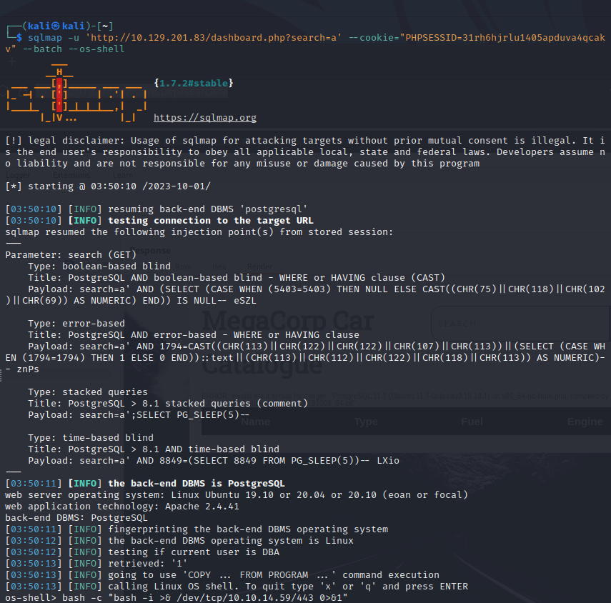
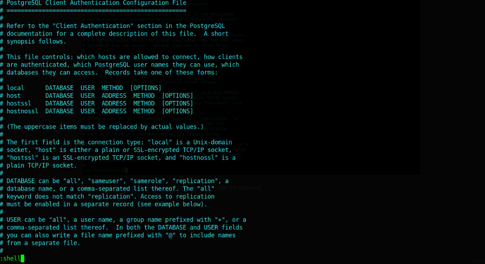

# 1. Enumeration

- Just as usual, we start off with the nmap scan:


-  We will start off with enumeration of the port 21, since the Nmap shows that it allows anonymous login:


- When we will try to unzip it, the compressed archive asks us for a password. We will crack the password with `john`:

```
zip2john backup.zip > hashes
john hashes
john --show hashes
```


- Now, we can extract the files:


- We will read `index.php` first:

```
session_start();
if(isset($_POST['username']) && isset($_POST['password'])) {
if($_POST['username'] === 'admin' && md5($_POST['password']) ===
"2cb42f8734ea607eefed3b70af13bbd3") {
$_SESSION['login'] = "true";
header("Location: dashboard.php");
```

- Looks like the password is md5 hashed, but we can easily break it. This left us with `admin:qwerty789`

- Visit the website and login using the above username and password:


- Nothing much, but the `search` parameter is vulnerable to SQL Injection:


- Now we will attempt to get an OS Shell so as to create a reverse shell back to our netcat listener:




- The user flag could be found in `/var/lib/postgresql/`

# 2. Privilege Escalation

- We are user `postgres`, but we don't know the password for it, which means we cannot check our sudo privileges.

- Therefore, we will try to find the password in the /var/www/html folder, since the machine uses both PHP & SQL,
meaning that there should be credentials in clear text. In the `dashboard.php`, we found the following:


- Now that we know the username and password, we can connect to the target machine with SSH to get a more stable shell.

- Let's check our privileges:


- So we have sudo privileges to edit the `pg_hba.conf` file using `vi` by running sudo `/bin/vi
/etc/postgresql/11/main/pg_hba.conf`. We will go to GTFOBins to see if we can abuse this privilege:
https://gtfobins.github.io/gtfobins/vi/#sudo


- Let's try to execute it:


- We are unable to execute the following command because `sudo` is restricted to only `/bin/vi
/etc/postgresql/11/main/pg_hba.conf`.

- But there's also an alternative way according to GTFOBins:

```
vi
:set shell=/bin/sh
:shell
```

- So we will perform that as well:

```
postgres@vaccine:~$ sudo /bin/vi /etc/postgresql/11/main/pg_hba.conf
```

- We managed to open `vi` as the superuser, which has root privileges:


- Now we will press the : button to set the instructions inside `vi`: `:set shell=/bin/sh`


- Next, we will open up the same instruction interface & type the following: `:shell`



- After we execute the instructions, we will see the following:


- The root flag can be obtained in the root folder.