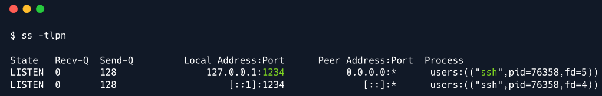

# 1. Introduction
### Tunnling

- A tunneling protocol í a communication protocol which allows for the movement of data from 1 network to another,
by exploiting encapsulation. It involves allowing private network communications to be sent across a public network
through a process called encapsulation

- The tunneling protocol works by using the data portion of a packet (the payload) to carry the packets that actually 
provide the service. Tunneling uses a layered protocol model such as those of the OSI or TCP/IP protocol suite, but
usually violates the layering when using the payload to carry a service not normally provided by the network.
Typically, the delivery protocol operates at an equal of higher level in the layered model than the payload protocol

### SSH

- The SSH protocol is vastly used for maintaining and accessing remote systems in a secure and encrypted way. 
But, it also offers the possibility to create tunnels that operate over the SSH protocol. More specifically, SSH offers 
various types of tunnels.

- The first type of tunneling is called `Local port forwarding`. When a local port forwarding is used, a separate tunnel
is created inside the existing SSH session that forwards network traffic from a local port on the client's machine
over to the remote server's port. Under the hood, SSH allocates a socket listener on the client on the given port.
When a connection is made to this port, the connection is forwarded over the existing SSH session over to the server's port

- The second typ of tunneling is called `Remote port forwarding`, also known as `Reverse Tunneling` and it is exactly 
the opposite operation of a `Local port forwarding tunnel`

- The third type of tunneling is called `Dynamic port forwarding`. The main issue with both local and remote forwarding
is that a local and a remote port have to be defined prior to the creation of the tunnel. To address this issue, one can
use `Dynamic port forwarding`. Dynamic tunneling, allows the users to specify just 1 port that will forward the incoming
traffic from the client to the server dynamically. The usage of dynamic tunneling relies upon the SOCKS5 protocol.

### SCOKS5

- SOCKS5 is an internet protocol that exchanges network packets between a client and server through a proxy server.
SOCKS5 optionally provides authentication so only authorized users may access a server. Practically, a SOCKS server
proxies TCP connections to an arbitrary IP address, and provides a means for UDP packets to be forwarded.

- So, what is happening is that SSH turns into a SOCKS5 proxy that proxies connections from the client through the
server. Now, suppose that you are working remotely, and you want to access a database that is only available on
the company's internal network. Let's say it's a PostgreSQL. With the use of tunneling, you can create a secure 
connection between your local machine and the internal network.


# 2. Enumeration

- Starting with the nmap scan:


- Anonymous users could connect the FTP server (as it is allowed):


- Let's check those files:
  - `welcome_28112022`:
    
  - `password_policy.pdf`:
    

# 3. Foothold

- Now it's easy, we just have to test each username appear in the `welcome_28112022` with the default password in the
  `password_policy.pdf` file (`funnel123#!#)
- After a few try, we get a valid hits on the combination `christine:funnel123#!#`. We can now use these credentials to
gain remote access to the machine


# 4. Services Enumeration

- From this point, we have complete access as `christine`, and can start enumerating for potential files or services
that can be exploited further. A crucial command at this point is `ss`, which stands for `socket statistics`, can can
be used to check which ports are listening locally on the server.


- The output reveals a handful of information, but we only need to pay attention to the forth column, which displays the
local address on which a service listens, as well as its port. `127.0.0.1` is synonymous with `localhost`, and essentially 
means that this port is only listening locally on the machine and cannot be accessed externally. This also explains
why we did not discover such ports in the nmap scan.
- On the other hand, the address `0.0.0.0`,`*`, and `[::]` indicate that a port is listening on all interfaces, meaning
that it is accessible externally, as well as locally, which is why we were able to detect both `FTP` and `SSH` services.

- Run it again to get the names of the services:


- So it runs PostgreSQL, however, attempting to run this command shows that the tool is not installed.

- Seeing as we do not have administrative privileges, we now find ourselves a bit of a crossroad. The service which
most likely has the flag is hidden locally on the target machine, and the tool to access that service is not installed.
While there are some potential workarounds involving uploading static binaries onto the target machine, an easier
way to bypass this roadblock is by a practice called `port forwarding` or `tunneling`, using SSH.
# 5. Tunneling

- In the scenario wa are currently facing, we want to forward traffic from any given local port to the port on which
PostgreSQL is listening on the remote server:
```
ssh -L 1234:localhost:5432 christine@{target_IP}
```

- We can see this new socket by running the `ss` command, but this time in our local machine:



# 6 Exploitation

- Now things are pretty straight forward. We can interact with the PostgreSQL service in the remote server using the
following command:
```
psql -U christine -h localhost -p 1234
```


- Some PostgreSQL commands:
  - `\l`: list all databases
  - `\c {database_name}`: select a database
  - `\dt`: list all tables in that database
  - `SELECT * FROM {table_name}`: get the data