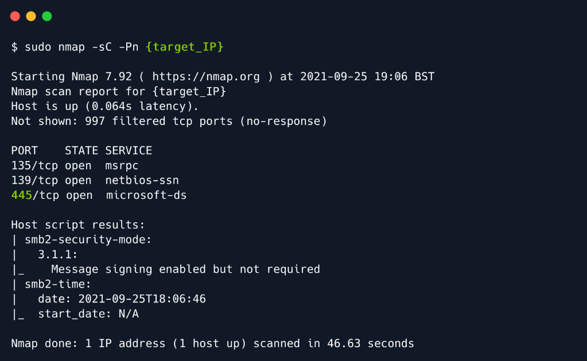
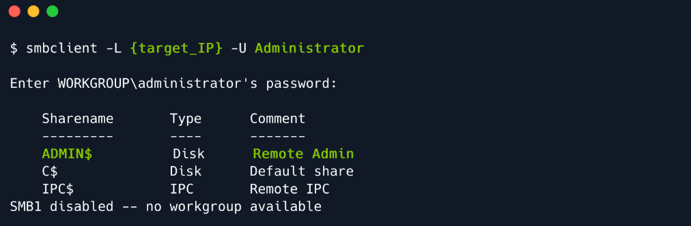
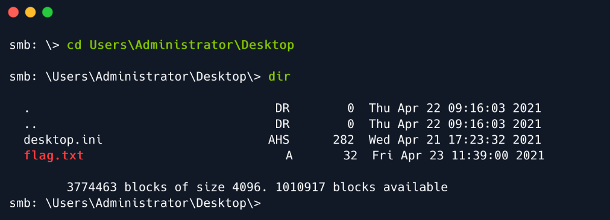
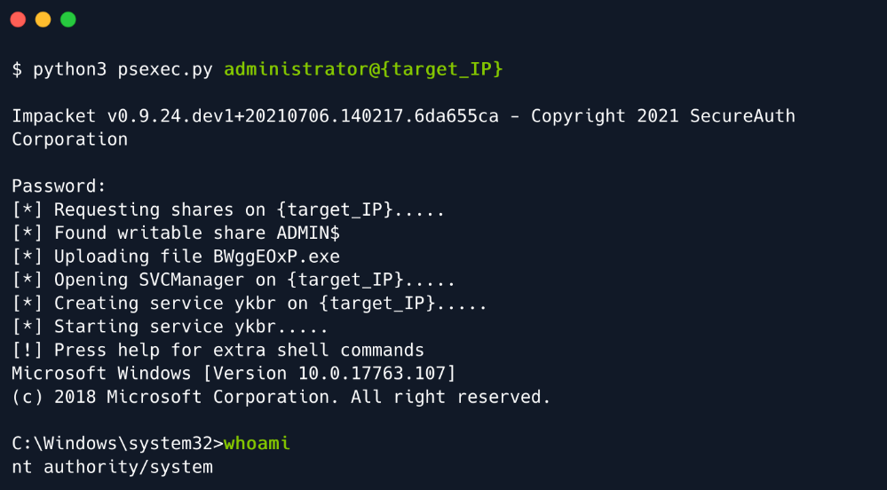

## 1. Enumeration

- We will begin by scanning the remote host for any open ports and running services with `nmap`. However, we will be
using a new switch for the scan: `-Pn`. 
- On a real world scenario, we should expect Firewalls to be present, intercepting connections at every step and denying
all nonstandard connection requests of scan attempts. During a typical nmap scan, the nmap script will perform a form
of complex ping scan, which most Firewalls are set to deny automatically, without question.
- The `-Pn` flag will skip the host discovery phase and move on straight to other probe types, silencing the active
scanning to a degree



- According to the results of the scan, the machine is running on Windows and the Server Message Block service on port 445.
```
Port 135:
    The Remote Procedure Call (RPC) service supports communication between Windows applications. Specifically, the service implements the RPC protocol — a low-level form
    of inter-process communication where a client process can make requests of a server process. Microsoft’s foundational COM and DCOM technologies are built on top of RPC.
    The service’s name is RpcSs and it runs inside the shared services host process, svchost.exe. This is one of the main processes in any Windows operating system & it
    should not be terminated.
Port 139:
    This port is used for NetBIOS. NetBIOS is an acronym for Network Basic Input/Output System. It provides services related to the session layer of the OSI model allowing
    applications on separate computers to communicate over a local area network. As strictly an API, NetBIOS is not a networking protocol. Older operating systems ran
    NetBIOS over IEEE 802.2 and IPX/SPX using the NetBIOS Frames (NBF) and NetBIOS over IPX/SPX (NBX) protocols, respectively. In modern networks, NetBIOS normally runs over
    TCP/IP via the NetBIOS over TCP/IP (NBT) protocol. This results in each computer in the network having both an IP address and a NetBIOS name corresponding to a (possibly
    different) host name. NetBIOS is also used for identifying system names in TCP/IP(Windows).
    Simply saying, it is a protocol that allows communication of files and printers through the Session Layer of the OSI Model in a LAN.
Port 445:
    This port is used for the SMB. SMB is a network file sharing protocol that requires an open port on a computer or server to communicate with other systems. SMB ports are
    generally port numbers 139 and 445. Port 139 is used by SMB dialects that communicate over NetBIOS. It's a session layer protocol designed to use in Windows operating
    systems over a local network. Port 445 is used by newer versions of SMB (after Windows 2000) on top of a TCP stack, allowing SMB to communicate over the Internet. This
    also means you can use IP addresses in order to use SMB like file sharing. Simply saying, SMB has always been a network file sharing protocol. As such, SMB
    requires network ports on a computer or server to enable communication to other systems. SMB uses either IP port 139 or 445.
```

- Inherently, SMB is a file sharing protocol, which means that we might extract some useful byproducts by exploring it.
This can be achieved by using the `smbclient` tool. 
- Typically, the SMB server will request a password, but since we want to cover all aspects of possible misconfigurations,
we can attempt a passwordless login:



## 2. Foothold

- From here we have two options of attack. One is loud, and one is not.
    - smbclient simple navigataion to C$ share with Administrator authorization
    - psexec.py from impacket


#### 2.1.   SMB Unprotected C$ Shared

```
smbclient \\\\10.10.10.131\\ADMIN$ -U Administrator
```

- From here, we will directly navigate to the standard root flag location on any Hack The Box Windows machine: Desktop



#### 2.2.   Impacket

- In this option, we will use a tool called `psexec.py` to exploit this misconfiguration and get the interactive shell.
- `PsExec` is a portable tool from Microsoft that lets you run processes remotely using any user's credentials.
- Syntax: `python psexec.py administrator@10.10.10.131`

